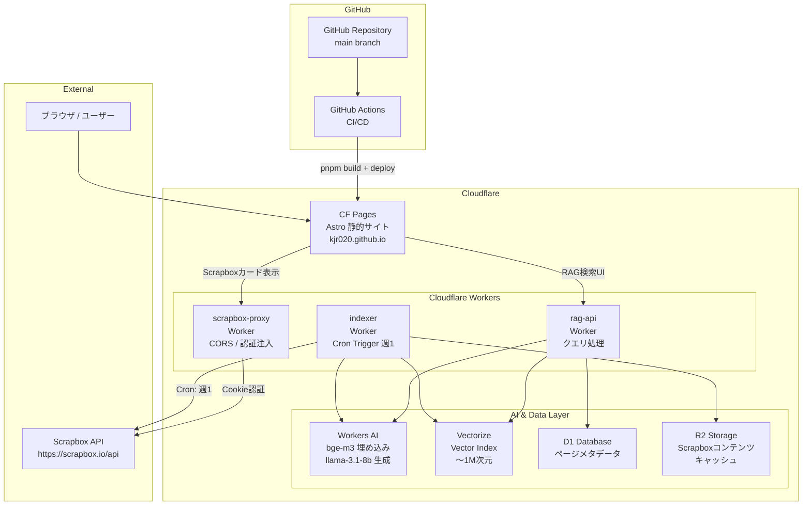

# Research Document: Cloudflare移管

## 調査日: 2026-03-21

---

## 1. Cloudflareサービス別コスト一覧（月額見積もり）

### 1-1. 各サービスの無料枠上限

| サービス | 無料枠上限 | Paid枠（$5/月〜） |
|---------|-----------|-----------------|
| **CF Pages** | 500ビルド/月、無制限帯域、20,000ファイル | プロ $20/月〜 |
| **Workers** | 100,000リクエスト/日、10ms CPU/呼び出し | 1,000万req/月 + $0.30/百万、30ms CPU |
| **Workers AI** | 10,000 Neurons/日（Paid含む） | $0.011/1,000 Neurons |
| **Vectorize** | 30Mクエリ次元/月、5M保存次元 | 50M/月込み + $0.01/M クエリ、$0.05/100M 保存 |
| **D1** | 5Mレコード読み/日、100Kレコード書き/日、5GB | 25Bレコード読み/月、50M書き/月 |
| **R2** | 10GB、Class A 1M ops/月、Class B 10M ops/月 | $0.015/GB、$4.50/M Class A |
| **Workers KV** | 100,000読み/日、1,000書き/日、1GB | $0.50/10M読み、$5/M書き |

### 1-2. 個人ブログ規模での月額見積もり

**前提条件**
- 月間PV: 1,000〜5,000
- RAGクエリ: 50件/日（個人ブログ上限想定）
- Scrapboxページ数: 〜1,000ページ（`@cf/baai/bge-m3` 1,024次元）

| サービス | 想定使用量 | 無料枠内? | 月額 |
|---------|-----------|---------|------|
| CF Pages | 〜30ビルド/月 | ✅ | $0 |
| Workers (proxy + RAG API) | 〜3,000 req/月 | ✅ | $0 |
| Workers AI (埋め込み) | 50クエリ×50トークン×1,075/M ≈ 3 Neurons/日 | ✅ | $0 |
| Workers AI (LLM応答) | 50クエリ×500トークン出力 ≈ 小さい | ✅ | $0 |
| Vectorize (保存) | 1,000ページ×1,024次元 ≈ 1M次元 | ✅ (上限5M) | $0 |
| Vectorize (クエリ) | 50/日×1,024次元×30日 ≈ 1.5M次元/月 | ✅ (上限30M) | $0 |
| D1 | メタデータ数KB | ✅ | $0 |
| R2 | 1,000ページ×10KB ≈ 10MB | ✅ (上限10GB) | $0 |

**合計: $0/月（完全無料枠内）**

### 1-3. スケールアップ時のコスト試算

| 規模 | Scrapboxページ数 | 月間RAGクエリ | 月額 |
|------|----------------|------------|------|
| 現在（MVP）| 〜1,000 | 〜1,500 | **$0** |
| 成長期 | 〜5,000 | 〜5,000 | **$0** |
| 拡大期 | 〜10,000 | 〜15,000 | **$5**（Workers Paid必要）|
| 商用水準 | 50,000 | 200,000 | **〜$7** |

> **結論**: 個人ブログ・副業ポートフォリオ用途では実質$0〜$5/月で運用可能。

### 1-4. 現行構成との差分

| 項目 | 現行（GitHub Pages + CF Workers） | 移行後（CF Pages + CF Workers） |
|------|----------------------------------|-------------------------------|
| ホスティング | $0（GitHub Pages 無料） | $0（CF Pages 無料） |
| API Proxy | $0（CF Workers 無料枠） | $0（同） |
| RAG基盤 | なし | $0（無料枠）|
| **合計** | **$0/月** | **$0/月** |

---

## 2. 移行後インフラ構成図

### 2-1. 全体アーキテクチャ



### 2-2. コンポーネント責務一覧

| コンポーネント | 種別 | 責務 | 既存/新規 |
|-------------|------|------|---------|
| CF Pages | ホスティング | Astro静的サイト配信 | **新規（移行）** |
| GitHub Actions | CI/CD | ビルド・テスト・デプロイ | **更新** |
| scrapbox-proxy Worker | Worker | Scrapbox API CORS proxy / 認証注入 | 既存（継続） |
| rag-api Worker | Worker | ベクター検索 + LLM回答生成エンドポイント | **新規** |
| indexer Worker | Worker | Scrapbox全ページ取得 → 埋め込み → Vectorize登録 | **新規** |
| Workers AI | AI推論 | bge-m3（埋め込み）/ llama-3.1-8b（生成） | **新規** |
| Vectorize | ベクターDB | 埋め込みベクター保存・類似検索 | **新規** |
| D1 | RDB | ページメタデータ（タイトル・URL・更新日） | **新規** |
| R2 | オブジェクトストレージ | Scrapboxページ原文キャッシュ（拡張時） | **新規（MVP後）** |

### 2-3. データフロー詳細

#### インデックス更新フロー（Cron / 手動）
```
indexer Worker (Cron: 週1)
  → Scrapbox API /api/pages/{project}?limit=1000
  → Workers AI bge-m3 (バッチ埋め込み)
  → Vectorize.upsert(vectors)
  → D1.insert(metadata: title, url, updated_at)
```

#### RAGクエリフロー（リアルタイム）
```
Browser → CF Pages → rag-api Worker
  → Workers AI bge-m3 (クエリ埋め込み: 1回)
  → Vectorize.query(topK=3)
  → D1.select(metadata by id)
  → Workers AI llama-3.1-8b (コンテキスト + クエリ → 回答)
  → CF Pages → Browser
```

---

## 3. 移行作業タスク一覧と工数見積もり

### Phase 1: ホスティング移行（必須・先行実施）

| # | タスク | 工数 | 難易度 |
|---|--------|------|--------|
| 1.1 | `@astrojs/cloudflare` アダプター導入・`astro.config.mjs` 更新 | 1h | 低 |
| 1.2 | GitHub Actions ワークフロー作成（CF Pages deploy） | 1.5h | 低 |
| 1.3 | CF Pagesプロジェクト作成・APIトークン設定 | 0.5h | 低 |
| 1.4 | scrapbox-proxyの許可オリジン更新（新URL対応） | 0.5h | 低 |
| 1.5 | 動作確認・既存URLの疎通テスト | 1h | 低 |
| **Phase 1 合計** | | **4.5h** | |

### Phase 2: RAG基盤 MVP

| # | タスク | 工数 | 難易度 |
|---|--------|------|--------|
| 2.1 | `workers/rag-api/` Worker プロジェクト作成・設定 | 0.5h | 低 |
| 2.2 | `workers/indexer/` Worker プロジェクト作成 | 0.5h | 低 |
| 2.3 | Vectorize インデックス作成（CLIまたはDashboard） | 0.5h | 低 |
| 2.4 | D1データベース・スキーマ作成 | 0.5h | 低 |
| 2.5 | indexer実装（Scrapbox取得 → bge-m3埋め込み → Vectorize登録） | 4h | 中 |
| 2.6 | rag-api実装（クエリ埋め込み → 類似検索 → LLM回答生成） | 4h | 中 |
| 2.7 | ブログUI: RAG検索コンポーネント（React） | 3h | 中 |
| 2.8 | Cron Trigger設定（週1インデックス更新） | 0.5h | 低 |
| 2.9 | 動作確認・プロンプトチューニング | 3h | 中 |
| **Phase 2 合計** | | **16.5h** | |

### 合計工数

| フェーズ | 工数 | 内容 |
|---------|------|------|
| Phase 1（ホスティング移行） | 4.5h | 週末1日で完了可能 |
| Phase 2（RAG MVP） | 16.5h | 週末2〜3日で完了可能 |
| **合計** | **21h** | |

> **判断**: 合計21時間。40時間を大きく下回るため段階的移行計画は不要。Phase 1を先行して安定稼働を確認後、Phase 2を着手する。

---

## 4. Go/No-Go判定

### 判断スコアリング（3軸評価）

| 評価軸 | 評価 | 根拠 |
|--------|------|------|
| **コスト** | ◎ 問題なし | $0/月（個人ブログ規模では完全無料枠内）。現行と差分なし |
| **工数** | ○ 許容範囲 | Phase 1: 4.5h、Phase 2: 16.5h。週末での実施が可能 |
| **ポートフォリオ価値** | ◎ 高い | エッジRAG実装はRAG・エージェント系副業案件でのアピールに直結 |

### 判定: **Go（移行実施）**

**根拠**:
1. 月額コストは現行の$0から変わらず、リスクゼロ
2. 工数21時間は個人開発として現実的な範囲
3. CloudflareスタックによるRAG実装は技術的差別化になる
4. Scrapbox APIプロキシ（構築中）との統合が自然
5. 移行しない場合の代替案（GitHub Pages継続）では技術アピール力が低い

---

## 5. RAG基盤 MVPスコープ定義

### MVPに含むもの

| 機能 | 実装方法 |
|------|---------|
| Scrapbox全ページのベクター化 | indexer Worker + `@cf/baai/bge-m3` |
| ベクター検索（類似度TOP3） | Cloudflare Vectorize |
| 日本語回答生成 | `@cf/meta/llama-3.1-8b-instruct` |
| ブログ内検索UI | Reactコンポーネント（`client:load`） |
| 週1回の自動インデックス更新 | Cron Triggers |
| ページメタデータ管理 | D1 |

### MVPに含まないもの（拡張スコープ）

| 機能 | 理由 |
|------|------|
| 会話履歴（マルチターン） | MVP後に実装。D1スキーマ拡張で対応 |
| 差分更新（インクリメンタル） | 全件再インデックスで十分（〜1,000ページ） |
| R2への原文キャッシュ | Scrapbox APIが直接使えるため不要 |
| ソースページへのリンク表示 | D1メタデータから実装可能。Phase 2.5で追加 |
| レート制限 | Cloudflare標準のDDoS保護で代替 |
| 回答品質評価（RAG Evaluation） | 商用化時に検討 |

### モデル選定根拠

| 用途 | モデル | 選定理由 |
|------|--------|---------|
| 埋め込み | `@cf/baai/bge-m3` | 多言語対応（日本語OK）、最安値（1,075 Neurons/Mトークン）、1,024次元 |
| 生成 | `@cf/meta/llama-3.1-8b-instruct` | 日本語生成品質良好、エッジ推論で十分なコンテキスト長 |

---

## 6. ポートフォリオ価値評価

### 技術スタックのアピール要素

| 技術要素 | アピールポイント |
|---------|---------------|
| Cloudflare Workers | エッジコンピューティング実装経験（低レイテンシ、グローバル分散） |
| Vectorize | ベクターDBの設計・運用経験（RAGの中核技術） |
| Workers AI | エッジでのAI推論（オンデバイスAIトレンドへの対応） |
| RAGパイプライン | データ取得→埋め込み→検索→生成の一貫実装 |
| Astro + CF Pages | モダンSSGとエッジホスティングの組み合わせ |

### 副業案件との接続

副業でRAG・エージェント案件を受ける際の訴求シナリオ：

> 「自社ブログのScrapboxナレッジベースをCloudflare WorkersとVectorizeでRAG化し、エッジで回答生成しています。インデックス更新パイプラインの設計・実装、プロンプトチューニング、無料枠内での運用設計まで一貫して経験しています。」

### 市場における技術需要

- Cloudflare Workersは2024-2025年に急速に採用企業が増加（特にスタートアップ・SaaS）
- エッジAI推論はLatency要件が厳しいサービスでの採用が増加中
- RAG実装経験はLLMアプリ開発案件で必須スキルとして認識されつつある

### GitHub Pagesとの比較

| 観点 | GitHub Pages継続 | CF Pages + RAG移行 |
|------|----------------|-------------------|
| 技術深度 | 静的ホスティングのみ | エッジ + AI + ベクターDB |
| 差別化度 | 低（多くのエンジニアが同構成） | 高（実装している人が少ない） |
| 案件アピール力 | 弱（ブログ = 普通） | 強（動くRAGデモ = 説得力がある） |
| 学習コスト | なし | 21h（投資対効果◎） |

> **評価**: Cloudflare移管後にRAGを実装することは、副業ポートフォリオとして**高い差別化効果**がある。同等の構成を個人ブログレベルで実装している日本人エンジニアは現状少なく、希少性がある。
