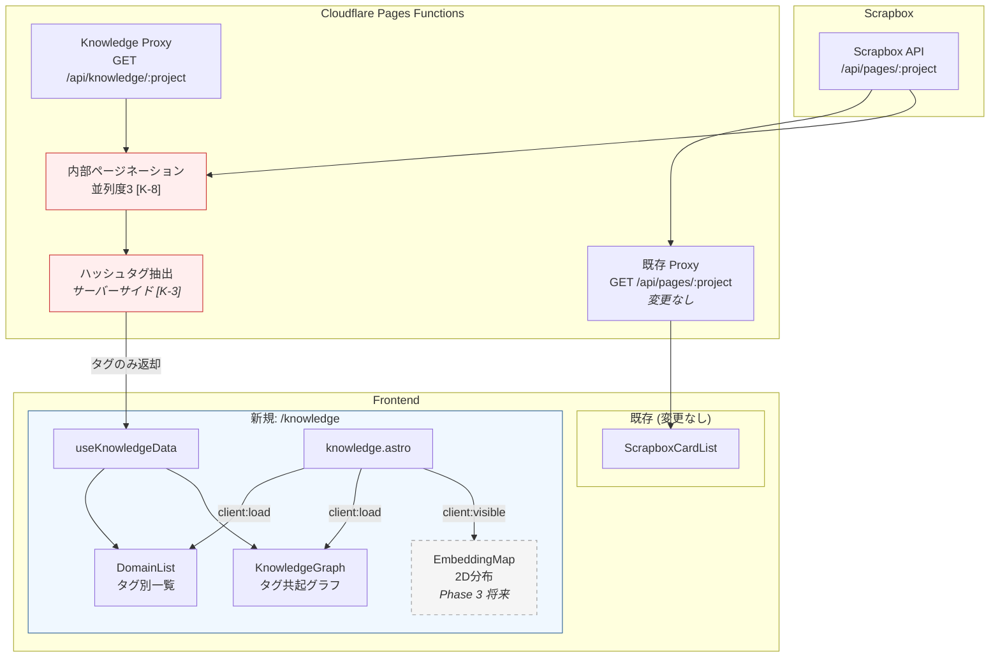
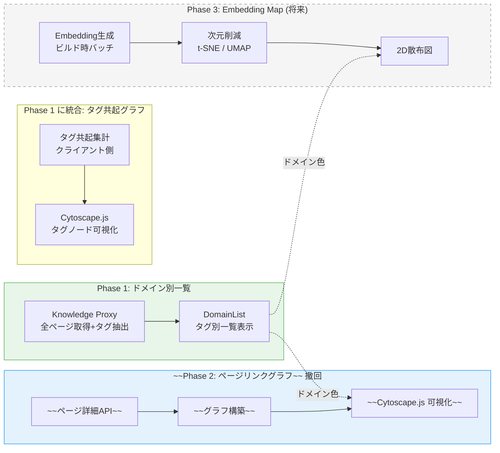
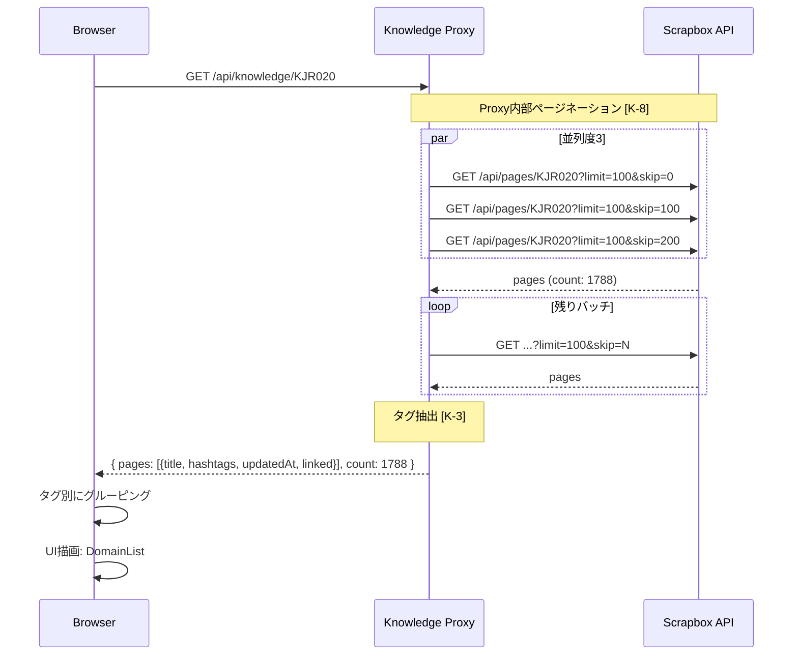

# Design Document: Scrapbox知識体系ビジュアライザー

## Overview

**Purpose**: Scrapboxに蓄積された1,788ページの知識メモを、既存のハッシュタグとリンク構造をそのまま活用して、ブログ上の `/knowledge` ページで俯瞰・可視化する。

**設計方針の変更（変更履歴）**:

**変更1: YAML参照フレームワーク → 削除**
- **当初案**: YAML定義の参照フレームワークによるカバレッジ/ギャップ分析
- **問題点**: YAML管理コストが「継続的に育てられる仕組み」という成功基準に反する
- **採用**: ギャップ分析はClaude Codeスキルで対話的に実施。ブログはビジュアライザーに徹する
- **付随**: 体系タグ (`[体系/SE/...]`) も導入しない。既存のハッシュタグ・リンクをそのまま使う

**変更2: ページリンクグラフ → タグ共起グラフに変更 (2026-04-13)**
- **当初案 (Phase 2 Req 5/6/7)**: ページ詳細APIで `links`/`relatedPages` を取得し、ページ間リンクをCytoscape.jsで可視化
- **問題点**:
  - 1,788ページの詳細fetchは並列度3でも60秒超、Cloudflare Functionsのタイムアウトに抵触しうる
  - 1,788ノードの force-directed layout はハリネズミ状になり視認性が低い
  - ページ粒度では「この分野が厚い/薄い」の判断材料にならず、ユーザー目的（俯瞰して掘り下げ先を決める）に合わない
- **採用: タグ共起グラフ (Req 8)**
  - タグレベルに集約することでノード数が視認可能 (ページ数>=2のタグのみ描画)
  - ノードサイズ=ページ数で知識量の濃淡を表現
  - ページ詳細API呼び出し不要、既存Knowledge Proxyだけで完結

**Impact**: 既存のScrapbox API Proxy・ScrapboxCardList/Carouselに影響を与えず、新規モジュールとして独立して追加する。

---

## Architecture

### 全体アーキテクチャ



### Phase別の拡張



### ランタイムシーケンス（Phase 1）



---

## Components and Interfaces

### Knowledge Proxy

**Intent**: 全ページのハッシュタグとメタデータを安全に取得する。descriptions原文は返さない。

```typescript
// functions/_lib/knowledge-proxy.ts

/** Proxy出力型 — descriptions原文は含まない */
interface KnowledgePageData {
  id: string;
  title: string;
  hashtags: string[];        // e.g. ["書籍", "セキュリティ"]
  updatedAt: string;
  linked: number;            // 被リンク数
}

interface KnowledgeProxyResponse {
  pages: KnowledgePageData[];
  count: number;
  projectName: string;
}
```

**セキュリティ**:
- descriptions原文を返さない [K-3]
- Proxy内部でページネーション集約、並列度3 [K-8]
- SCRAPBOX_SID非露出 [K-1]
- プロジェクト名バリデーション [K-2]
- `Cache-Control: public, max-age=300` [K-10]
- `Access-Control-Allow-Origin` を本番ドメインに制限 [K-9]

### ハッシュタグ抽出

```typescript
// functions/_lib/hashtag-parser.ts

/** descriptions配列からハッシュタグを抽出 */
const HASHTAG_PATTERN = /#([\w\u3000-\u9FFF]+)/g;

function extractHashtags(descriptions: string[]): string[];
```

### useKnowledgeData

```typescript
// src/hooks/useKnowledgeData.ts

interface UseKnowledgeDataReturn {
  pages: KnowledgePageData[];
  /** タグ → ページ配列のマップ */
  domainMap: Map<string, KnowledgePageData[]>;
  /** ユニークタグ一覧（ページ数降順） */
  tags: { name: string; count: number }[];
  totalPages: number;
  isLoading: boolean;
  error: Error | null;
}

function useKnowledgeData(project: string): UseKnowledgeDataReturn;
```

### UI Components

```typescript
// src/components/knowledge/DomainList.tsx
interface DomainListProps {
  domainMap: Map<string, KnowledgePageData[]>;
  tags: { name: string; count: number }[];
  isLoading: boolean;
}

// src/components/knowledge/KnowledgeGraph.tsx (Phase 2)
interface KnowledgeGraphProps {
  pages: KnowledgePageData[];
  graphData: { nodes: GraphNode[]; edges: GraphEdge[] };
}
```

### ファイル配置

```
functions/
├── _lib/
│   ├── hashtag-parser.ts          # ハッシュタグ抽出
│   ├── hashtag-parser.test.ts
│   ├── knowledge-proxy.ts         # Proxy変換ロジック
│   └── knowledge-proxy.test.ts
└── api/knowledge/
    └── [project].ts               # /api/knowledge/:project

src/
├── hooks/
│   └── useKnowledgeData.ts
├── components/knowledge/
│   ├── index.ts
│   ├── KnowledgeMap.tsx           # コンテナ（ビュー切り替え）
│   ├── DomainList.tsx             # タグ別一覧
│   └── DomainList.test.tsx
├── pages/
│   └── knowledge.astro
└── types/
    └── knowledge.ts
```

Phase 1に追加 (当初Phase 2から移動):
```
src/components/knowledge/
├── KnowledgeGraph.tsx             # Cytoscape.js タグ共起グラフ
└── PageList.tsx                   # タグ選択時の詳細パネル

src/lib/
└── domains.ts                     # 14ドメインの色定義 (domains.json と同期)

frameworks/
└── domains.json                   # ドメインタグ定義
```

~~Phase 2 (撤回)~~:
```
~~functions/api/pages/[project]/[title].ts~~  # ページ詳細API
~~functions/_lib/graph-builder.ts~~            # グラフ構築
~~src/hooks/useKnowledgeGraph.ts~~             # グラフデータ取得
~~functions/api/knowledge/[project]/graph.ts~~ # グラフAPI
```

---

## Data Models

### Knowledge Proxy Response

```json
{
  "pages": [
    {
      "id": "abc123",
      "title": "TypeScript",
      "hashtags": ["プログラミング"],
      "updatedAt": "2026-03-20T10:00:00.000Z",
      "linked": 3
    },
    {
      "id": "def456",
      "title": "鶏むね肉の低温調理",
      "hashtags": ["料理"],
      "updatedAt": "2026-03-18T15:00:00.000Z",
      "linked": 1
    },
    {
      "id": "ghi789",
      "title": "tmux設定メモ",
      "hashtags": [],
      "updatedAt": "2026-03-15T09:00:00.000Z",
      "linked": 0
    }
  ],
  "count": 1788,
  "projectName": "KJR020"
}
```

### 拡張性: Phase 3（Embedding Map）対応

`KnowledgePageData` にPhase 3で以下のフィールドを追加可能な構造にする:

```typescript
interface KnowledgePageData {
  id: string;
  title: string;
  hashtags: string[];
  updatedAt: string;
  linked: number;
  // Phase 3で追加（オプショナル）
  embedding2d?: { x: number; y: number };
}
```

知識マップページは**3つのビュー切り替え**を想定したレイアウトにする:
1. **一覧ビュー** (Phase 1): DomainList
2. **グラフビュー** (Phase 2): KnowledgeGraph
3. **マップビュー** (Phase 3): EmbeddingMap（2D散布図）

---

## セキュリティ設計

セキュリティレビュー（`security-review.md`）の指摘を反映済み。

| ID | 対策 | 反映箇所 |
|----|------|---------|
| **K-3** (High) | descriptions原文をクライアントに返さない。Proxy側でタグ抽出のみ返却 | Knowledge Proxy |
| **K-8** (High) | Proxy内部でページネーション集約。並列度3に制限 | Knowledge Proxy |
| K-1 | SCRAPBOX_SID非露出 | Knowledge Proxy |
| K-9 | CORS制限 | Knowledge Proxy |
| K-10 | Cache-Controlヘッダー | Knowledge Proxy |
| K-11 | dangerouslySetInnerHTML禁止 | UIコンポーネント |

---

## Performance

| メトリクス | 目標 | 備考 |
|-----------|------|------|
| Proxyレスポンス | < 10秒 | 18リクエスト×並列度3 + タグ抽出 |
| フロントエンド表示 | < 2秒（Proxy応答後） | タグ別グルーピング + UI描画 |
| Phase 2 グラフ描画 | `client:visible` で遅延ロード | バンドルサイズ影響を最小化 |

---

## 設計上の重要な判断

1. **既存Proxy非破壊**: `/api/knowledge/:project` として新規エンドポイント追加
2. **既存タグをそのまま活用**: 新しいタグ記法は導入しない。Scrapboxの既存ハッシュタグ（26%のページで使用中）を分類基準にする
3. **YAML定義を削除**: ギャップ分析はClaude Codeスキルで対話的に行う。ブログはビジュアライザーに徹する
4. **サーバーサイドタグ抽出 [K-3]**: descriptions原文はクライアントに返さない
5. **Proxy集約ページネーション [K-8]**: クライアント→Proxyは単一リクエスト
6. **3ビュー設計**: 一覧（Ph1）→ グラフ（Ph2）→ 2Dマップ（Ph3）の段階的拡張。KnowledgeMapコンテナでビュー切り替え
7. **Phase 2可視化**: Cytoscape.js（グラフ理論ベース、軽量）
8. **Phase 3拡張性**: `KnowledgePageData` に `embedding2d` フィールドを将来追加可能な設計
