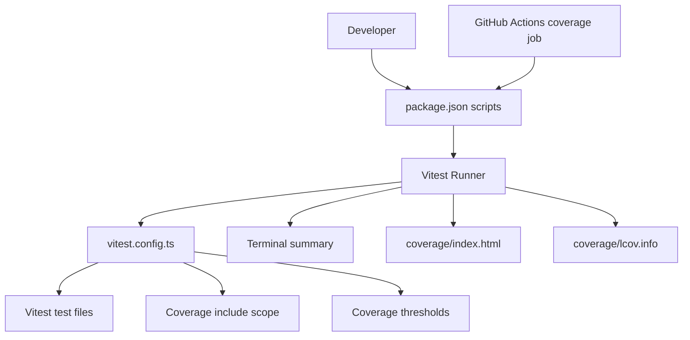
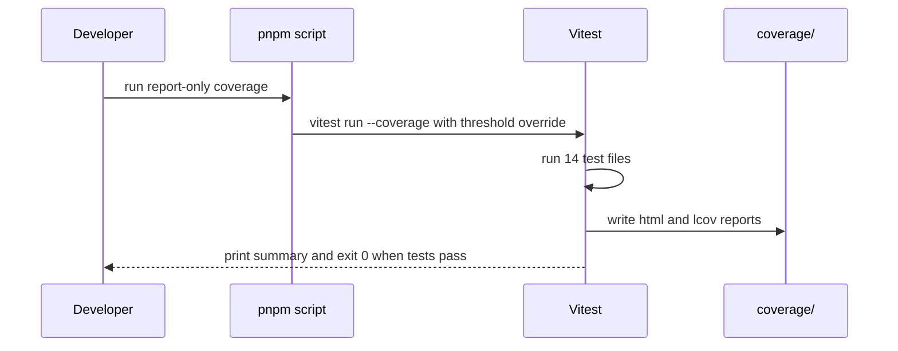
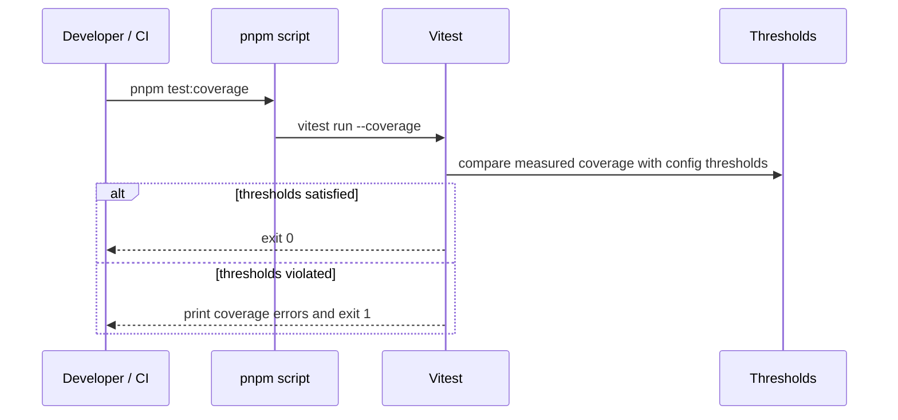

# Design Document: test-coverage-measurement

## Table of Contents

| Section | What You'll Learn |
|---------|-------------------|
| [Overview](#overview) | カバレッジ測定の設計方針と非目標を示す |
| [Architecture](#architecture) | 既存の Vitest/CI 構成にどう組み込むかを示す |
| [System Flows](#system-flows) | report-only と quality gate の実行フローを示す |
| [Requirements Traceability](#requirements-traceability) | 各要件と設計要素の対応を示す |
| [Components and Interfaces](#components-and-interfaces) | 変更・参照対象の設定ファイルと契約を整理する |
| [Verification](#verification) | 実測済みコマンドと期待結果を記録する |

## Overview

**Purpose**: この設計は、Vitest の v8 coverage provider を使って、既存の単体・統合テストからロジック中心のカバレッジを再現可能に測定する。

**Users**: 開発者が実装前後のテストカバレッジを確認し、未カバー箇所の優先順位を決めるために利用する。

**Impact**: 既存の `vitest.config.ts`, `package.json`, `.github/workflows/ci.yml` を中心に、測定専用コマンドと閾値チェックコマンドの責務を明確にする。`test:coverage:report` を日常測定用、`test:coverage:check` を品質ゲート用として追加する。

### Goals

- カバレッジ測定結果をローカルで再現可能に取得できる
- HTML/LCOV レポートを生成できる
- report-only と quality gate の exit code の意味を分離する
- CI 上の coverage job の意図を明確にする

### Non-Goals

- Playwright E2E/snapshot test の coverage 統合
- UI コンポーネント全体の網羅率を coverage gate に含めること
- 初回から coverage threshold を必須 gate にすること
- カバレッジを上げるためだけの低価値テスト追加

## Architecture

### Existing Architecture Analysis

現在の構成:

- `package.json`
  - `test:run`: `vitest run`
  - `test:coverage`: `vitest run --coverage`
- `vitest.config.ts`
  - `coverage.provider`: `v8`
  - `coverage.reporter`: `text`, `html`, `lcov`
  - `coverage.include`: Functions, lib, hooks, knowledge format
  - `coverage.thresholds`: lines/functions/statements/branches 80%
- `.github/workflows/ci.yml`
  - `test` job で `pnpm test:run --passWithNoTests`
  - `coverage` job で `pnpm test:coverage`
  - `coverage` job は `continue-on-error: true`

維持する制約:

- 測定対象はロジック中心に限定する。
- coverage artifacts は `coverage/` に生成し、`.gitignore` で除外する。
- CI の初期運用では coverage failure を blocking gate にしない。

### Architecture Pattern & Boundary Map



**Architecture Integration**:

- **Selected pattern**: Existing config extension.
- **Domain boundaries**: Vitest coverage は単体・統合テストによるロジック測定、Playwright は E2E/visual regression。
- **Existing patterns preserved**: `coverage/` artifact, v8 provider, CI continue-on-error.
- **New components rationale**: report-only script を追加する場合のみ、日常測定の exit code を安定化できる。

### Technology Stack

| Layer | Choice / Version | Role in Feature | Notes |
|-------|------------------|-----------------|-------|
| Test Runner | Vitest 4.1.4 | Unit/integration test execution | lockfile resolved version |
| Coverage Provider | @vitest/coverage-v8 4.1.4 | V8 coverage collection | `pnpm install --frozen-lockfile` で同期 |
| Reports | text/html/lcov | Human and tool-readable output | `coverage/` ignored |
| CI | GitHub Actions | Continuous observation | `coverage` job is non-blocking |

## System Flows

### Report-only Measurement Flow



### Quality Gate Flow



## Requirements Traceability

| Requirement | Summary | Components | Interfaces | Flows |
|-------------|---------|------------|------------|-------|
| 1.1 | 測定対象の固定 | `vitest.config.ts` | coverage.include | Report-only, Quality gate |
| 1.2 | 除外対象の固定 | `vitest.config.ts` | coverage.exclude | Report-only, Quality gate |
| 1.3 | 依存同期手順 | `pnpm-lock.yaml`, README/task docs | `pnpm install --frozen-lockfile` | Report-only |
| 1.4 | E2E除外 | `playwright.config.ts`, `vitest.config.ts` | separate test runners | Both |
| 2.1 | ターミナル表示 | Vitest reporter | text reporter | Both |
| 2.2 | HTML生成 | Vitest reporter | html reporter | Both |
| 2.3 | LCOV生成 | Vitest reporter | lcov reporter | Both |
| 2.4 | artifact除外 | `.gitignore` | `coverage/` | Both |
| 3.1 | report-only exit 0 | package script or CLI override | threshold override | Report-only |
| 3.2 | threshold check exit 1 | `vitest.config.ts` | coverage.thresholds | Quality gate |
| 3.3 | threshold変更根拠 | spec docs | baseline table | Quality gate |
| 3.4 | 現行scriptの意味 | README/spec docs | `pnpm test:coverage` | Quality gate |
| 4.1 | CI実行 | `.github/workflows/ci.yml` | coverage job | Quality gate |
| 4.2 | 初期非blocking | `.github/workflows/ci.yml` | continue-on-error | Quality gate |
| 4.3 | 段階的gate化 | tasks.md | task plan | Quality gate |
| 4.4 | CI実行順 | `.github/workflows/ci.yml` | job steps | Quality gate |

## Components and Interfaces

| Component | Domain/Layer | Intent | Req Coverage | Key Dependencies | Contracts |
|-----------|--------------|--------|--------------|------------------|-----------|
| `vitest.config.ts` | Test config | coverage provider, scope, reporters, thresholds を定義する | 1, 2, 3 | Vitest, coverage-v8 | Config |
| `package.json` scripts | Developer UX | 測定と閾値チェックの入口を提供する | 1, 3 | pnpm, Vitest CLI | Command |
| `.github/workflows/ci.yml` | CI | coverage を継続的に実行する | 4 | GitHub Actions, pnpm | Workflow |
| `coverage/` | Artifact | HTML/LCOV/text output の生成先 | 2 | Vitest reporters | Filesystem |

### Command Contract

| Command | Purpose | Expected Exit |
|---------|---------|---------------|
| `pnpm test:coverage:report` | report-only measurement | tests 通過時は 0 |
| `pnpm test:coverage` | configured thresholds を含む quality gate | 80%未満の指標がある場合は 1 |
| `pnpm test:coverage:check` | quality gate の明示名 | 80%未満の指標がある場合は 1 |

追加した `package.json` scripts:

```json
{
  "scripts": {
    "test:coverage:report": "vitest run --coverage --coverage.thresholds.lines=0 --coverage.thresholds.functions=0 --coverage.thresholds.statements=0 --coverage.thresholds.branches=0",
    "test:coverage:check": "vitest run --coverage"
  }
}
```

## Verification

### Quality Gate Command

- **Command**: `pnpm test:coverage`
- **Observed Result**:
  - Test Files: 20 passed
  - Tests: 205 passed
  - Exit: 0
  - Reason: all global coverage metrics are above 80%

### Report-only Command

- **Command**: `pnpm test:coverage:report`
- **Observed Result**:
  - Test Files: 20 passed
  - Tests: 205 passed
  - Exit: 0
  - Reports: `coverage/index.html`, `coverage/lcov.info`

### Current Coverage Baseline

| Metric | Current | Configured Threshold |
|--------|---------|----------------------|
| Statements | 97.97% | 80% |
| Branches | 89.71% | 80% |
| Functions | 95.23% | 80% |
| Lines | 98.90% | 80% |
