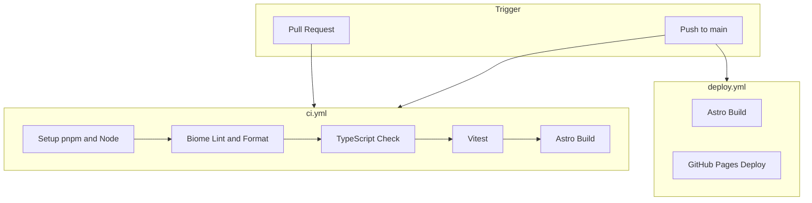
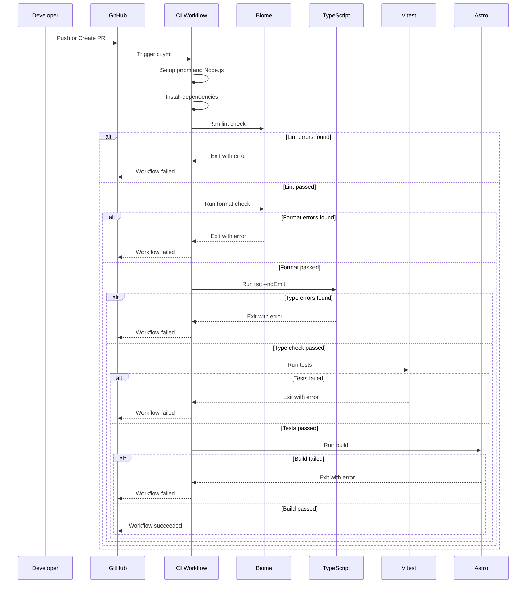

# Design Document: CI/Linter Setup

## Overview

**Purpose**: Astro ブログプロジェクトに対して、コード品質を継続的に担保するための CI パイプラインを構築する。Biome による静的解析/フォーマット、TypeScript 型検査、Vitest によるユニットテスト、およびビルド検証を自動化する。

**Users**: プロジェクト開発者が PR 作成時およびコード push 時に自動で品質検査を受ける。

**Impact**: 既存の `deploy.yml` とは独立した新規 CI ワークフローを追加し、コードベースに Biome 設定、Vitest 設定、テストファイルを追加する。

### Goals
- コードスタイルの統一と自動検査の実現
- 型安全性の継続的な検証
- リグレッションを防ぐテスト基盤の構築
- ローカルと CI での検査の一貫性確保

### Non-Goals
- E2E テスト（Playwright）の導入（既に devDependencies にあるが本スコープ外）
- deploy.yml の変更やデプロイフローへの影響
- Astro コンポーネントの単体テスト（utility 関数のみ対象）

## Architecture

### Existing Architecture Analysis
- **既存ワークフロー**: `.github/workflows/deploy.yml` が main push 時に Astro ビルド + GitHub Pages デプロイを実行
- **パッケージマネージャ**: pnpm 10 を使用
- **TypeScript 設定**: `astro/tsconfigs/strict` を継承、React JSX 対応済み
- **テストフレームワーク**: 未導入（Playwright のみ devDependencies に存在）

### Architecture Pattern & Boundary Map

**Architecture Integration**:
- **Selected pattern**: Sequential Pipeline — lint → typecheck → test → build の順序で実行
- **Domain boundaries**: CI（品質検査）と Deploy（本番反映）を独立したワークフローとして分離
- **Existing patterns preserved**: deploy.yml のセットアップパターン（pnpm/action-setup + setup-node）を踏襲
- **New components rationale**: 品質検査専用の ci.yml により責務を明確化
- **Steering compliance**: 該当なし（steering ドキュメント未設定）

### Technology Stack

| Layer | Choice / Version | Role in Feature | Notes |
|-------|------------------|-----------------|-------|
| Linter/Formatter | Biome v2.x | TypeScript/JavaScript の静的解析・フォーマット | ESLint + Prettier の 10〜25 倍高速 |
| Test Framework | Vitest (latest) | ユニットテスト実行 | Astro 公式推奨、Vite ネイティブ |
| Type Checker | TypeScript 5.x (existing) | 型検査 | 既存の tsconfig.json を使用 |
| CI Platform | GitHub Actions | ワークフロー実行 | 既存の deploy.yml と並行運用 |
| Package Manager | pnpm 10 (existing) | 依存関係管理 | 既存設定を踏襲 |

技術選定の詳細な比較検討は [research.md](./research.md) を参照。

## System Flows

### CI Workflow Execution Flow

**Key Decisions**:
- 各ステップは前段の成功を前提とし、失敗時は即座にワークフローを終了
- テストステップはテストファイルが存在しない場合でもエラーにしない（`--passWithNoTests`）

## Requirements Traceability

| Requirement | Summary | Components | Interfaces | Flows |
|-------------|---------|------------|------------|-------|
| 1.1, 1.2 | Biome による lint/format 検査 | BiomeConfig, CIWorkflow | lint, format scripts | CI Workflow |
| 1.3 | 違反時のワークフロー失敗 | CIWorkflow | - | CI Workflow |
| 1.4, 1.5 | Biome 設定（Astro 対応） | BiomeConfig | - | - |
| 2.1, 2.2, 2.3 | TypeScript 型検査 | CIWorkflow | typecheck script | CI Workflow |
| 3.1, 3.2, 3.3 | Astro ビルド検証 | CIWorkflow | build script | CI Workflow |
| 4.1 | Vitest 導入 | VitestConfig | - | - |
| 4.2, 4.3 | テスト実行と失敗検出 | CIWorkflow | test script | CI Workflow |
| 4.4 | cn 関数のテスト | UtilsTest | - | - |
| 4.5 | テスト未存在時のスキップ | CIWorkflow | - | CI Workflow |
| 5.1, 5.2 | CI トリガー設定 | CIWorkflow | - | - |
| 5.3 | 実行順序 | CIWorkflow | - | CI Workflow |
| 5.4 | キャッシュ活用 | CIWorkflow | - | - |
| 5.5 | デプロイとの独立性 | CIWorkflow | - | - |
| 6.1〜6.5 | npm scripts 追加 | PackageJson | lint, format, typecheck, test | - |

## Components and Interfaces

| Component | Domain/Layer | Intent | Req Coverage | Key Dependencies | Contracts |
|-----------|--------------|--------|--------------|------------------|-----------|
| CIWorkflow | CI/Infrastructure | GitHub Actions ワークフロー定義 | 1.1-1.3, 2.1-2.3, 3.1-3.3, 4.2-4.3, 4.5, 5.1-5.5 | GitHub Actions (P0) | - |
| BiomeConfig | Config | Biome の設定ファイル | 1.4, 1.5 | Biome (P0) | - |
| VitestConfig | Config | Vitest の設定ファイル | 4.1 | Vitest (P0), Astro (P1) | - |
| PackageJson | Config | npm scripts の追加 | 6.1-6.5 | - | - |
| UtilsTest | Test | cn 関数のユニットテスト | 4.4 | Vitest (P0) | - |

### CI/Infrastructure

#### CIWorkflow

| Field | Detail |
|-------|--------|
| Intent | PR/push 時に品質検査を自動実行する GitHub Actions ワークフロー |
| Requirements | 1.1-1.3, 2.1-2.3, 3.1-3.3, 4.2-4.3, 4.5, 5.1-5.5 |

**Responsibilities & Constraints**
- main ブランチへの push および PR 作成/更新時にトリガー
- lint → typecheck → test → build の順序で実行
- 各ステップ失敗時は後続をスキップしワークフロー失敗

**Dependencies**
- External: `actions/checkout@v4` — リポジトリのチェックアウト (P0)
- External: `pnpm/action-setup@v4` — pnpm セットアップ (P0)
- External: `actions/setup-node@v4` — Node.js セットアップとキャッシュ (P0)

**Implementation Notes**
- Integration: 既存の deploy.yml と同一のセットアップパターンを使用
- Validation: `--frozen-lockfile` で lockfile の一貫性を検証
- Risks: テスト未存在時の挙動は `--passWithNoTests` で対応

### Config

#### BiomeConfig

| Field | Detail |
|-------|--------|
| Intent | プロジェクト固有の Biome lint/format ルール設定 |
| Requirements | 1.4, 1.5 |

**Responsibilities & Constraints**
- TypeScript/JavaScript ファイルに対する lint/format ルールを定義
- `.astro` ファイル向けに一部ルールを overrides で無効化
- Prettier 互換のフォーマット設定

**Dependencies**
- External: `@biomejs/biome` — Biome CLI (P0)

**Contracts**: Service [ ] / API [ ] / Event [ ] / Batch [ ] / State [x]

##### State Management
- State model: `biome.json` ファイルとしてプロジェクトルートに配置
- Persistence: Git 管理下
- Concurrency: N/A

**Implementation Notes**
- Integration: `npm run lint` / `npm run format` から呼び出し
- Validation: Biome 公式推奨設定をベースに Astro 向け overrides を追加
- Risks: Astro サポートが実験的なため、予期しない挙動の可能性

#### VitestConfig

| Field | Detail |
|-------|--------|
| Intent | Vitest テストランナーの設定 |
| Requirements | 4.1 |

**Responsibilities & Constraints**
- Astro の `getViteConfig()` を使用して Vite 設定を統合
- テスト環境として `node` を使用（utility 関数テストのため）

**Dependencies**
- External: `vitest` — テストランナー (P0)
- Inbound: Astro config — `getViteConfig()` 経由 (P1)

**Contracts**: Service [ ] / API [ ] / Event [ ] / Batch [ ] / State [x]

##### State Management
- State model: `vitest.config.ts` ファイルとしてプロジェクトルートに配置
- Persistence: Git 管理下

**Implementation Notes**
- Integration: `npm run test` から呼び出し
- Validation: Astro 公式ドキュメントの設定パターンに準拠

### Test

#### UtilsTest

| Field | Detail |
|-------|--------|
| Intent | `src/lib/utils.ts` の cn 関数に対するユニットテスト |
| Requirements | 4.4 |

**Responsibilities & Constraints**
- cn 関数の基本動作を検証
- clsx と tailwind-merge の統合動作を確認

**Dependencies**
- Inbound: `src/lib/utils.ts` — テスト対象 (P0)
- External: Vitest — テストランナー (P0)

**Implementation Notes**
- Integration: `src/lib/utils.test.ts` として配置
- Validation: 複数クラス名の結合、条件付きクラス、Tailwind クラスのマージをテスト

## Testing Strategy

### Unit Tests
1. `cn` 関数: 単一クラス名の処理
2. `cn` 関数: 複数クラス名の結合
3. `cn` 関数: 条件付きクラス（falsy 値の除外）
4. `cn` 関数: Tailwind クラスの競合解決（`twMerge` 動作）
5. `cn` 関数: 空入力の処理

### Integration Tests
本スコープでは対象外（utility 関数のみのため）

### E2E Tests
本スコープでは対象外

## Error Handling

### Error Strategy
- CI ワークフローの各ステップで失敗時は即座にエラー終了
- エラーメッセージは GitHub Actions のログに出力

### Error Categories and Responses
**Lint Errors**: Biome が検出したコードスタイル違反 → 違反箇所と修正方法を報告
**Format Errors**: フォーマット不整合 → `npm run format` での修正を案内
**Type Errors**: TypeScript 型エラー → エラー箇所と型情報を報告
**Test Failures**: テスト失敗 → 失敗したテストケースと期待値/実際値を報告
**Build Errors**: Astro ビルドエラー → エラーログを出力

### Monitoring
- GitHub Actions のワークフロー実行履歴で監視
- PR へのステータスチェックとして表示
