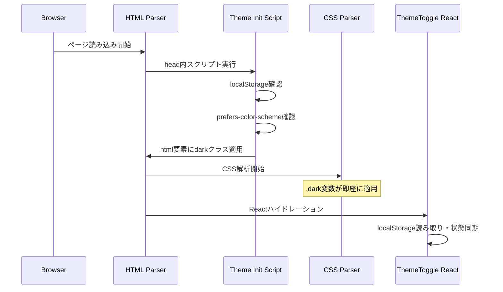
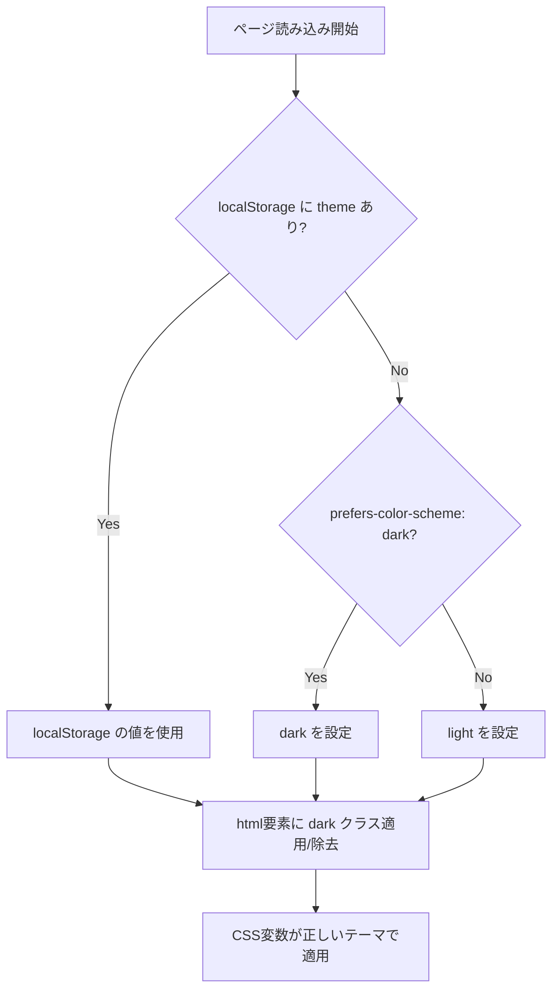

# Design Document: Dark Mode Flash Fix

## Overview

**Purpose**: 本機能は、ダークモード選択時のページリロードで発生するFOUC（Flash of Unstyled Content）を解消し、シームレスなテーマ切り替え体験を提供する。

**Users**: サイト訪問者全員が対象。特にダークモードを好むユーザーが主な受益者となる。

**Impact**: 現在のテーマ適用タイミング（Reactハイドレーション後）を変更し、ページ解析段階でテーマを適用するよう改善する。

### Goals
- ダークモードリロード時のライトモードフラッシュを完全に排除
- システム設定（prefers-color-scheme）との連携を維持
- 既存のテーマ切り替え機能（ThemeToggle）との互換性を確保
- パフォーマンスへの影響を最小限に抑える

### Non-Goals
- 新しいテーマ（カスタムカラースキーム）の追加
- テーマ切り替えアニメーションの実装
- サーバーサイドでのテーマ永続化

## Architecture

### Existing Architecture Analysis

現在の実装:
- `ThemeToggle.tsx`: Reactコンポーネントとして実装、`client:load`でハイドレーション
- `globals.css`: `:root`（ライト）と`.dark`（ダーク）でCSS変数を定義
- `BaseLayout.astro`: `<html>`要素にテーマクラスなし（初期状態）

**問題点**: ThemeToggleの`useEffect`がハイドレーション後に実行されるため、ページレンダリング開始からテーマ適用までの間にライトモードのスタイルが表示される。

### Architecture Pattern & Boundary Map



**Architecture Integration**:
- Selected pattern: Astroコンポーネントとして分離したインラインスクリプト（Astro推奨パターン）
- Domain/feature boundaries: テーマ初期化ロジックを専用Astroコンポーネント（`ThemeInit.astro`）に分離、Reactコンポーネントは切り替えUIのみ担当
- Existing patterns preserved: localStorageキー（`"theme"`）、クラス名（`.dark`）、CSS変数構造
- New components rationale: `ThemeInit.astro`はテーマ初期化ロジックを1ファイルに集約し、保守性を向上
- Steering compliance: 外部依存なし、最小限のコード変更、コンポーネント分離による可読性確保

### Technology Stack

| Layer | Choice / Version | Role in Feature | Notes |
|-------|------------------|-----------------|-------|
| Frontend | Astro 5.x | インラインスクリプトホスト | `is:inline`ディレクティブ使用 |
| Frontend | React 18 | テーマ切り替えUI | 既存ThemeToggle維持 |
| Data / Storage | localStorage | テーマ設定永続化 | キー: `"theme"` |

## System Flows

### テーマ初期化フロー



**Key Decisions**:
- localStorageを最優先とし、ユーザー設定を尊重
- システム設定はフォールバックとして機能
- クラス操作は`document.documentElement`に対して行う

## Requirements Traceability

| Requirement | Summary | Components | Interfaces | Flows |
|-------------|---------|------------|------------|-------|
| 1.1 | CSS解析前にテーマ読み取り・適用 | ThemeInit.astro | - | テーマ初期化フロー |
| 1.2 | ダークモード時にライトモード色を表示しない | ThemeInit.astro | - | テーマ初期化フロー |
| 1.3 | head内でブロッキング実行 | BaseHead.astro, ThemeInit.astro | - | - |
| 2.1 | localStorage未設定時にprefers-color-scheme参照 | ThemeInit.astro | - | テーマ初期化フロー |
| 2.2 | システム設定ダーク時にダークモード適用 | ThemeInit.astro | - | テーマ初期化フロー |
| 2.3 | システム設定ライト時にライトモード適用 | ThemeInit.astro | - | テーマ初期化フロー |
| 3.1 | テーマ切り替えボタンの即座の切り替え | ThemeToggle | ThemeToggleProps | - |
| 3.2 | 切り替え時にlocalStorageに保存 | ThemeToggle | - | - |
| 3.3 | 初期化スクリプトとの状態同期 | ThemeToggle | - | - |
| 4.1 | 最小限のコード（100行未満） | ThemeInit.astro | - | - |
| 4.2 | 外部依存なし | ThemeInit.astro | - | - |
| 4.3 | FCPへの影響最小化 | ThemeInit.astro | - | - |

## Components and Interfaces

| Component | Domain/Layer | Intent | Req Coverage | Key Dependencies | Contracts |
|-----------|--------------|--------|--------------|------------------|-----------|
| ThemeInit.astro | Astro/Component | テーマ初期化ロジックをカプセル化 | 1.1, 1.2, 1.3, 2.1, 2.2, 2.3, 4.1, 4.2, 4.3 | localStorage, prefers-color-scheme (P0) | State |
| BaseHead.astro | Astro/Layout | ThemeInit.astroをインポート | 1.3 | ThemeInit.astro (P0) | - |
| ThemeToggle | React/UI | テーマ切り替えUIとlocalStorage更新 | 3.1, 3.2, 3.3 | localStorage (P0) | State |

### Astro / Component Layer

#### ThemeInit.astro（新規作成）

| Field | Detail |
|-------|--------|
| Intent | テーマ初期化ロジックを専用Astroコンポーネントとしてカプセル化し、`is:inline`スクリプトを提供 |
| Requirements | 1.1, 1.2, 1.3, 2.1, 2.2, 2.3, 4.1, 4.2, 4.3 |
| File Path | `src/components/ThemeInit.astro` |

**Responsibilities & Constraints**
- テーマ初期化ロジックを1ファイルに集約
- `<script is:inline>`を内包し、インポート先で`<head>`内に配置される
- 外部モジュールに依存しない
- 100行未満、500バイト未満を目標

**Dependencies**
- Inbound: BaseHead.astro — コンポーネントとしてインポート (P0)
- Outbound: なし
- External: localStorage API、matchMedia API (P0)

**Contracts**: State [x]

##### State Management
- State model:
  - 入力: `localStorage.getItem("theme")` → `"light" | "dark" | null`
  - 入力: `window.matchMedia("(prefers-color-scheme: dark)").matches` → `boolean`
  - 出力: `document.documentElement.classList` → `.dark`の追加/削除
- Persistence & consistency: localStorageの値が存在すればそれを優先、なければシステム設定を使用
- Concurrency strategy: 単一スクリプト実行、競合なし

**Implementation Notes**
- Integration: `BaseHead.astro`の最上部で`<ThemeInit />`としてインポート・使用
- Validation: localStorageの値が`"light"`または`"dark"`以外の場合はシステム設定にフォールバック
- Risks: localStorageアクセスがブロックされた場合（プライベートブラウジング等）は例外をキャッチしシステム設定を使用

**コンポーネント構造例**:
```astro
---
// src/components/ThemeInit.astro
// フロントマター部分は空（ロジックはクライアントサイドのみ）
---
<script is:inline>
  (function() {
    try {
      const stored = localStorage.getItem("theme");
      const theme = stored === "dark" || stored === "light"
        ? stored
        : (window.matchMedia("(prefers-color-scheme: dark)").matches ? "dark" : "light");
      document.documentElement.classList.toggle("dark", theme === "dark");
    } catch (e) {
      // localStorageアクセス不可時はシステム設定を使用
      if (window.matchMedia("(prefers-color-scheme: dark)").matches) {
        document.documentElement.classList.add("dark");
      }
    }
  })();
</script>
```

### React / UI Layer

#### ThemeToggle（変更）

| Field | Detail |
|-------|--------|
| Intent | テーマ切り替えボタンの提供とlocalStorageへの設定保存 |
| Requirements | 3.1, 3.2, 3.3 |

**Responsibilities & Constraints**
- 現在のテーマ状態をUIに反映
- クリック時にテーマを切り替え、localStorageに保存
- 初期化スクリプトで設定されたDOM状態と同期

**Dependencies**
- Inbound: Header.astro — テーマ切り替えボタンとして使用 (P0)
- Outbound: なし
- External: localStorage API (P0)

**Contracts**: State [x]

##### State Management
- State model:
  - `theme: "light" | "dark"` — 現在のテーマ状態
  - 初期値: `document.documentElement.classList.contains("dark")` または localStorage から取得
- Persistence & consistency: 変更時にlocalStorageへ保存、DOMクラスを更新
- Concurrency strategy: Reactの状態管理で一貫性を保証

**Implementation Notes**
- Integration: 既存のThemeToggleの初期化ロジックを調整し、DOM状態からの読み取りを追加
- Validation: 不正な値は無視し、システム設定にフォールバック
- Risks: ハイドレーション時の状態不整合 — DOM状態を信頼することで回避

## Data Models

### Domain Model

シンプルな値オブジェクトのみ:

```typescript
type Theme = "light" | "dark";

interface ThemePreference {
  stored: Theme | null;      // localStorageの値
  system: Theme;             // prefers-color-schemeの値
  resolved: Theme;           // 最終的に適用するテーマ
}
```

**Business Rules**:
- `stored`が存在すればそれを使用
- `stored`がnullの場合は`system`を使用

## Error Handling

### Error Strategy

テーマ初期化は失敗しても致命的ではないため、グレースフルデグラデーションを採用。

### Error Categories and Responses

**User Errors (4xx)**: 該当なし

**System Errors (5xx)**:
- localStorage アクセス不可 → `try-catch`でキャッチし、システム設定を使用
- matchMedia 未サポート → ライトモードをデフォルトとして使用

**Business Logic Errors (422)**: 該当なし

### Monitoring

- エラーログ: ブラウザコンソールへの警告出力（開発時のみ）
- ヘルスモニタリング: 不要（クライアントサイドのみ）

## Testing Strategy

### Unit Tests
- `getResolvedTheme`: localStorage値とシステム設定の組み合わせテスト
- `applyTheme`: DOMクラス操作の検証

### Integration Tests
- ThemeInitScript + ThemeToggle: 初期化後の状態同期
- ページリロード時のテーマ永続化

### E2E Tests
- ダークモード設定 → ページリロード → フラッシュなし確認
- システム設定変更時の初回訪問テスト
- テーマ切り替え → リロード → 設定維持確認

### Performance Tests
- スクリプト実行時間: < 5ms目標
- FCPへの影響: < 10ms増加を許容
