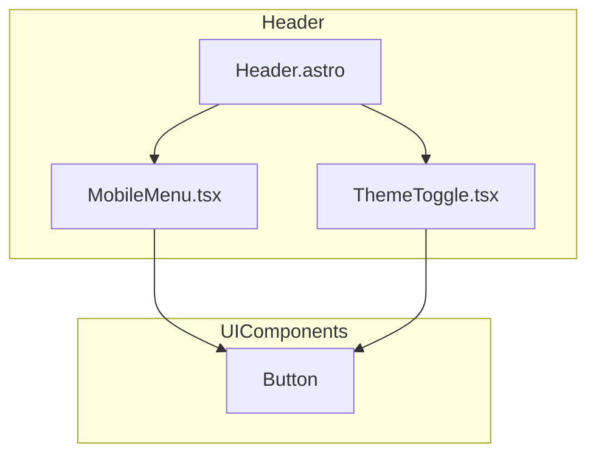
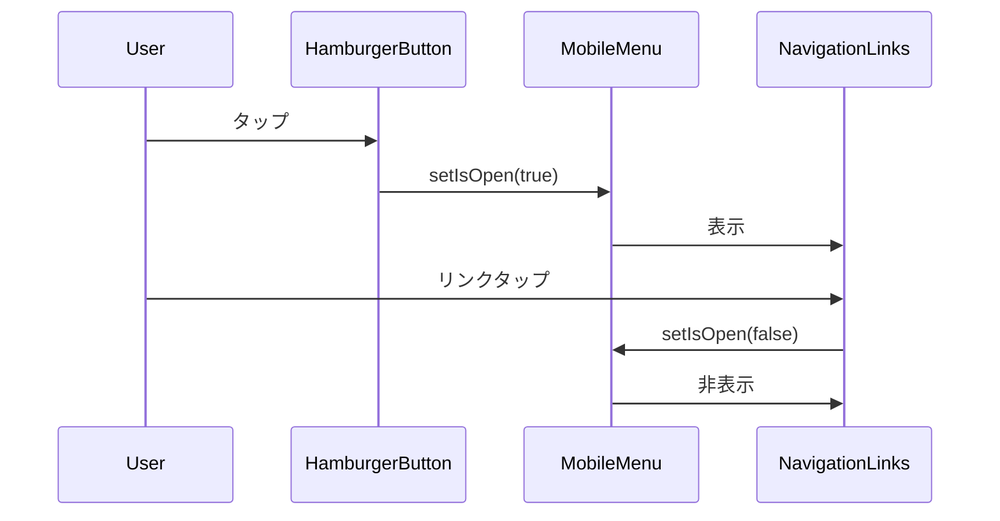

# Design Document: fix-mobile-header-layout

## Overview
**Purpose**: モバイル端末でのヘッダー表示崩れを修正し、レスポンシブなナビゲーション体験を提供する。

**Users**: モバイルデバイスからブログを閲覧するユーザーが、画面サイズに適したナビゲーションを利用できる。

**Impact**: 既存のHeader.astroを拡張し、768px未満の画面幅でハンバーガーメニューに切り替える。

### Goals
- モバイル画面でヘッダーがコンテナ幅を超えない
- ハンバーガーメニューによる直感的なナビゲーション
- デスクトップ表示の既存動作を維持
- アクセシビリティ要件（ARIA属性、キーボード操作）の充足

### Non-Goals
- ナビゲーション項目の追加・変更
- メガメニューやサブメニュー機能
- PWA対応やオフライン機能

## Architecture

### Existing Architecture Analysis
- **現在のパターン**: Astroコンポーネント + Reactアイランド（ThemeToggle）
- **ドメイン境界**: UIコンポーネントは`src/components/`に集約
- **維持すべき統合ポイント**: navItems配列、ThemeToggleの配置
- **対処する技術的課題**: 横一列ナビゲーションのオーバーフロー

### Architecture Pattern & Boundary Map



**Architecture Integration**:
- **Selected pattern**: Astro Islands（既存パターン踏襲）
- **Domain boundaries**: MobileMenuはナビゲーション状態のみ管理、ThemeToggleとは独立
- **Existing patterns preserved**: client:load、Buttonコンポーネント再利用
- **New components rationale**: MobileMenuはモバイル固有のUI/状態管理を担当

### Technology Stack

| Layer | Choice / Version | Role in Feature | Notes |
|-------|------------------|-----------------|-------|
| Frontend | Astro + React | コンポーネント構成 | 既存 |
| Styling | Tailwind CSS v4 | レスポンシブスタイル | `md:`ブレークポイント使用 |
| UI Library | Button (CVA) | ハンバーガーボタン | ghost variant, icon size |

## System Flows



## Requirements Traceability

| Requirement | Summary | Components | Interfaces | Flows |
|-------------|---------|------------|------------|-------|
| 1.1 | 768px未満でハンバーガー表示 | Header.astro, MobileMenu | - | - |
| 1.2 | メニュー展開 | MobileMenu | MobileMenuProps | Menu Toggle |
| 1.3 | リンクタップでメニュー閉じる | MobileMenu | onNavigate | Menu Toggle |
| 1.4 | メニュー外タップで閉じる | MobileMenu | useClickOutside | Menu Toggle |
| 1.5 | コンテナ幅超過防止 | Header.astro | - | - |
| 2.1 | デスクトップで水平表示 | Header.astro | - | - |
| 2.2 | デスクトップでハンバーガー非表示 | Header.astro | - | - |
| 2.3 | 既存スタイル維持 | Header.astro | - | - |
| 3.1 | aria-label | MobileMenu | aria-label | - |
| 3.2 | aria-expanded | MobileMenu | aria-expanded | - |
| 3.3 | キーボード操作 | MobileMenu | onKeyDown | - |
| 4.1 | アニメーション300ms以内 | MobileMenu | CSS transition | - |

## Components and Interfaces

| Component | Domain/Layer | Intent | Req Coverage | Key Dependencies | Contracts |
|-----------|--------------|--------|--------------|------------------|-----------|
| Header.astro | UI/Layout | レスポンシブヘッダーレイアウト | 1.1, 1.5, 2.1-2.3 | MobileMenu (P0), ThemeToggle (P0) | - |
| MobileMenu.tsx | UI/Navigation | モバイルメニュー状態管理・表示 | 1.2-1.4, 3.1-3.3, 4.1 | Button (P1) | State |

### UI Layer

#### Header.astro

| Field | Detail |
|-------|--------|
| Intent | レスポンシブナビゲーションのレイアウト制御 |
| Requirements | 1.1, 1.5, 2.1, 2.2, 2.3 |

**Responsibilities & Constraints**
- モバイル/デスクトップ表示の切り替え（Tailwind `md:`）
- navItems配列の管理
- MobileMenuとThemeToggleの配置

**Dependencies**
- Outbound: MobileMenu — モバイルナビゲーション (P0)
- Outbound: ThemeToggle — テーマ切替 (P0)

**Contracts**: State [ ]

**Implementation Notes**
- デスクトップナビゲーションは`hidden md:flex`で表示制御
- ハンバーガーボタンは`md:hidden`で非表示

#### MobileMenu.tsx

| Field | Detail |
|-------|--------|
| Intent | モバイルメニューの開閉状態管理とUI表示 |
| Requirements | 1.2, 1.3, 1.4, 3.1, 3.2, 3.3, 4.1 |

**Responsibilities & Constraints**
- メニュー開閉状態（isOpen）の管理
- メニュー外クリック検出（documentへのイベントリスナー方式）
- キーボードイベントハンドリング（Escape）
- アクセシビリティ属性の管理

**Dependencies**
- Inbound: Header.astro — navItems props (P0)
- Outbound: Button — UI表示 (P1)

**Contracts**: State [x]

##### State Management
```typescript
interface NavItem {
  href: string;
  label: string;
  external?: boolean;
}

interface MobileMenuProps {
  navItems: NavItem[];
}

// Internal state
const [isOpen, setIsOpen] = useState(false);
```

- **State model**: isOpen boolean
- **Persistence**: なし（揮発性）
- **Concurrency strategy**: 単一コンポーネント内で完結

**Implementation Notes**
- Integration: `client:load`でハイドレーション
- Validation: navItemsは親から受け取り、バリデーション不要
- Risks: ハイドレーション前はボタンが動作しない（許容）

## Testing Strategy

### Unit Tests
- MobileMenu: isOpen状態のトグル動作
- MobileMenu: Escapeキーでメニュー閉じる
- MobileMenu: aria-expanded属性の同期

### E2E Tests (Playwright)
- モバイルビューポートでハンバーガーメニュー表示確認
- メニュー開閉アニメーション動作確認
- デスクトップビューポートで水平ナビ表示確認
- リンククリック後のメニュー自動閉じ
