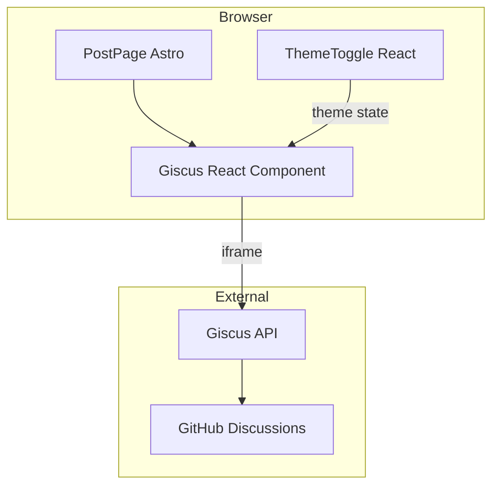
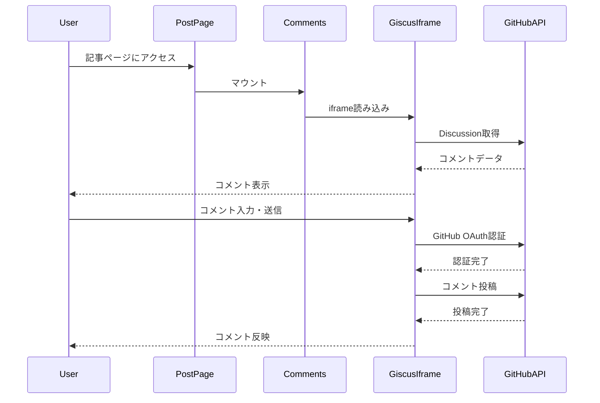
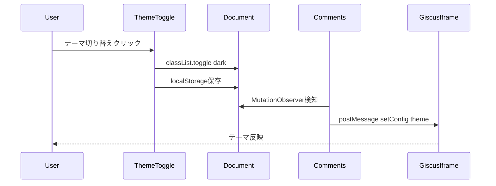

# Design Document: giscus-comments

## Overview

**Purpose**: Astro製技術ブログにGiscus（GitHub Discussions連携）コメント機能を導入し、読者がGitHub認証でMarkdown対応のコメントを投稿できるようにする。

**Users**: ブログ読者（コメント閲覧・投稿）、ブログ管理者（コメント管理、設定）

**Impact**: 記事詳細ページ（`[...slug].astro`）にコメントセクションを追加。GitHub Discussionsを外部データストアとして利用。

### Goals
- 全記事にGiscusコメント欄を表示
- サイトのダークモード切り替えとGiscusテーマを連動
- `docs/architecture/comment_architecture.md` に意思決定ログを出力

### Non-Goals
- 匿名コメント機能（GitHub認証必須）
- コメントのローカルキャッシュ
- コメント通知機能（GitHub側の機能を利用）

## Architecture

### Existing Architecture Analysis
- **現行パターン**: Astro + React Islands Architecture
- **テーマ管理**: `ThemeToggle.tsx` が `localStorage` と `classList.toggle("dark")` で管理
- **記事ページ**: `src/pages/posts/[...slug].astro` が記事詳細を表示
- **維持すべき統合点**: View Transitions対応（`astro:page-load` イベント）

### Architecture Pattern & Boundary Map



**Architecture Integration**:
- **Selected pattern**: React Islands（既存パターン継承）
- **Domain boundaries**: コメント機能は独立したReactコンポーネントとして分離
- **Existing patterns preserved**: `client:only="react"` ディレクティブ、Tailwind CSS変数
- **New components**: `Comments.tsx`（Giscusラッパー）
- **Steering compliance**: 既存のReact統合パターンに従う

### Technology Stack

| Layer | Choice / Version | Role in Feature | Notes |
|-------|------------------|-----------------|-------|
| Frontend | `@giscus/react` ^3.1.0 | Giscus Reactコンポーネント | 新規追加 |
| Frontend | Astro 5 | ページレンダリング | 既存 |
| Frontend | React 19 | コンポーネントランタイム | 既存 |
| Data / Storage | GitHub Discussions | コメントデータ永続化 | 外部サービス |
| Configuration | `.env` + `PUBLIC_*` | Giscus設定管理 | 新規追加 |

### Configuration Management

Giscus設定は環境変数で管理する。Astroの `PUBLIC_` プレフィックス付き環境変数はクライアントサイドで利用可能。

**環境変数定義** (`.env`):
```bash
PUBLIC_GISCUS_REPO=KJR020/kjr020.github.io
PUBLIC_GISCUS_REPO_ID=<giscus.appで取得>
PUBLIC_GISCUS_CATEGORY=Comments
PUBLIC_GISCUS_CATEGORY_ID=<giscus.appで取得>
```

**利用方法** (Astroコンポーネント):
```astro
<Comments
  repo={import.meta.env.PUBLIC_GISCUS_REPO}
  repoId={import.meta.env.PUBLIC_GISCUS_REPO_ID}
  category={import.meta.env.PUBLIC_GISCUS_CATEGORY}
  categoryId={import.meta.env.PUBLIC_GISCUS_CATEGORY_ID}
  client:only="react"
/>
```

**注意**: `repoId` と `categoryId` は [giscus.app](https://giscus.app) の設定ツールで取得する。

## System Flows

### コメント表示・投稿フロー



### テーマ切り替えフロー



## Requirements Traceability

| Requirement | Summary | Components | Interfaces | Flows |
|-------------|---------|------------|------------|-------|
| 1.1 | Giscusウィジェット表示 | Comments | GiscusProps | コメント表示フロー |
| 1.2 | 記事とDiscussion紐づけ | Comments | mapping=pathname | - |
| 1.3 | 既存コメント取得 | Comments, Giscus | - | コメント表示フロー |
| 2.1 | コメント投稿 | Comments, Giscus | - | コメント表示フロー |
| 2.2 | Markdownサポート | Giscus（外部） | - | - |
| 2.3 | GitHub認証促進 | Giscus（外部） | - | - |
| 3.1, 3.2 | テーマ適用 | Comments | theme prop | テーマ切り替えフロー |
| 3.3 | テーマ動的切り替え | Comments | MutationObserver | テーマ切り替えフロー |
| 4.1, 4.2, 4.3 | GitHub設定 | - | - | 手動セットアップ |
| 5.1, 5.2 | 意思決定ドキュメント | - | - | ビルド時生成 |

## Components and Interfaces

| Component | Domain/Layer | Intent | Req Coverage | Key Dependencies | Contracts |
|-----------|--------------|--------|--------------|------------------|-----------|
| Comments | UI/React | Giscusウィジェットをラップしテーマ連動を管理 | 1.1-1.3, 2.1, 3.1-3.3 | @giscus/react (P0) | State |
| comment_architecture.md | Docs | 意思決定ログを記録 | 5.1, 5.2 | - | - |

### UI Layer

#### Comments

| Field | Detail |
|-------|--------|
| Intent | Giscusウィジェットをラップし、サイトテーマと連動させる |
| Requirements | 1.1, 1.2, 1.3, 2.1, 3.1, 3.2, 3.3 |

**Responsibilities & Constraints**
- Giscus Reactコンポーネントの設定とレンダリング
- サイトテーマ変更の監視とGiscusテーマの同期
- 記事ページでのみ使用（`client:only="react"`）

**Dependencies**
- External: `@giscus/react` — Giscusウィジェット (P0)
- Inbound: PostPage — コンポーネントマウント (P0)

**Contracts**: State [x]

##### State Management
```typescript
interface CommentsProps {
  // Giscus設定（環境変数から注入）
  repo: `${string}/${string}`;
  repoId: string;
  category: string;
  categoryId: string;
}

interface CommentsState {
  theme: "light" | "dark";
}
```

- **State model**: `theme` はサイトの現在テーマを追跡
- **Persistence**: なし（DOMから取得）
- **Concurrency**: MutationObserverで変更を監視

**Implementation Notes**
- Integration: `document.documentElement.classList.contains("dark")` で初期テーマ判定
- Validation: Giscus設定パラメータは必須、未設定時はコンポーネント非表示
- Risks: View Transitions時の再マウント → `astro:page-load` イベントで対応

## Data Models

### Domain Model

本機能ではアプリケーション内にデータモデルを持たない。コメントデータはGitHub Discussionsに保存され、Giscusが管理する。

**External Data Flow**:
- 記事パス → Giscus API → GitHub Discussions（Discussion検索/作成）
- コメントデータ → GitHub Discussions → Giscus API → iframe表示

### Configuration Model

```typescript
// Giscus設定（giscus.appで生成）
interface GiscusConfig {
  repo: `${string}/${string}`;        // "KJR020/kjr020.github.io"
  repoId: string;                     // GraphQL ID
  category: string;                   // "Comments"
  categoryId: string;                 // GraphQL ID
  mapping: "pathname" | "url" | "title" | "og:title";
  reactionsEnabled: "1" | "0";
  emitMetadata: "0" | "1";
  inputPosition: "top" | "bottom";
  theme: string;                      // "light", "dark", etc.
  lang: string;                       // "ja"
  loading: "lazy" | "eager";
}
```

## Error Handling

### Error Strategy
Giscusは外部サービスのため、エラーはiframe内で処理される。アプリケーション側での追加処理は最小限。

### Error Categories and Responses
- **Network Error**: Giscus API接続失敗 → iframe内でリトライUI表示
- **Auth Error**: GitHub認証失敗 → Giscusが再認証を促進
- **Config Error**: 設定不備 → コンポーネント非表示 + コンソールログ

### Monitoring
- Giscus読み込み失敗はブラウザコンソールで確認
- GitHub Discussions APIのレート制限はGitHub側で管理

## Testing Strategy

### Unit Tests
- `Comments` コンポーネントの初期テーマ判定ロジック
- MutationObserverのセットアップ/クリーンアップ

### Integration Tests
- テーマ切り替え時のGiscusテーマ同期
- View Transitions後のコンポーネント再マウント

### E2E Tests
- 記事ページでGiscus iframeが表示される
- ダークモード切り替えでiframeテーマが変わる

## Optional Sections

### Security Considerations
- Giscus iframeは `giscus.app` ドメインから読み込み（CORS制限）
- GitHub OAuth認証はGiscus側で処理（トークンはアプリに渡らない）
- CSP設定: `frame-src https://giscus.app` を許可

### Performance & Scalability
- `loading="lazy"` で遅延読み込み（Viewport外では読み込まない）
- iframe分離によりメインスレッドへの影響は最小
- GitHub APIレート制限: 認証ユーザー5000req/h、非認証60req/h
