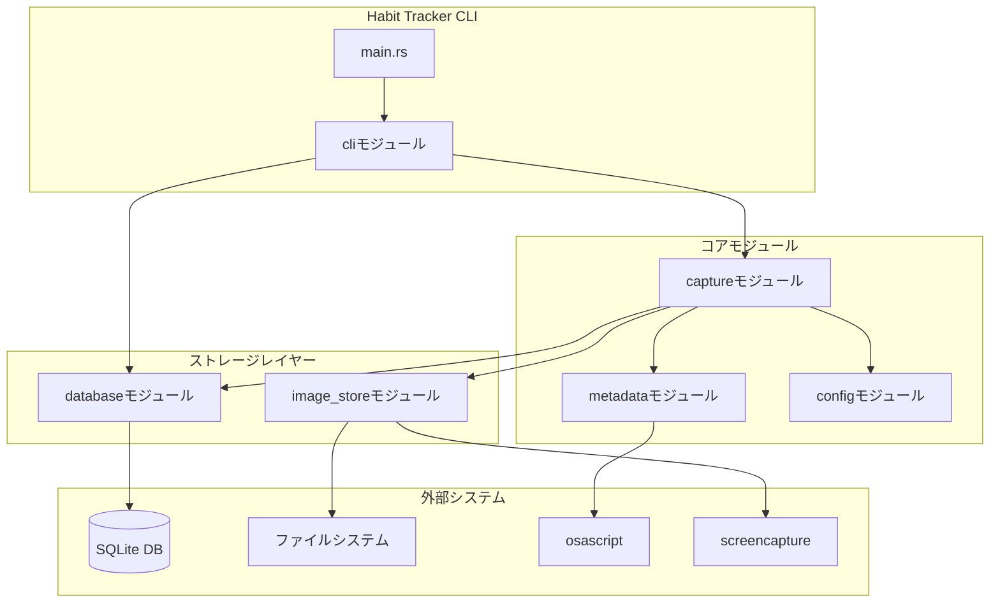
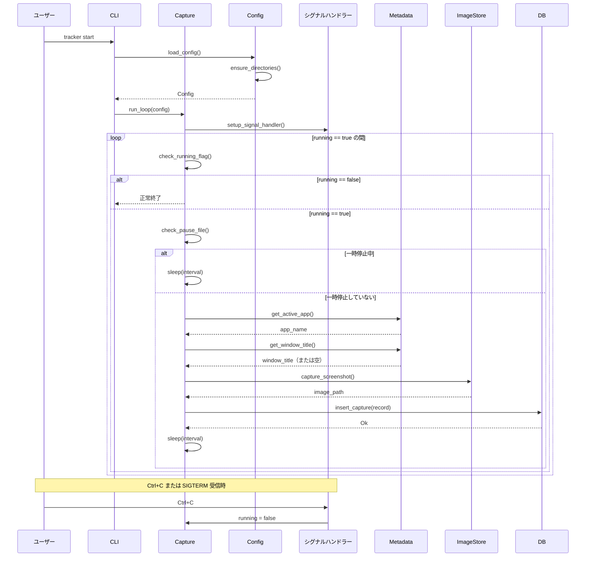
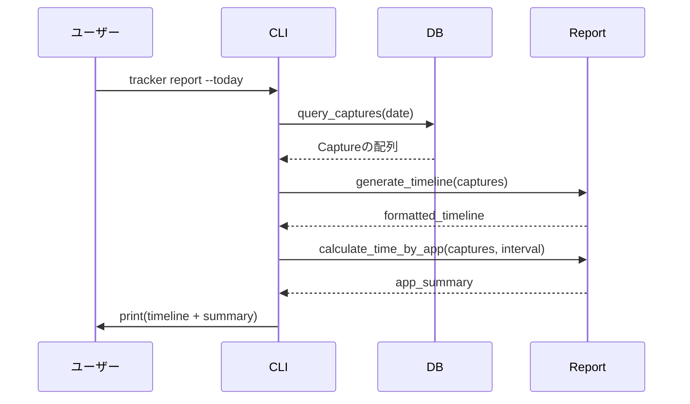
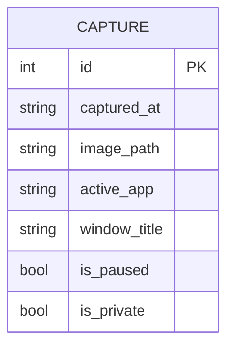

# 設計ドキュメント: Habit Tracker MVP

## 概要

**目的**: この機能は、手動ログなしで日々の作業パターンを把握したいmacOSユーザー向けに、自動化された作業活動トラッキングを提供します。

**ユーザー**: 主にmacOSで作業し、アプリケーション使用状況の一日の終わりの可視化を求める個人の生産性向上愛好家やセルフトラッカー。

**影響**: 定期的にスクリーンショットをキャプチャし、アクティブなアプリケーションのメタデータを記録し、すべてのデータをSQLiteに保存して後で分析・レポート作成できる新しいローカルファーストのトラッキングシステムを作成します。

### 目標
- 設定可能な間隔（デフォルト60秒）での自動スクリーンショットキャプチャ
- AppleScript経由でのアクティブアプリケーションとウィンドウタイトルの検出
- すべてのキャプチャメタデータの信頼性の高いローカルSQLiteストレージ
- 開始/一時停止/再開/レポート操作のためのシンプルなCLI
- 日次タイムラインとアプリ別時間サマリーレポート

### 非目標
- クラウド同期やマルチデバイスサポート
- リアルタイムのアクティビティ分類（v1で計画）
- スクリーンショットからのOCRテキスト抽出（v1で計画）
- GUIインターフェース（MVPではCLIのみ）
- ビデオ/連続画面録画

## アーキテクチャ

### アーキテクチャパターンと境界マップ

**選択されたパターン**: モジュラー内部構造を持つシングルバイナリCLI

アプリケーションは2つの目的を果たす単一のRustバイナリです：
1. **キャプチャデーモン**: キャプチャループを実行する長時間実行フォアグラウンドプロセス
2. **CLIコントローラー**: デーモンを制御（一時停止/再開）し、データをクエリ（レポート）するコマンド



**アーキテクチャ統合**:
- 選択されたパターン: モジュラーモノリス — 明確な内部モジュール境界を持つ単一バイナリ
- ドメイン/機能境界: キャプチャループ、メタデータ収集、ストレージ、レポートは別々のモジュールに分離
- 新しいコンポーネントの根拠: 各モジュールは単一の責任をカプセル化（SRP）
- ステアリング準拠: 外部サービス依存のないローカルファースト設計

### 技術スタック

| レイヤー | 選択 / バージョン | 機能での役割 | 備考 |
|---------|------------------|--------------|------|
| ランタイム | Rust stable | シングルバイナリCLIアプリケーション | 外部ランタイム不要 |
| CLI | clap 4.x | deriveマクロによるコマンド解析 | サブコマンド: start, pause, resume, report |
| データベース | rusqlite 0.32.x | SQLiteバインディング | 信頼性のためWALモード |
| 日時 | chrono 0.4.x | ISO-8601タイムスタンプ、日付解析 | ローカルタイムゾーン処理 |
| 設定 | serde + toml | TOML設定ファイル解析 | ~/.habit-tracker/config.toml |
| ロギング | tracing + tracing-subscriber | 構造化ログ | ファイルとコンソール出力 |
| エラー処理 | thiserror + anyhow | 型安全なエラー | ライブラリにthiserror、mainにanyhow |
| シグナル処理 | ctrlc 3.x | グレースフルシャットダウン | Ctrl+C/SIGTERMハンドリング |
| macOS統合 | std::process::Command | osascript、screencaptureの実行 | シェルコマンド実行 |

## システムフロー

### キャプチャループフロー



**主な決定事項**:
- 一時停止チェックは各サイクルの開始時に行い、再開時のレイテンシを最小化
- メタデータ収集はスクリーンショットの前に行い、一貫したタイムスタンプを確保
- データベース挿入は最後のステップ; 失敗した場合、キャプチャはログに記録されるがリトライされない
- **Config::load()でディレクトリの初期化を実行**（初回セットアップ）
- **Ctrl+C/SIGTERM受信時は現在のサイクル完了後に優雅に終了**（ctrlcクレート使用）

### レポート生成フロー



## 要件トレーサビリティ

| 要件 | 概要 | コンポーネント | インターフェース | フロー |
|------|------|---------------|-----------------|--------|
| 1.1 | キャプチャループの開始 | Capture, Config | CaptureLoop::run | キャプチャループ |
| 1.2 | screencaptureによるスクリーンショット | ImageStore | ImageStore::capture | キャプチャループ |
| 1.3 | AppleScriptによるアクティブアプリ取得 | Metadata | Metadata::get_active_app | キャプチャループ |
| 1.4 | AppleScriptによるウィンドウタイトル取得 | Metadata | Metadata::get_window_title | キャプチャループ |
| 1.5 | ウィンドウタイトルの優雅なフォールバック | Metadata | エラー処理 | キャプチャループ |
| 1.6 | SQLiteへのキャプチャ保存 | Database | Database::insert_capture | キャプチャループ |
| 2.1 | 一時停止フラグの作成 | PauseControl | PauseControl::pause | CLI |
| 2.2 | 一時停止中のキャプチャスキップ | Capture | Capture::check_pause | キャプチャループ |
| 2.3 | 一時停止フラグの削除 | PauseControl | PauseControl::resume | CLI |
| 2.4 | 一時停止解除後のキャプチャ再開 | Capture | Capture::check_pause | キャプチャループ |
| 2.5 | 一時停止中も継続実行 | Capture | メインループ | キャプチャループ |
| 3.1 | SQLiteデータベースストレージ | Database | Database::new | 全体 |
| 3.2 | 日付別画像ディレクトリ | ImageStore | ImageStore::get_path | キャプチャループ |
| 3.3 | キャプチャレコードスキーマ | Database | CaptureRecord | 全体 |
| 3.4 | captured_atへのインデックス | Database | スキーママイグレーション | 初期化 |
| 3.5 | データベースエラーのログ | Database | エラーログ | 全体 |
| 4.1 | 日付別レポート | Report, Database | Report::by_date | レポート |
| 4.2 | 今日のレポート | Report, Database | Report::today | レポート |
| 4.3 | タイムライン表示 | Report | Report::timeline | レポート |
| 4.4 | アプリ別時間計算 | Report | Report::time_by_app | レポート |
| 4.5 | 空の日付の処理 | Report | レポートフォーマット | レポート |
| 5.1 | 設定ファイルの読み込み | Config | Config::load | 初期化 |
| 5.2 | 設定オプション | Config | Config構造体 | 全体 |
| 5.3 | デフォルト値 | Config | Config::default | 初期化 |
| 5.4 | CLIが設定を上書き | Config, CLI | 引数マージ | 初期化 |
| 6.1-6.6 | CLIコマンド | CLI | clapサブコマンド | 全体 |

## コンポーネントとインターフェース

| コンポーネント | ドメイン/レイヤー | 目的 | 要件カバレッジ | 主な依存関係 | コントラクト |
|---------------|------------------|------|---------------|-------------|-------------|
| cli | インターフェース | CLIコマンドの解析とディスパッチ | 6.1-6.6 | clap (P0), 全モジュール (P1) | Service |
| config | コア | 設定の読み込みとマージ | 5.1-5.4 | serde, toml (P0) | Service |
| capture | コア | キャプチャループの実行 | 1.1-1.6, 2.2, 2.4, 2.5 | metadata (P0), image_store (P0), database (P0), config (P0) | Service |
| metadata | コア | アクティブアプリとウィンドウタイトルの収集 | 1.3-1.5 | std::process (P0) | Service |
| image_store | ストレージ | スクリーンショットのキャプチャと保存 | 1.2, 3.2 | std::process (P0), std::fs (P0) | Service |
| database | ストレージ | SQLite操作 | 3.1, 3.3-3.5, 4.1-4.5 | rusqlite (P0) | Service |
| pause_control | コア | ファイルベースの一時停止メカニズム | 2.1-2.3 | std::fs (P0) | Service |
| report | コア | タイムラインとサマリーの生成 | 4.1-4.5 | database (P0) | Service |

### コアレイヤー

#### config

| フィールド | 詳細 |
|-----------|------|
| 目的 | ファイルとCLI引数から設定を読み込む |
| 要件 | 5.1, 5.2, 5.3, 5.4 |

**責任と制約**
- ~/.habit-tracker/config.tomlからTOML設定ファイルを解析
- CLI引数とファイル設定をマージ（CLIが優先）
- 設定ファイルがない場合は適切なデフォルト値を提供
- **初回起動時に必要なディレクトリを自動作成**（images_dir、db_pathの親ディレクトリ）

**依存関係**
- 外部: serde, toml — 設定解析 (P0)

**コントラクト**: Service [x]

##### サービスインターフェース
```rust
pub struct Config {
    pub interval_seconds: u64,
    pub jpeg_quality: u8,
    pub db_path: PathBuf,
    pub images_dir: PathBuf,
    pub pause_file: PathBuf,
}

impl Config {
    /// ファイルとCLI引数から設定を読み込む
    /// CLI引数がファイル値を上書き; 欠損値にはデフォルトを使用
    /// 内部でensure_directories()を呼び出し、必要なディレクトリを作成
    pub fn load(cli_args: &CliArgs) -> Result<Self, ConfigError>;

    /// デフォルト設定を返す
    pub fn default() -> Self;

    /// 必要なディレクトリを作成（初回セットアップ）
    /// - images_dir: スクリーンショット保存ディレクトリ
    /// - db_pathの親ディレクトリ: データベースファイル用
    /// - pause_fileの親ディレクトリ: 一時停止フラグ用
    fn ensure_directories(&self) -> Result<(), std::io::Error>;
}

pub enum ConfigError {
    IoError(std::io::Error),
    ParseError(toml::de::Error),
    DirectoryCreationError(std::io::Error),
}
```

- **事前条件**: なし（欠損ファイルを優雅に処理）
- **事後条件**: すべてのフィールドが設定された有効なConfigを返す。必要なディレクトリが存在する。
- **不変条件**: interval_seconds > 0, jpeg_qualityは0..=100の範囲

#### capture

| フィールド | 詳細 |
|-----------|------|
| 目的 | メインキャプチャループを実行 |
| 要件 | 1.1, 1.2, 1.3, 1.4, 1.5, 1.6, 2.2, 2.4, 2.5 |

**責任と制約**
- 設定可能なスリープ間隔で無限ループを実行
- 各キャプチャサイクル前に一時停止状態をチェック
- メタデータ収集、スクリーンショットキャプチャ、データベース挿入を調整
- クラッシュせずにエラーを優雅に処理
- **Ctrl+C/SIGTERMシグナルを受信したら現在のサイクル完了後に優雅に終了**

**依存関係**
- インバウンド: cli — キャプチャループを開始 (P0)
- アウトバウンド: metadata — アクティブアプリ/ウィンドウを取得 (P0)
- アウトバウンド: image_store — スクリーンショットをキャプチャ (P0)
- アウトバウンド: database — キャプチャレコードを保存 (P0)
- アウトバウンド: pause_control — 一時停止状態をチェック (P0)
- 外部: ctrlc — シグナルハンドリング (P0)

**コントラクト**: Service [x]

##### サービスインターフェース
```rust
use std::sync::atomic::{AtomicBool, Ordering};
use std::sync::Arc;

pub struct CaptureLoop {
    config: Config,
    db: Database,
    metadata: Metadata,
    image_store: ImageStore,
    pause_control: PauseControl,
    running: Arc<AtomicBool>,  // シグナルハンドラーと共有
}

impl CaptureLoop {
    pub fn new(config: Config) -> Result<Self, CaptureError>;

    /// キャプチャループを実行
    /// Ctrl+C/SIGTERMを受信すると現在のサイクル完了後に優雅に終了
    /// 回復不能なエラー時のみエラーを返す
    pub fn run(&self) -> Result<(), CaptureError>;

    /// シグナルハンドラーを設定（ctrlcクレート使用）
    /// running flagをfalseにしてループを停止
    fn setup_signal_handler(&self) -> Result<(), CaptureError>;
}

pub enum CaptureError {
    DatabaseError(DatabaseError),
    ConfigError(ConfigError),
    InitializationError(String),
    SignalHandlerError(String),
}
```

**グレースフルシャットダウンの流れ**:
1. `ctrlc::set_handler`でシグナルハンドラーを登録
2. シグナル受信時に`running.store(false, Ordering::SeqCst)`を実行
3. メインループは各サイクル開始時に`running.load()`をチェック
4. falseの場合、ループを抜けて正常終了

- **事前条件**: Configが有効、データベースにアクセス可能
- **事後条件**: シグナル受信または回復不能エラーまでループを実行。シグナル受信時は現在のサイクル完了後に正常終了。
- **不変条件**: 間隔ごとに1回のキャプチャ（一時停止中はスキップ）

#### metadata

| フィールド | 詳細 |
|-----------|------|
| 目的 | AppleScript経由でアクティブアプリケーションとウィンドウメタデータを収集 |
| 要件 | 1.3, 1.4, 1.5 |

**責任と制約**
- osascriptを実行してアクティブアプリケーション名を取得
- osascriptを実行してウィンドウタイトルを取得（ベストエフォート）
- 失敗時はウィンドウタイトルとして空文字列を返す

**依存関係**
- 外部: std::process::Command — osascriptを実行 (P0)

**コントラクト**: Service [x]

##### サービスインターフェース
```rust
pub struct Metadata;

impl Metadata {
    /// 最前面のアプリケーション名を取得
    /// osascript実行が完全に失敗した場合のみエラーを返す
    pub fn get_active_app() -> Result<String, MetadataError>;

    /// 最前面のウィンドウタイトルを取得
    /// ウィンドウタイトルが取得できない場合はOk("")を返す
    pub fn get_window_title() -> Result<String, MetadataError>;
}

pub enum MetadataError {
    CommandFailed(std::io::Error),
    Utf8Error(std::string::FromUtf8Error),
}
```

- **事前条件**: System Eventsアクセスを持つmacOS
- **事後条件**: アプリケーション名を返す（アクティブアプリは空にならない）
- **不変条件**: ウィンドウタイトルの失敗はエラーではなく空文字列を返す

#### pause_control

| フィールド | 詳細 |
|-----------|------|
| 目的 | ファイルベースのフラグで一時停止状態を管理 |
| 要件 | 2.1, 2.2, 2.3 |

**責任と制約**
- キャプチャを一時停止するためのフラグファイルを作成
- キャプチャを再開するためのフラグファイルを削除
- 一時停止フラグファイルの存在をチェック

**依存関係**
- 外部: std::fs — ファイル操作 (P0)

**コントラクト**: Service [x]

##### サービスインターフェース
```rust
pub struct PauseControl {
    pause_file: PathBuf,
}

impl PauseControl {
    pub fn new(pause_file: PathBuf) -> Self;

    /// 一時停止フラグファイルを作成
    pub fn pause(&self) -> Result<(), std::io::Error>;

    /// 一時停止フラグファイルを削除
    pub fn resume(&self) -> Result<(), std::io::Error>;

    /// 現在一時停止中かどうかをチェック
    pub fn is_paused(&self) -> bool;
}
```

- **事前条件**: 一時停止ファイルディレクトリへの書き込みアクセス
- **事後条件**: リクエストに応じてファイルを作成/削除
- **不変条件**: is_paused()はファイルの存在を反映

### ストレージレイヤー

#### database

| フィールド | 詳細 |
|-----------|------|
| 目的 | SQLiteデータベース操作を管理 |
| 要件 | 3.1, 3.3, 3.4, 3.5, 4.1-4.5 |

**責任と制約**
- スキーマとインデックスでデータベースを初期化
- キャプチャレコードを挿入
- 日付範囲でキャプチャをクエリ
- ログでデータベースエラーを処理

**依存関係**
- 外部: rusqlite — SQLiteバインディング (P0)

**コントラクト**: Service [x]

##### サービスインターフェース
```rust
pub struct Database {
    conn: rusqlite::Connection,
}

pub struct CaptureRecord {
    pub id: Option<i64>,
    pub captured_at: String,  // ISO-8601
    pub image_path: Option<String>,
    pub active_app: String,
    pub window_title: String,
    pub is_paused: bool,
    pub is_private: bool,
}

impl Database {
    /// パスでデータベースを開く、必要に応じて作成
    /// マイグレーションを実行しWALモードを有効化
    pub fn open(path: &Path) -> Result<Self, DatabaseError>;

    /// 新しいキャプチャレコードを挿入
    pub fn insert_capture(&self, record: &CaptureRecord) -> Result<i64, DatabaseError>;

    /// 特定の日付（YYYY-MM-DD）のキャプチャをクエリ
    pub fn get_captures_by_date(&self, date: &str) -> Result<Vec<CaptureRecord>, DatabaseError>;
}

pub enum DatabaseError {
    SqliteError(rusqlite::Error),
    IoError(std::io::Error),
    MigrationError(String),
}
```

- **事前条件**: 書き込みアクセスを持つ有効なファイルパス
- **事後条件**: スキーマでデータベースを初期化
- **不変条件**: WALモードが有効; captured_atへのインデックスが存在

#### image_store

| フィールド | 詳細 |
|-----------|------|
| 目的 | スクリーンショット画像のキャプチャと保存 |
| 要件 | 1.2, 3.2 |

**責任と制約**
- 設定された品質でscreencaptureコマンドを実行
- 日付ベースのディレクトリ構造を作成
- タイムスタンプから一意のファイル名を生成

**依存関係**
- 外部: std::process::Command — screencaptureを実行 (P0)
- 外部: std::fs — ディレクトリ作成 (P0)

**コントラクト**: Service [x]

##### サービスインターフェース
```rust
pub struct ImageStore {
    images_dir: PathBuf,
    jpeg_quality: u8,
}

impl ImageStore {
    pub fn new(images_dir: PathBuf, jpeg_quality: u8) -> Self;

    /// スクリーンショットをキャプチャし日付別ディレクトリに保存
    /// 保存された画像へのパスを返す
    pub fn capture(&self, timestamp: &DateTime<Local>) -> Result<PathBuf, ImageStoreError>;

    /// 指定されたタイムスタンプでのキャプチャの予想パスを取得
    pub fn get_path(&self, timestamp: &DateTime<Local>) -> PathBuf;
}

pub enum ImageStoreError {
    CommandFailed(std::io::Error),
    DirectoryCreationFailed(std::io::Error),
    CaptureCommandFailed(String),
}
```

- **事前条件**: screencaptureが利用可能、画面収録権限が付与済み
- **事後条件**: 返されたパスに画像ファイルが存在
- **不変条件**: ディレクトリ構造 YYYY-MM-DD/HHMMSS.jpg

### インターフェースレイヤー

#### cli

| フィールド | 詳細 |
|-----------|------|
| 目的 | CLIコマンドを解析し適切なハンドラーにディスパッチ |
| 要件 | 6.1, 6.2, 6.3, 6.4, 6.5, 6.6 |

**責任と制約**
- サブコマンドを定義: start, pause, resume, report
- コマンドライン引数を解析
- 適切なモジュールハンドラーにディスパッチ

**依存関係**
- 外部: clap — 引数解析 (P0)
- アウトバウンド: capture — startコマンド (P1)
- アウトバウンド: pause_control — pause/resumeコマンド (P1)
- アウトバウンド: report — reportコマンド (P1)

**コントラクト**: Service [x]

##### サービスインターフェース
```rust
use clap::{Parser, Subcommand};

#[derive(Parser)]
#[command(name = "tracker")]
#[command(about = "macOS向け個人作業トラッキングツール")]
pub struct Cli {
    #[command(subcommand)]
    pub command: Commands,
}

#[derive(Subcommand)]
pub enum Commands {
    /// キャプチャループを開始
    Start {
        #[arg(long, default_value = "60")]
        interval: u64,
        #[arg(long, default_value = "60")]
        quality: u8,
    },
    /// スクリーンショットキャプチャを一時停止
    Pause,
    /// スクリーンショットキャプチャを再開
    Resume,
    /// 日次レポートを生成
    Report {
        /// 特定の日付を指定（YYYY-MM-DD形式）
        #[arg(long, conflicts_with = "today")]
        date: Option<String>,
        /// 今日の日付を使用
        #[arg(long, conflicts_with = "date")]
        today: bool,
    },
}

pub fn run() -> Result<(), anyhow::Error>;
```

- **事前条件**: 有効なコマンドライン引数
- **事後条件**: 適切なハンドラーが実行される
- **不変条件**: 無効なコマンドにはヘルプが表示される

#### report

| フィールド | 詳細 |
|-----------|------|
| 目的 | 日次レポートを生成しフォーマット |
| 要件 | 4.1, 4.2, 4.3, 4.4, 4.5 |

**責任と制約**
- 指定された日付のキャプチャをクエリ
- タイムライン出力をフォーマット
- アプリケーションごとの使用時間を計算

**依存関係**
- インバウンド: cli — reportコマンド (P0)
- アウトバウンド: database — キャプチャをクエリ (P0)

**コントラクト**: Service [x]

##### サービスインターフェース
```rust
pub struct Report {
    db: Database,
    interval_seconds: u64,
}

pub struct TimelineEntry {
    pub time: String,
    pub active_app: String,
    pub window_title: String,
}

pub struct AppSummary {
    pub app_name: String,
    pub duration_seconds: u64,
    pub capture_count: u64,
}

impl Report {
    pub fn new(db: Database, interval_seconds: u64) -> Self;

    /// 特定の日付のタイムラインを生成
    pub fn timeline(&self, date: &str) -> Result<Vec<TimelineEntry>, ReportError>;

    /// アプリケーションごとの使用時間を計算
    pub fn time_by_app(&self, date: &str) -> Result<Vec<AppSummary>, ReportError>;

    /// 完全なレポートをフォーマットして出力
    pub fn print(&self, date: &str) -> Result<(), ReportError>;
}

pub enum ReportError {
    DatabaseError(DatabaseError),
    InvalidDate(String),
}
```

- **事前条件**: 有効な日付形式（YYYY-MM-DD）
- **事後条件**: レポートがstdoutに出力される
- **不変条件**: キャプチャが空の場合は適切なメッセージが表示される

## データモデル

### ドメインモデル



**集約と境界**:
- Captureは唯一の集約ルート
- 各キャプチャは独立した不変のレコード

**ビジネスルール**:
- captured_atは有効なISO-8601タイムスタンプでなければならない
- active_appは必須で空にできない
- window_titleのデフォルトは空文字列
- image_pathはnull可能（一時停止中はnull）

### 物理データモデル

**SQLiteスキーマ**:
```sql
CREATE TABLE IF NOT EXISTS captures (
    id INTEGER PRIMARY KEY AUTOINCREMENT,
    captured_at TEXT NOT NULL,
    image_path TEXT,
    active_app TEXT NOT NULL,
    window_title TEXT NOT NULL DEFAULT '',
    is_paused INTEGER NOT NULL DEFAULT 0,
    is_private INTEGER NOT NULL DEFAULT 0
);

CREATE INDEX IF NOT EXISTS idx_captures_captured_at ON captures(captured_at);
```

**ストレージの決定事項**:
- クラッシュリカバリのためWALモードを有効化
- 効率的な日付範囲クエリのためcaptured_atにインデックス
- 一時停止中のキャプチャ用にimage_pathをnull可能に
- is_privateは将来使用のために予約（v2プライバシー機能）

### データコントラクト

**キャプチャレコードDTO**:
```rust
#[derive(Debug, Clone)]
pub struct CaptureRecord {
    pub id: Option<i64>,
    pub captured_at: String,
    pub image_path: Option<String>,
    pub active_app: String,
    pub window_title: String,
    pub is_paused: bool,
    pub is_private: bool,
}
```

## エラー処理

### エラー戦略

すべてのモジュールは`thiserror`を介した型付きエラー列挙型を使用します。main関数はコンテキスト付きの便利なエラー伝播のために`anyhow`を使用します。

### エラーカテゴリと応答

**ユーザーエラー**:
- 無効な日付形式 → 期待される形式を表示（YYYY-MM-DD）
- 無効なコマンド → ヘルプ情報を表示

**システムエラー**:
- データベース接続失敗 → エラーをログし、非ゼロステータスで終了
- スクリーンショットキャプチャ失敗 → エラーをログ、キャプチャをスキップ、ループを継続
- メタデータ取得失敗 → 警告をログ、フォールバック値を使用、継続

**外部エラー**:
- 権限拒否（画面収録） → ガイダンス付きでエラーをログ、スクリーンショットなしで継続
- osascript失敗 → 警告をログ、空文字列を使用、継続

### モニタリング

- 構造化ログに`tracing`を使用
- ログレベル:
  - ERROR: 回復不能な失敗（データベース初期化）
  - WARN: 回復可能な失敗（スクリーンショットキャプチャ失敗）
  - INFO: 通常操作（キャプチャ完了）
  - DEBUG: 詳細な診断（コマンド実行）
- ログ出力: stderr（デフォルト）、設定によるオプションのファイル

## テスト戦略

### ユニットテスト
- `config`: 有効なTOMLの読み込み、欠損ファイルの処理、CLIオーバーライドの優先順位
- `metadata`: osascript出力の解析、空の応答の処理
- `report`: モックデータからのアプリ別時間計算、タイムラインのフォーマット
- `pause_control`: 一時停止ファイルの作成/削除/チェック

### 統合テスト
- `database`: 一時データベースでの完全なCRUDサイクル
- `capture`: 偽の依存関係でのモックキャプチャサイクル
- `cli`: すべてのサブコマンドバリエーションの解析

### E2Eテスト
- 開始 → キャプチャ → 一時停止 → 再開 → レポートの完全なワークフロー
- 正しいディレクトリ構造に画像ファイルが作成されることを検証
- データベースレコードがキャプチャされたデータと一致することを検証

### 手動テスト
- macOS権限フロー（画面収録、アクセシビリティ）
- 長時間実行安定性テスト（1時間キャプチャ）
- 様々なデータ量でのレポートフォーマット
