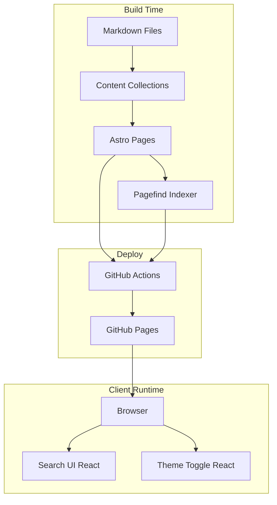
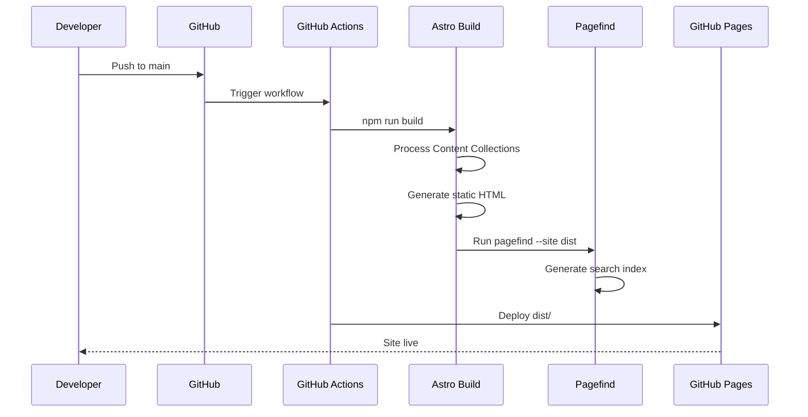
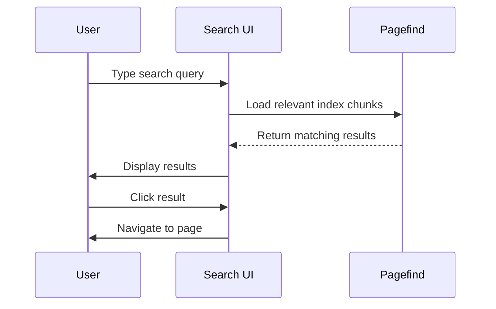
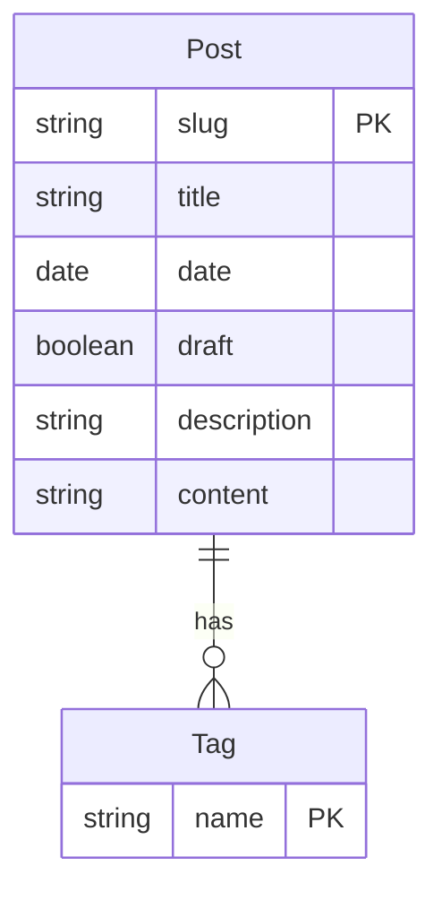
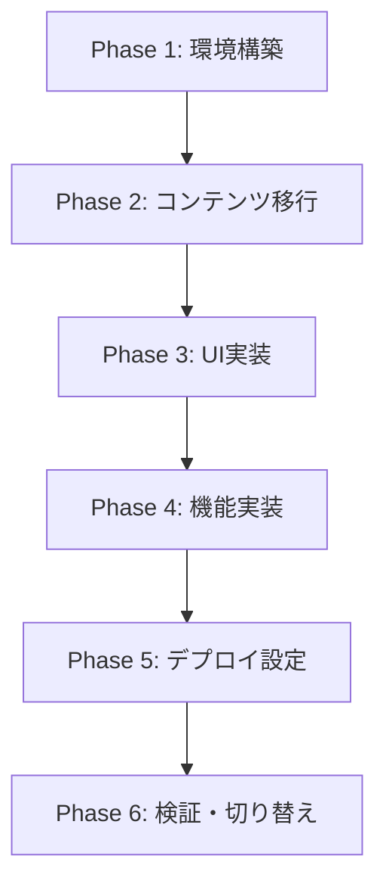

# Technical Design Document

## Overview

**Purpose**: HugoブログからAstroへの移行により、Reactコンポーネントの活用と型安全なコンテンツ管理を実現する。

**Users**: ブログ運営者（KJR020）がコンテンツ管理と開発を行い、読者がブログを閲覧する。

**Impact**: 既存のHugo + PaperModテーマ構成をAstro + Tailwind CSS + React構成に置き換え、GitHub Pagesでのホスティングを維持する。

### Goals
- 約45記事のMarkdownコンテンツを損失なく移行
- 現在と同等のナビゲーション・検索・タグ機能を維持
- TypeScriptによる型安全な開発環境の構築
- Reactコンポーネントによるインタラクティブ機能の拡張性確保

### Non-Goals
- コメント機能の追加（将来検討）
- RSS/Atomフィードの生成（将来検討）
- 多言語対応
- CMS統合

## Architecture

### Architecture Pattern & Boundary Map



**Architecture Integration**:
- **Selected pattern**: Islands Architecture - 静的HTMLに必要な部分のみReactをhydrate
- **Domain/feature boundaries**: コンテンツ管理（Content Collections）、UI（Layouts/Components）、検索（Pagefind）
- **Existing patterns preserved**: N/A（新規構築）
- **New components rationale**: 検索UIとテーマ切り替えにReactを使用（インタラクティブ性が必要）
- **Steering compliance**: ブログとしてのシンプルさを維持

### Technology Stack

| Layer | Choice / Version | Role in Feature | Notes |
|-------|------------------|-----------------|-------|
| Frontend | Astro 5.x | SSG、ページ生成 | Content Layer API使用 |
| UI Framework | React 19.x + @astrojs/react | インタラクティブコンポーネント | Islands Architectureで部分hydration |
| UI Components | shadcn/ui | 再利用可能なUIコンポーネント | Radix UI + Tailwind CSS |
| Styling | Tailwind CSS 4.x | スタイリング | ダークモード対応 |
| Content | Markdown + Zod | 記事管理、スキーマ検証 | YAML frontmatter |
| Search | Pagefind + astro-pagefind | 全文検索 | ビルド時インデックス生成 |
| Diagram | @beoe/rehype-mermaid | Mermaidレンダリング | ビルド時SVG変換 |
| Deploy | GitHub Actions + withastro/action@v5 | CI/CD | GitHub Pagesへデプロイ |
| Language | TypeScript 5.x | 型安全性 | strictモード |

### shadcn/ui Integration

**セットアップ手順**:
```bash
# 初期化
npx shadcn@latest init

# コンポーネント追加
npx shadcn@latest add button card input badge
```

**使用コンポーネント（予定）**:
| Component | 用途 | 配置場所 |
|-----------|------|----------|
| Button | ナビゲーション、アクション | Header, SearchComponent |
| Card | 記事カード | IndexPage, ArchivePage |
| Input | 検索入力 | SearchComponent |
| Badge | タグ表示 | PostMeta, TagPage |
| Dialog | 検索モーダル（将来） | SearchComponent |

**Astro Islands Architecture との統合**:
- shadcn/uiコンポーネントはReact島として使用
- 複合コンポーネント（Dialog等）は`.tsx`ファイルにまとめて実装
- `client:load`または`client:idle`ディレクティブで必要な部分のみhydrate

```typescript
// src/components/ui/ に配置
// 例: src/components/ui/button.tsx
// Astroファイルからインポート
---
import { Button } from "@/components/ui/button"
---
<Button client:load>Click me</Button>
```

## System Flows

### ビルド・デプロイフロー



### 検索フロー



## Requirements Traceability

| Requirement | Summary | Components | Interfaces | Flows |
|-------------|---------|------------|------------|-------|
| 1.1 | Content Collections読み込み | ContentConfig, BlogCollection | Zod Schema | Build |
| 1.2 | TOML→YAML frontmatter変換 | MigrationScript | - | Pre-build |
| 1.3 | 日本語ファイル名対応 | ContentConfig | - | Build |
| 1.4 | シンタックスハイライト | AstroConfig | Shiki | Build |
| 1.5 | Mermaidレンダリング | AstroConfig, rehype-mermaid | - | Build |
| 2.1 | トップページ | IndexPage | getCollection | - |
| 2.2 | アーカイブページ | ArchivePage | getCollection | - |
| 2.3 | 個別記事ページ | PostPage | getEntry | - |
| 2.4 | 検索機能 | SearchPage, SearchComponent | Pagefind API | Search Flow |
| 2.5 | ヘッダーナビゲーション | Header | - | - |
| 2.6 | タグ別記事一覧 | TagPage | getCollection | - |
| 3.1 | レスポンシブデザイン | Tailwind Config | - | - |
| 3.2 | ダークモード切り替え | ThemeToggle | localStorage | - |
| 3.3 | 著者・ソーシャルリンク | Footer | - | - |
| 3.4 | 投稿日表示 | PostMeta | - | - |
| 3.5 | シンタックスハイライト | AstroConfig | Shiki | Build |
| 4.1 | title/descriptionメタタグ | BaseHead | - | - |
| 4.2 | OGPメタタグ | BaseHead | - | - |
| 4.3 | robots.txt生成 | public/robots.txt | - | Build |
| 4.4 | サイトマップ生成 | @astrojs/sitemap | - | Build |
| 4.5 | canonical URL | BaseHead, AstroConfig | - | - |
| 5.1 | 静的サイトビルド | AstroConfig | - | Build |
| 5.2 | GitHub Actionsビルド | deploy.yml | withastro/action | Deploy Flow |
| 5.3 | GitHub Pagesデプロイ | deploy.yml | deploy-pages | Deploy Flow |
| 5.4 | ベースURL設定 | AstroConfig | - | - |
| 5.5 | エラーハンドリング | deploy.yml | - | Deploy Flow |
| 6.1 | 開発サーバー | Astro Dev | - | - |
| 6.2 | TypeScript | tsconfig.json | - | - |
| 6.3 | React統合 | @astrojs/react | - | - |
| 6.4 | Content Collections型安全性 | ContentConfig, Zod | CollectionEntry | - |
| 6.5 | Hot Reload | Astro Dev | - | - |

## Components and Interfaces

| Component | Domain/Layer | Intent | Req Coverage | Key Dependencies | Contracts |
|-----------|--------------|--------|--------------|------------------|-----------|
| ContentConfig | Content | コレクション定義とスキーマ | 1.1, 1.3, 6.4 | astro:content, Zod (P0) | Schema |
| BaseLayout | Layout | 共通レイアウト | 3.1, 4.1, 4.2, 4.5 | BaseHead (P0) | Props |
| Header | UI | ナビゲーション | 2.5 | - | - |
| Footer | UI | フッター表示 | 3.3 | - | - |
| IndexPage | Page | トップページ | 2.1 | ContentConfig (P0) | - |
| ArchivePage | Page | 記事一覧 | 2.2 | ContentConfig (P0) | - |
| PostPage | Page | 個別記事 | 2.3, 3.4 | ContentConfig (P0) | - |
| TagPage | Page | タグ別一覧 | 2.6 | ContentConfig (P0) | - |
| SearchPage | Page | 検索ページ | 2.4 | Pagefind (P0) | - |
| SearchComponent | UI/React | 検索UI | 2.4 | Pagefind API (P0) | Props |
| ThemeToggle | UI/React | テーマ切り替え | 3.2 | localStorage (P1) | Props |
| BaseHead | Partial | メタタグ出力 | 4.1, 4.2, 4.5 | - | Props |
| PostMeta | UI | 記事メタ情報表示 | 3.4 | - | Props |

### Content Layer

#### ContentConfig

| Field | Detail |
|-------|--------|
| Intent | ブログ記事コレクションの定義とZodスキーマによる型検証 |
| Requirements | 1.1, 1.3, 6.4 |

**Responsibilities & Constraints**
- `src/content.config.ts`でコレクション定義
- Zodスキーマによるfrontmatter検証
- 日本語ファイル名を含むMarkdownファイルの処理

**Dependencies**
- Inbound: All Page components - コンテンツ取得 (P0)
- External: astro:content - Content Layer API (P0)
- External: Zod - スキーマ検証 (P0)

**Contracts**: Schema [x]

##### Schema Definition

```typescript
// src/content.config.ts
import { defineCollection, z } from 'astro:content';
import { glob } from 'astro/loaders';

const posts = defineCollection({
  loader: glob({ pattern: '**/*.md', base: './src/content/posts' }),
  schema: z.object({
    title: z.string(),
    date: z.coerce.date(),
    draft: z.boolean().optional().default(false),
    tags: z.array(z.string()).optional().default([]),
    description: z.string().optional(),
  }),
});

export const collections = { posts };
```

**Implementation Notes**
- `glob()`ローダーで`src/content/posts/`配下を再帰的に読み込み
- `date`は`z.coerce.date()`で文字列から自動変換
- `draft: true`の記事は本番ビルドで除外

### Layout Layer

#### BaseLayout

| Field | Detail |
|-------|--------|
| Intent | 全ページ共通のHTML構造とメタタグを提供 |
| Requirements | 3.1, 4.1, 4.2, 4.5 |

**Responsibilities & Constraints**
- `<html>`, `<head>`, `<body>`の共通構造
- レスポンシブ対応のviewport設定
- ダークモードクラスの適用

**Dependencies**
- Inbound: All Page components - レイアウト使用 (P0)
- Outbound: BaseHead - メタタグ出力 (P0)
- Outbound: Header, Footer - ナビゲーション (P0)

**Contracts**: Props [x]

##### Props Interface

```typescript
interface BaseLayoutProps {
  title: string;
  description?: string;
  ogImage?: string;
  canonicalUrl?: string;
}
```

#### BaseHead

| Field | Detail |
|-------|--------|
| Intent | SEO・OGP用メタタグの出力 |
| Requirements | 4.1, 4.2, 4.5 |

**Contracts**: Props [x]

```typescript
interface BaseHeadProps {
  title: string;
  description: string;
  ogImage?: string;
  canonicalUrl: string;
}
```

**Implementation Notes**
- `<title>`, `<meta name="description">`, OGPタグを出力
- canonical URLは`Astro.site`と`Astro.url.pathname`から構築

### UI Components

#### Header

| Field | Detail |
|-------|--------|
| Intent | サイトタイトルとナビゲーションリンクの表示 |
| Requirements | 2.5 |

**Implementation Notes**
- Archive, Search, Scrapbox（外部リンク）へのナビゲーション
- モバイル時はハンバーガーメニュー（将来対応可）

#### ThemeToggle (React)

| Field | Detail |
|-------|--------|
| Intent | ダークモード/ライトモードの切り替えUI |
| Requirements | 3.2 |

**Dependencies**
- External: localStorage - テーマ設定の永続化 (P1)

**Contracts**: State [x]

##### State Management

```typescript
// Theme state
type Theme = 'light' | 'dark' | 'system';

// localStorage key
const THEME_KEY = 'theme';

// Usage in Astro
// <ThemeToggle client:load />
```

**Implementation Notes**
- `client:load`でページ読み込み時にhydrate
- システム設定（`prefers-color-scheme`）をデフォルトとして使用
- `<html>`要素に`dark`クラスを切り替え

#### SearchComponent (React)

| Field | Detail |
|-------|--------|
| Intent | Pagefindを使用した検索UIの提供 |
| Requirements | 2.4 |

**Dependencies**
- External: Pagefind API - 検索実行 (P0)
- External: astro-pagefind - 開発時検索対応 (P1)

**Contracts**: Props [x] / State [x]

```typescript
interface SearchComponentProps {
  placeholder?: string;
}

interface SearchState {
  query: string;
  results: PagefindResult[];
  isLoading: boolean;
}

interface PagefindResult {
  url: string;
  title: string;
  excerpt: string;
}
```

**Implementation Notes**
- `client:idle`でアイドル時にhydrate（パフォーマンス優先）
- 入力デバウンスで不要なAPI呼び出しを削減
- 検索結果をリスト表示、クリックで遷移

### Page Layer

#### IndexPage (`src/pages/index.astro`)

| Field | Detail |
|-------|--------|
| Intent | トップページ：ブログ概要と最新記事一覧を表示 |
| Requirements | 2.1 |

**Implementation Notes**
- `getCollection('posts')`で全記事取得
- `draft: false`かつ日付でソート
- 最新10件程度を表示

#### ArchivePage (`src/pages/archives.astro`)

| Field | Detail |
|-------|--------|
| Intent | 全記事一覧を日付順に表示 |
| Requirements | 2.2 |

#### PostPage (`src/pages/posts/[...slug].astro`)

| Field | Detail |
|-------|--------|
| Intent | 個別記事の表示 |
| Requirements | 2.3, 3.4 |

**Implementation Notes**
- 動的ルーティングで`[...slug]`を使用
- `getStaticPaths()`で全記事のパスを生成
- 記事メタ情報（日付、タグ）を表示

#### TagPage (`src/pages/tags/[tag].astro`)

| Field | Detail |
|-------|--------|
| Intent | 指定タグの記事一覧を表示 |
| Requirements | 2.6 |

**Implementation Notes**
- 全タグを`getStaticPaths()`で生成
- タグ名でフィルタリングした記事一覧を表示

#### SearchPage (`src/pages/search.astro`)

| Field | Detail |
|-------|--------|
| Intent | 検索機能を提供するページ |
| Requirements | 2.4 |

**Implementation Notes**
- `SearchComponent`をReact Islandとして配置
- URLパラメータで初期クエリ対応（将来）

## Data Models

### Domain Model



### Logical Data Model

**Post Entity (Content Collection)**:
- `slug`: ファイルパスから自動生成されるID
- `title`: 記事タイトル（必須）
- `date`: 投稿日（必須、Dateオブジェクトに変換）
- `draft`: 下書きフラグ（オプション、デフォルトfalse）
- `tags`: タグ配列（オプション、デフォルト空配列）
- `description`: 記事概要（オプション）
- `body`: Markdown本文（Content Layerが自動処理）

### Data Contracts & Integration

**Collection Query API**:
```typescript
// 全記事取得（公開済みのみ）
const posts = await getCollection('posts', ({ data }) => !data.draft);

// 単一記事取得
const post = await getEntry('posts', slug);

// タグでフィルタリング
const taggedPosts = await getCollection('posts', ({ data }) =>
  data.tags.includes(targetTag)
);
```

## Error Handling

### Error Strategy

**Build Time Errors**:
- Zodスキーマ違反: ビルド失敗、詳細なエラーメッセージを出力
- Markdownパースエラー: ビルド失敗、ファイル名と行番号を表示
- 画像・アセット欠損: ビルド失敗、パスを表示

**Runtime Errors**:
- 404 Not Found: カスタム404ページを表示
- 検索インデックス読み込み失敗: 検索不可メッセージを表示

### Monitoring

- GitHub Actionsのビルドログで失敗を検知
- ビルド失敗時はデプロイを中止（既存サイトを維持）

## Testing Strategy

### Unit Tests
- Zodスキーマのバリデーションテスト
- 日付フォーマット変換のテスト
- タグ正規化のテスト

### Integration Tests
- Content Collections読み込みテスト
- ページ生成テスト（`astro build`の成功確認）

### E2E/UI Tests（将来対応）
- 検索機能の動作確認
- ダークモード切り替えの確認
- ナビゲーションの動作確認

### Manual Testing
- 全記事の表示確認
- リンク切れチェック
- レスポンシブデザイン確認
- OGP画像表示確認

## Migration Strategy



### Phase 1: 環境構築
- Astroプロジェクト初期化
- TypeScript、Tailwind CSS、React統合設定
- shadcn/ui初期化と基本コンポーネント追加（Button, Card, Input, Badge）
- Content Collections設定

### Phase 2: コンテンツ移行
- TOML→YAML frontmatter変換スクリプト作成・実行
- Markdownファイルを`src/content/posts/`に移動
- スキーマ検証でエラーがないことを確認

### Phase 3: UI実装
- BaseLayout、Header、Footer作成
- Tailwind CSSでスタイリング
- レスポンシブ対応

### Phase 4: 機能実装
- ダークモード切り替え（ThemeToggle）
- 検索機能（Pagefind + SearchComponent）
- Mermaidレンダリング設定

### Phase 5: デプロイ設定
- GitHub Actions workflow作成
- astro.config.mjsのsite設定
- GitHub Pages設定変更

### Phase 6: 検証・切り替え
- ローカルでの全機能テスト
- ステージング環境（別ブランチ）でのテスト
- 本番切り替え

### Rollback Strategy
- 既存のHugo構成はブランチに保持
- 問題発生時はHugoワークフローに戻す
