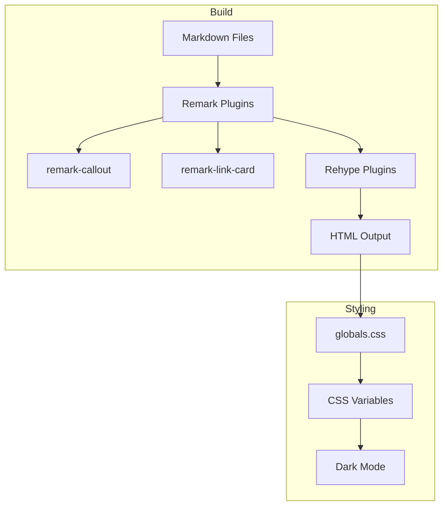

# Design Document: markdown-callout

## Overview

**Purpose**: 本機能は、ブログ執筆者がMarkdown記事内でObsidian/GitHub風のコールアウト記法（`> [!type]`）を使用し、読者に重要な情報を視覚的に強調して伝えることを可能にする。

**Users**: ブログ執筆者が記事作成時にコールアウトを使用し、ブログ読者が視覚的に区別されたコールアウトを閲覧する。

**Impact**: 既存のMarkdownパイプラインに`@r4ai/remark-callout`プラグインを追加し、`globals.css`にスタイル定義を追加する。既存記事のレンダリングには影響しない。

### Goals
- Markdown記事内で`> [!note]`/`> [!tip]`/`> [!warning]`/`> [!danger]`記法を使用可能にする
- コールアウトタイプごとに視覚的に区別可能なスタイルを適用する
- ライトモード/ダークモード両方で適切な表示を実現する
- 既存記事の表示に副作用を与えない

### Non-Goals
- MDXへの移行
- 折りたたみ可能なコールアウト（将来的に検討）
- カスタムアイコンの追加（デフォルトタイトルテキストで対応）
- 4種類以外のコールアウトタイプ追加

## Architecture

### Existing Architecture Analysis

現在のMarkdownパイプラインは以下の構成:
- `remarkLinkCard`: リンクカード変換
- `rehypeMermaid`: Mermaidダイアグラム変換

スタイルは`src/styles/globals.css`で管理され、CSS変数によるダークモード対応が実装済み。

### Architecture Pattern & Boundary Map



**Architecture Integration**:
- Selected pattern: Pipeline Extension（既存remarkPluginsへの追加）
- Domain boundaries: Markdownパース層とスタイル層を分離
- Existing patterns preserved: CSS変数によるテーマ管理、`.dark`クラスによるモード切り替え
- New components rationale: プラグイン追加のみ、新規コンポーネントは不要
- Steering compliance: シンプルさを維持、過度な抽象化を避ける

### Technology Stack

| Layer | Choice / Version | Role in Feature | Notes |
|-------|------------------|-----------------|-------|
| Build | @r4ai/remark-callout ^0.6.2 | Markdown変換 | remarkPluginsに追加 |
| Styling | CSS (globals.css) | 視覚的スタイリング | 既存ファイルに追加 |
| Theme | CSS Variables | ダークモード対応 | 既存パターン踏襲 |

## Requirements Traceability

| Requirement | Summary | Components | Interfaces | Flows |
|-------------|---------|------------|------------|-------|
| 1.1-1.6 | コールアウト記法の変換 | astro.config.mjs | remarkCallout plugin | Build |
| 2.1-2.4 | コールアウト内コンテンツ対応 | astro.config.mjs | remarkCallout plugin | Build |
| 3.1-3.5 | スタイリング | globals.css | CSS selectors | Runtime |
| 4.1-4.3 | アクセシビリティ | globals.css | CSS variables | Runtime |
| 5.1-5.3 | 既存コンテンツ互換性 | astro.config.mjs | remarkCallout plugin | Build |
| 6.1-6.3 | ドキュメント | README.md | Markdown | N/A |

## Components and Interfaces

| Component | Domain/Layer | Intent | Req Coverage | Key Dependencies | Contracts |
|-----------|--------------|--------|--------------|-----------------|-----------|
| astro.config.mjs | Build Config | remarkCalloutプラグイン登録 | 1.1-1.6, 2.1-2.4, 5.1-5.3 | @r4ai/remark-callout (P0) | Config |
| globals.css | Styling | コールアウトスタイル定義 | 3.1-3.5, 4.1-4.3 | CSS Variables (P0) | Style |
| README.md | Documentation | 使用方法の記載 | 6.1-6.3 | None | Doc |

### Build Config Layer

#### astro.config.mjs

| Field | Detail |
|-------|--------|
| Intent | remarkCalloutプラグインをMarkdownパイプラインに追加 |
| Requirements | 1.1-1.6, 2.1-2.4, 5.1-5.3 |

**Responsibilities & Constraints**
- remarkPlugins配列にremarkCalloutを追加
- 既存プラグイン（remarkLinkCard）との共存を維持
- プラグイン順序: remarkCallout → remarkLinkCard（順序依存なし）

**Dependencies**
- External: @r4ai/remark-callout ^0.6.2 — Markdown変換 (P0)

**Contracts**: Config [x]

##### Config Interface
```typescript
// astro.config.mjs 変更箇所
import remarkCallout from "@r4ai/remark-callout";

export default defineConfig({
  markdown: {
    remarkPlugins: [
      remarkCallout,  // 追加
      [remarkLinkCard, { cache: true, shortenUrl: true }]
    ],
    // 既存設定維持
  },
});
```

**Implementation Notes**
- Integration: pnpm add @r4ai/remark-callout で依存追加
- Validation: ビルド成功とサンプル記事での動作確認
- Risks: プラグイン間の干渉なし（独立したAST変換）

### Styling Layer

#### globals.css

| Field | Detail |
|-------|--------|
| Intent | コールアウト要素のビジュアルスタイル定義 |
| Requirements | 3.1-3.5, 4.1-4.3 |

**Responsibilities & Constraints**
- data属性セレクタによるスタイル適用
- CSS変数によるカラー定義（ライト/ダーク両対応）
- 既存のCSS変数パターンとの一貫性維持

**Dependencies**
- Inbound: HTML elements with data-callout attributes — スタイル対象 (P0)

**Contracts**: Style [x]

##### Style Interface

```css
/* CSS Variables（:rootに追加） */
:root {
  /* Note: 青系 */
  --callout-note-bg: hsl(210 100% 97%);
  --callout-note-border: hsl(210 100% 50%);
  --callout-note-title: hsl(210 100% 40%);

  /* Tip: 緑系 */
  --callout-tip-bg: hsl(142 76% 95%);
  --callout-tip-border: hsl(142 76% 36%);
  --callout-tip-title: hsl(142 76% 30%);

  /* Warning: 黄/オレンジ系 */
  --callout-warning-bg: hsl(45 100% 95%);
  --callout-warning-border: hsl(45 100% 40%);
  --callout-warning-title: hsl(30 100% 35%);

  /* Danger: 赤系 */
  --callout-danger-bg: hsl(0 100% 97%);
  --callout-danger-border: hsl(0 84% 60%);
  --callout-danger-title: hsl(0 84% 40%);
}

.dark {
  /* Note */
  --callout-note-bg: hsl(210 50% 15%);
  --callout-note-border: hsl(210 100% 60%);
  --callout-note-title: hsl(210 100% 70%);

  /* Tip */
  --callout-tip-bg: hsl(142 40% 15%);
  --callout-tip-border: hsl(142 76% 46%);
  --callout-tip-title: hsl(142 76% 60%);

  /* Warning */
  --callout-warning-bg: hsl(45 50% 15%);
  --callout-warning-border: hsl(45 100% 50%);
  --callout-warning-title: hsl(45 100% 65%);

  /* Danger */
  --callout-danger-bg: hsl(0 50% 15%);
  --callout-danger-border: hsl(0 84% 55%);
  --callout-danger-title: hsl(0 84% 70%);
}

/* Callout Base Styles */
[data-callout] {
  margin: 1.5em 0;
  padding: 1rem 1.25rem;
  border-left: 4px solid var(--border);
  border-radius: var(--radius);
  background-color: var(--secondary);
}

[data-callout-title] {
  font-weight: 600;
  margin-bottom: 0.5rem;
}

[data-callout-body] > *:last-child {
  margin-bottom: 0;
}

/* Type-specific Styles */
[data-callout-type="note"] {
  background-color: var(--callout-note-bg);
  border-left-color: var(--callout-note-border);
}
[data-callout-type="note"] [data-callout-title] {
  color: var(--callout-note-title);
}

[data-callout-type="tip"] {
  background-color: var(--callout-tip-bg);
  border-left-color: var(--callout-tip-border);
}
[data-callout-type="tip"] [data-callout-title] {
  color: var(--callout-tip-title);
}

[data-callout-type="warning"] {
  background-color: var(--callout-warning-bg);
  border-left-color: var(--callout-warning-border);
}
[data-callout-type="warning"] [data-callout-title] {
  color: var(--callout-warning-title);
}

[data-callout-type="danger"] {
  background-color: var(--callout-danger-bg);
  border-left-color: var(--callout-danger-border);
}
[data-callout-type="danger"] [data-callout-title] {
  color: var(--callout-danger-title);
}
```

**Implementation Notes**
- Integration: 既存の`/* remark-link-card スタイル */`セクションの後に追加
- Validation: 各コールアウトタイプの視覚的確認、ダークモード切り替え確認
- Risks: 既存スタイルとの競合なし（data属性セレクタは独立）

### Documentation Layer

#### README.md

| Field | Detail |
|-------|--------|
| Intent | コールアウト記法の使用方法を執筆者向けに記載 |
| Requirements | 6.1-6.3 |

**Responsibilities & Constraints**
- 基本的な記法例（note/tip/warning/danger）
- カスタムタイトルの指定方法
- 複数段落・リスト・コードブロックの例

**Contracts**: Doc [x]

##### Documentation Content

```markdown
## コールアウト（Callouts）

記事内で重要な情報を強調するためのコールアウト記法を使用できます。

### 基本記法

> [!note]
> これは補足情報です。

> [!tip]
> これは推奨事項です。

> [!warning]
> これは注意喚起です。

> [!danger]
> これは重要な警告です。

### カスタムタイトル

> [!note] カスタムタイトル
> タイトルを指定できます。

### 複数段落・リスト

> [!tip] 複数コンテンツ
> 最初の段落
>
> - リスト項目1
> - リスト項目2
>
> ```js
> const example = "コードブロック";
> ```
```

## Data Models

本機能ではデータモデルの追加は不要。プラグインが生成するHTML構造は以下の通り:

### HTML Output Structure

```html
<!-- 通常のコールアウト -->
<div data-callout data-callout-type="note">
  <div data-callout-title>Note</div>
  <div data-callout-body>
    <p>コンテンツ</p>
  </div>
</div>
```

## Error Handling

### Error Strategy
本機能はビルド時の変換であり、ランタイムエラーは発生しない。

### Error Categories and Responses
- **不正なコールアウト記法**: 通常のblockquoteとしてレンダリング（フォールバック動作）
- **未知のコールアウトタイプ**: デフォルトスタイル（`--secondary`背景）が適用

## Testing Strategy

### Unit Tests
- 不要（プラグイン自体のテストはライブラリ側で実施済み）

### Integration Tests
- サンプル記事でのビルド成功確認
- 4種類のコールアウトタイプ表示確認
- 複数段落・リスト・コードブロック内包の確認

### E2E/UI Tests
- ライトモードでの表示確認
- ダークモードでの表示確認
- 既存記事のレンダリング影響なし確認
