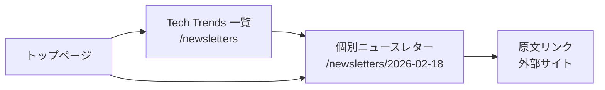
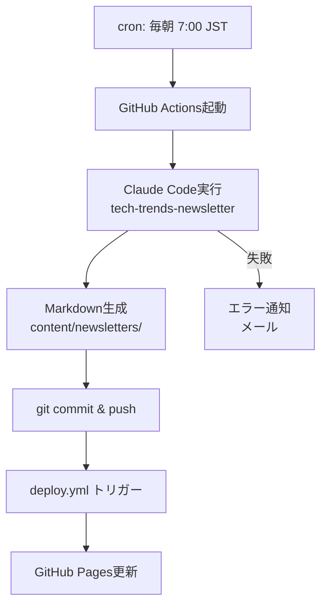

# 機能仕様書: Tech Trends ニュースレター自動公開ページ

> **ステータス**: 承認済み
>
> **作成者**: KJR020 (Owner)
>
> **最終更新**: 2026-02-18

---

## 1. 概要

ブログとは独立した「Tech Trends ニュースレター」ページを新設する。AIが毎日自動で収集・整理した最新のテック情報を、決まった時間にサイトへ公開する仕組みである。

現在、KJR020さんはClaude Codeの `tech-trends-newsletter` スキルを使ってニュースレターを生成し、ObsidianのVaultにMarkdownとして蓄積している。しかし、この情報は個人の手元にとどまっており、外部への発信にはつながっていない。また、毎回手動でスキルを実行する手間がかかっている。

この機能は、ニュースレターの生成から公開までを完全自動化する。GitHub Actionsが毎朝Claude Codeを起動してニュースレターを生成し、Astroの独立したContent Collection（`newsletters`）としてコミット・デプロイする。読者はブログ記事とは別の専用ページでニュースレターを閲覧でき、KJR020さん自身のナレッジベースとしても、技術コミュニティへの情報発信としても機能する。

---

## 2. ペルソナ

### KJR020さん（ブログオーナー / メインユーザー）

- **役割**: Webエンジニア（3年目）、個人ブログ運営者
- **背景**: AI・開発ツールのトレンドを日々追いかけている。Claude Codeの `tech-trends-newsletter` スキルを使ってObsidianにニュースレターを蓄積中。Astro + GitHub Pagesでブログを運営しており、CI/CDの知識がある
- **利用頻度**: 毎日（自身の振り返り・確認用）
- **ゴール**: 手作業ゼロで毎日テックニュースが自動公開される仕組みを作る。自分の振り返りにも、外部発信にも使いたい
- **フラストレーション**: 情報収集に時間を取られる。せっかく生成したニュースレターがObsidianの中に閉じている

### 佐藤さん（ブログ読者 / サブユーザー）

- **役割**: 同僚エンジニア、ブログの定期読者
- **背景**: 自分でも情報収集しているが、KJR020さんのキュレーションを参考にしたい。日本語の要約があると助かる
- **利用頻度**: 週数回（気になったときに流し読み）
- **ゴール**: 30秒〜1分で「今日の注目ニュース」を把握したい。興味のある分野だけ深掘りしたい
- **フラストレーション**: ブログ記事とニュースレターが混在すると、どれが何なのかわかりづらい

---

## 3. シナリオ

### シナリオ A: KJR020さんが今日のニュースレターを確認する（メインフロー）

KJR020さんは朝、自分のブログサイト `kjr020.github.io` を開く。ヘッダーのナビゲーションには「Blog」「Archive」に加えて「Tech Trends」というリンクが見える。クリックすると、ニュースレター一覧ページ `/newsletters` に遷移する。

一覧ページには日付の新しい順でニュースレターが並んでいる。各エントリには日付とハイライトの冒頭が表示されており、今日の分が一番上にある。タイトルをクリックすると個別ページに遷移する。

個別ページには、Obsidianで見ていたのと同じ構造 — Highlights、セクション別ニュース（AI Platform Updates、Developer Community、Tech Media、Research Papers）、Key Takeaways — が表示されている。各ニュースには原文へのリンクが付いており、気になった記事をそのまま読みに行ける。

KJR020さんは「今日はMCPの動向が多いな」と確認し、後で深掘りするトピックの目星をつける。

> **補足メモ（開発者向け）**: ニュースレターの構造は既存の `tech-trends-newsletter` スキルが生成するMarkdownフォーマットに準拠する。frontmatterにdate、tags、titleを持たせ、Astro Content Collectionとして管理する。

### シナリオ B: GitHub Actionsが毎朝ニュースレターを自動生成・公開する

毎朝7:00 JST、GitHub Actionsのcronスケジュールが発動する。ワークフローはClaude Codeを起動し、`tech-trends-newsletter` スキルを実行する。Claude Codeはウェブ上から最新のAI/テック情報を収集し、所定のフォーマットでMarkdownファイルを生成する。

生成されたファイルは `content/newsletters/2026-02-18_tech-trends.md` のようなファイル名で保存される。ワークフローはこのファイルをgitにコミットし、mainブランチにプッシュする。プッシュをトリガーに既存の `deploy.yml` ワークフローが走り、数分後にはサイトに反映される。

KJR020さんは何もする必要がない。GitHub Actionsの通知を見れば、正常に完了したかどうかだけ確認できる。

> **補足メモ（開発者向け）**: Claude Code GitHub Actionsの利用にはAnthropicのAPIキーが必要。リポジトリのSecretsに設定する。cronの時刻はUTCで指定するため、JST 7:00 = UTC 22:00（前日）に注意。

### シナリオ C: 佐藤さんがニュースレターを流し読みする

佐藤さんはブログのトップページを訪れる。トップページにはブログ記事のLatest Postsとは別に、最新のニュースレターへの導線がある。クリックすると今日のニュースレターが表示される。

冒頭のHighlightsセクションに5つの注目ニュースが箇条書きになっている。佐藤さんは30秒でざっと目を通し、「Claude Opus 4.6のリリース」が気になったので、該当セクションまでスクロールして詳細を読む。日本語で要約されているのでさっと理解でき、原文リンクから英語の一次ソースにも飛べる。

佐藤さんは「KJR020さんのキュレーション助かるな」と思いつつ、自分の仕事に戻る。

### シナリオ D: ニュースレター生成が失敗した場合（エラーケース）

ある日、Anthropic APIのレート制限に引っかかり、Claude Codeの実行が失敗する。GitHub Actionsのワークフローがエラーステータスで終了し、KJR020さんにはGitHubからメール通知が届く。

その日のニュースレターは生成されないが、サイトには影響がない。過去のニュースレターはすべてそのまま表示されている。一覧ページには「歯抜け」の日が存在するが、特にエラー表示はされない（単にその日の号がないだけ）。

翌朝、cronが再び発動し、正常にニュースレターが生成・公開される。

---

## 4. 画面・操作フロー

### ユーザー閲覧フロー



### 自動公開フロー



### ページ構成

```
/                        # トップページ（最新ニュースレターへの導線追加）
/newsletters             # ニュースレター一覧ページ（新着順）
/newsletters/[slug]      # 個別ニュースレターページ
```

---

## 5. 非目標

この仕様書のスコープに**含まれない**もの:

- **メール配信機能**: ニュースレターという名前だが、メールで購読者に配信する機能は作らない。あくまでWebページとして公開するのみ
- **ニュースレターの編集UI**: 管理画面やCMSのような編集インターフェースは不要。Markdownファイルの直接編集で十分
- **RSS/Atomフィードの新設**: ニュースレター専用のフィードは初期スコープでは作らない。必要になれば後から追加可能
- **過去のObsidianファイルの移行**: 既にObsidianに蓄積されたニュースレターの一括移行は行わない。新規生成分からスタートする
- **レビュー・承認フロー**: PRベースの承認プロセスは設けない。完全自動で生成から公開まで行う
- **コメント機能**: ニュースレターページにGiscusなどのコメント機能は付けない。ブログ記事とは性質が異なるため

---

## 6. 未解決事項

| # | 事項 | 影響範囲 | 決定期限 | 備考 |
|---|------|---------|---------|------|
| 1 | Claude Code GitHub Actionsの具体的な設定方法（アクション名、APIキーの管理） | シナリオB: 自動生成フロー | 設計フェーズ | `anthropics/claude-code-action` の利用を想定。要調査 |
| 2 | ニュースレターのfrontmatterスキーマの詳細（必須フィールド、タグの扱い） | Content Collection定義 | 設計フェーズ | 既存のObsidianファイルのfrontmatter（tags, date）を参考に決定 |
| 3 | トップページへの導線の具体的なデザイン | シナリオA,C: ユーザー閲覧 | 設計フェーズ | 「最新号のカード表示」か「リンクのみ」か |
| 4 | 土日・祝日のニュースレター生成をどうするか | シナリオB: 自動生成フロー | 実装フェーズ | 平日のみ or 毎日。ニュースが少ない日の品質問題 |
| 5 | APIコスト（Anthropic API利用料）の見積もりと許容範囲 | 運用全体 | 設計フェーズ | 月額のAPI利用料を概算しておく |

---

## 7. 補足メモ（開発者向け）

**既存アーキテクチャとの統合ポイント**:
- Astro Content Collection に `newsletters` を新設（`content/newsletters/`）
- `content.config.ts` に newsletters コレクションの定義を追加
- ページルーティング: `src/pages/newsletters/index.astro`（一覧）と `src/pages/newsletters/[...slug].astro`（個別）
- 既存の `BaseLayout` を流用してデザインの統一感を保つ

**`tech-trends-newsletter` スキルとの連携**:
- スキルが生成するMarkdownのフォーマット（frontmatter + 本文）をそのままContent Collectionのソースとして使えるよう、スキーマを合わせる
- 参考ファイル: `/Users/kjr020/Library/Mobile Documents/iCloud~md~obsidian/Documents/KJR020sVault/tech/2026-02-18_tech-trends.md`

**GitHub Actions ワークフロー**:
- 新規ワークフロー `newsletter.yml` を作成
- `schedule` (cron) トリガーでClaude Codeを実行
- 生成後に `git commit && git push` → 既存の `deploy.yml` がデプロイを担当

> 詳細な技術設計は design.md で定義する。ここでは機能の「何を」に焦点を当てる。
