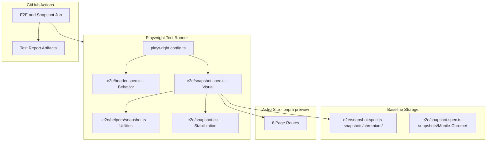
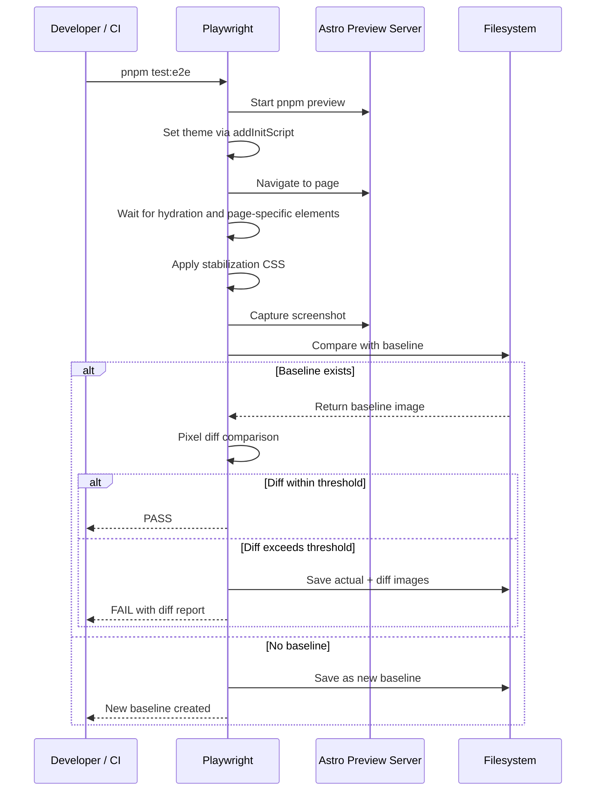

# Design Document: playwright-snapshot-testing

## Overview

**Purpose**: Playwrightの `toHaveScreenshot()` APIを使用したビジュアルリグレッションテスト基盤を構築する。各ページのUI外観をスナップショットとして記録し、意図しないUI変更を自動検出する。

**Users**: 開発者がコード変更時にUI崩れを早期発見するために使用する。

**Impact**: 既存の `e2e/` テストディレクトリと `playwright.config.ts` を拡張し、新たにスナップショットテストファイルとCI設定を追加する。

### Goals
- 全8ページルートのビジュアルスナップショットを取得・管理する
- ライト/ダークモード両テーマのUI状態を記録する
- CI（GitHub Actions）でビジュアルリグレッションを自動検出する
- 既存E2Eテストとの共存を維持する

### Non-Goals
- コンポーネント単位のスナップショットテスト（ページ単位のみ）
- Dockerによる環境統一（CI環境をベースラインの正とする）
- Firefox / WebKit のスナップショット（chromium のみ）
- パフォーマンス測定やレスポンス時間のテスト

## Architecture

### Existing Architecture Analysis

現在の構成:
- `playwright.config.ts`: chromium + Mobile Chrome の2プロジェクト、`e2e/` ディレクトリ
- `e2e/header.spec.ts`: 振る舞いテスト（メニュー動作、ナビゲーション）
- `.github/workflows/ci.yml`: 5ジョブ並列（E2Eジョブなし）
- テーマ管理: `document.documentElement.classList.toggle("dark")` パターン

維持すべきパターン:
- `e2e/` ディレクトリへのテスト配置
- `pnpm preview` によるビルド済みサイト配信
- chromium / Mobile Chrome のプロジェクト分離

### Architecture Pattern & Boundary Map



**Architecture Integration**:
- **Selected pattern**: 既存config拡張 — `playwright.config.ts` にスナップショット設定を追加し、テストファイルで分離
- **Domain boundaries**: 振る舞いテスト（`*.spec.ts`）とスナップショットテスト（`snapshot.spec.ts`）をファイルレベルで分離
- **Existing patterns preserved**: `e2e/` ディレクトリ配置、`pnpm preview` サーバー、chromium/Mobile Chrome プロジェクト
- **New components rationale**: `snapshot.spec.ts`（テスト本体）、`helpers/snapshot.ts`（再利用可能ユーティリティ）、`snapshot.css`（安定化CSS）

### Technology Stack

| Layer | Choice / Version | Role in Feature | Notes |
|-------|------------------|-----------------|-------|
| Testing | Playwright v1.57.0 | `toHaveScreenshot()` API | 既存依存。追加パッケージ不要 |
| CI | GitHub Actions (ubuntu-latest) | ベースライン生成・比較環境 | 既存CIに E2E ジョブを追加 |
| Runtime | Node.js 22, pnpm 10 | テスト実行環境 | 既存設定と同一 |

## System Flows

### スナップショットテスト実行フロー



## Requirements Traceability

| Requirement | Summary | Components | Interfaces | Flows |
|-------------|---------|------------|------------|-------|
| 1.1 | テストファイル配置と共存 | snapshot.spec.ts | — | — |
| 1.2 | ベースライン画像のリポジトリ管理 | snapshotPathTemplate 設定 | — | — |
| 1.3 | 2ビューポート対応 | playwright.config.ts projects | — | — |
| 1.4 | 統合実行 | playwright.config.ts | — | 実行フロー |
| 2.1 | 静的ページスナップショット | snapshot.spec.ts | capturePageSnapshot | 実行フロー |
| 2.2 | 動的ページスナップショット | snapshot.spec.ts | capturePageSnapshot | 実行フロー |
| 2.3 | ハイドレーション待機 | helpers/snapshot.ts | waitForHydration | 実行フロー |
| 2.4 | 偽陽性抑制 | snapshot.css, config | — | — |
| 3.1 | 両テーマ対応 | snapshot.spec.ts | setTheme | 実行フロー |
| 3.2 | テーマ識別ファイル名 | toHaveScreenshot name param | — | — |
| 3.3 | classList操作によるテーマ適用 | helpers/snapshot.ts | setTheme | — |
| 4.1 | 差分レポート | playwright.config.ts reporter | — | 実行フロー |
| 4.2 | 更新npmスクリプト | package.json | — | — |
| 4.3 | Git管理 | snapshotPathTemplate 設定 | — | — |
| 5.1 | CI実行 | ci.yml E2Eジョブ | — | — |
| 5.2 | 同一ベースライン使用 | ubuntu-latest 統一 | — | — |
| 5.3 | CI差分レポート | ci.yml artifacts | — | — |

## Components and Interfaces

| Component | Domain | Intent | Req Coverage | Key Dependencies | Contracts |
|-----------|--------|--------|--------------|-----------------|-----------|
| playwright.config.ts 拡張 | Config | スナップショット設定追加 | 1.2, 1.3, 1.4, 2.4, 4.1 | Playwright (P0) | — |
| e2e/snapshot.spec.ts | Test | 全ページスナップショット取得 | 1.1, 2.1, 2.2, 3.1, 3.2 | helpers/snapshot.ts (P0) | — |
| e2e/helpers/snapshot.ts | Utility | テスト共通ユーティリティ | 2.3, 3.3 | Playwright Page API (P0) | Service |
| e2e/snapshot.css | Config | 動的コンテンツ安定化 | 2.4 | — | — |
| package.json スクリプト追加 | Config | 更新ワークフロー | 4.2 | — | — |
| .github/workflows/ci.yml 拡張 | CI | E2Eジョブ追加 | 5.1, 5.2, 5.3 | GitHub Actions (P0) | — |

### Utility Layer

#### e2e/helpers/snapshot.ts

| Field | Detail |
|-------|--------|
| Intent | スナップショットテスト用の共通ユーティリティ関数を提供 |
| Requirements | 2.3, 3.3 |

**Responsibilities & Constraints**
- Astro Islandのハイドレーション完了待機
- テーマ切り替え（classList操作）
- ページ安定化待機（ネットワークアイドル、アニメーション完了）

**Dependencies**
- External: Playwright `Page` API — ページ操作・スクリーンショット取得 (P0)

**Contracts**: Service [x]

##### Service Interface

```typescript
import type { Page, Locator } from "playwright/test";

interface PageConfig {
  route: string;
  name: string;
  hasIslands: boolean;
}

/**
 * Astro Islandのハイドレーション完了を待機する
 */
declare function waitForHydration(page: Page, config: PageConfig): Promise<void>;

/**
 * テーマを設定する（light/dark）
 * page.goto() の前に呼び出す。addInitScript で localStorage.theme を注入し、
 * ThemeInit.astro の初期化ロジックがページロード時に正しいテーマを適用する。
 * これにより goto 後の classList 操作による FOUC を防止する。
 */
declare function setTheme(page: Page, theme: "light" | "dark"): Promise<void>;

/**
 * スナップショット取得のための安定化処理を実行する
 * - ネットワークアイドル待機
 * - 遅延読み込み画像の即時読み込み
 * - アニメーション完了待機
 */
declare function stabilizePage(page: Page): Promise<void>;

/**
 * ページのスナップショットを取得する共通処理
 * - テーマ設定
 * - ハイドレーション待機
 * - 安定化処理
 * - toHaveScreenshot 呼び出し
 */
declare function capturePageSnapshot(
  page: Page,
  options: {
    config: PageConfig;
    theme: "light" | "dark";
    snapshotName: string;
    fullPage?: boolean;
    mask?: Locator[];
  }
): Promise<void>;
```

- Preconditions: Playwright Preview Serverが起動済み
- Postconditions: スナップショット画像がベースラインと比較される
- Invariants: テーマ状態は各テスト間でリセットされる

**Implementation Notes**
- `waitForHydration`: `PageConfig.hasIslands` に基づき条件分岐。`hasIslands: true` のページのみ `page.waitForSelector("astro-island[client='load']:not([ssr])")` を実行。`hasIslands: false`（`/404` 等）ではスキップ。`/search` ページは追加で `.pagefind-ui` セレクタの出現を待機
- `setTheme`: `page.addInitScript` で `localStorage.setItem("theme", theme)` を注入し、`page.emulateMedia({ colorScheme })` を設定。**`page.goto()` の前に呼び出す**ことで、`ThemeInit.astro` の初期化時に正しいテーマが適用され、FOUC（Flash of Unstyled Content）を防止する
- `stabilizePage`: `page.waitForLoadState("networkidle")` の後にアニメーション完了を待機

### Config Layer

#### playwright.config.ts 拡張

| Field | Detail |
|-------|--------|
| Intent | スナップショットテストの全体設定を定義 |
| Requirements | 1.2, 1.3, 1.4, 2.4, 4.1 |

**追加設定項目**

```typescript
// playwright.config.ts に追加する設定
interface SnapshotConfig {
  expect: {
    toHaveScreenshot: {
      // 偽陽性抑制の閾値（厳格な初期値。ページ別に緩和可能）
      maxDiffPixelRatio: number; // 0.005 (0.5%)
      // アニメーション無効化
      animations: "disabled";
      // 安定化CSS
      stylePath: string; // "./e2e/snapshot.css"
    };
  };
  // スナップショット保存パスのカスタマイズ（{projectName} でビューポート別に分離）
  snapshotPathTemplate: string;
}
```

**Implementation Notes**
- `snapshotPathTemplate`: `{testDir}/{testFileDir}/{testFileName}-snapshots/{projectName}/{arg}{ext}` で **`{projectName}` を含めて Desktop/Mobile のベースラインを分離**。`{platform}` は除外（CI環境 ubuntu-latest に統一）
- `maxDiffPixelRatio: 0.005` を初期値とする。偽陽性が頻発するページは `toHaveScreenshot` 呼び出し時に個別に `maxDiffPixels` や `mask` で調整
- `animations: "disabled"` でCSSアニメーションを自動停止

#### e2e/snapshot.css

| Field | Detail |
|-------|--------|
| Intent | スナップショット取得時の動的コンテンツを安定化 |
| Requirements | 2.4 |

**安定化対象**
- トランジション・アニメーションの無効化（バックアップ）
- カーソル点滅の停止
- スクロールバーの非表示（OS間差分抑制）
- 画像の遅延読み込みを即時読み込みに変更

**ページ別動的要素の安定化戦略**

| ページ | 動的要素 | 安定化手法 |
|--------|----------|-----------|
| `/` (トップ) | `ScrapboxCardList` (`client:load`, 外部データ) | `mask` で Scrapbox セクションを隠す。prebuild データは CI ビルド時に固定 |
| `/search` | `PagefindUI` (遅延初期化) | `.pagefind-ui` セレクタの出現を待機。検索ボックスのみ表示状態をキャプチャ |
| `/posts/[slug]` | `Comments` (`client:only="react"`, Giscus iframe) | `mask` で Giscus iframe 領域を隠す |
| `/posts/[slug]` | `TableOfContents` (`client:load`) | `astro-island` ハイドレーション待機で対応 |
| その他 | テーマトグルアニメーション | `animations: 'disabled'` + `snapshot.css` で無効化 |

### Test Layer

#### e2e/snapshot.spec.ts

| Field | Detail |
|-------|--------|
| Intent | 全ページのビジュアルスナップショットを取得・比較 |
| Requirements | 1.1, 2.1, 2.2, 3.1, 3.2 |

**テスト構成**

```typescript
// テスト構成のインターフェース定義
interface PageConfig {
  /** ページルート */
  route: string;
  /** テスト用の表示名 */
  name: string;
  /** ハイドレーション待機が必要か */
  hasIslands: boolean;
}

/** テスト対象ページの定義 */
type SnapshotTargetPages = readonly [
  // 静的ページ
  { route: "/"; name: "index"; hasIslands: true },
  { route: "/archive"; name: "archive"; hasIslands: true },
  { route: "/search"; name: "search"; hasIslands: true },
  { route: "/404"; name: "404"; hasIslands: false },
  // 動的ページ（代表的な1ページ）
  { route: string; name: "post-detail"; hasIslands: true },
  { route: string; name: "tag-list"; hasIslands: true },
  { route: string; name: "newsletter-index"; hasIslands: true },
  { route: string; name: "newsletter-detail"; hasIslands: true },
];

/** スナップショット名の命名規則: {pageName}-{theme} */
type SnapshotName = `${string}-${"light" | "dark"}`;
```

**テストマトリクス**

| ページ | ルート例 | Light | Dark |
|--------|----------|-------|------|
| トップ | `/` | index-light | index-dark |
| アーカイブ | `/archive` | archive-light | archive-dark |
| 検索 | `/search` | search-light | search-dark |
| 404 | `/404` | 404-light | 404-dark |
| 記事詳細 | `/posts/terraform入門した` | post-detail-light | post-detail-dark |
| タグ一覧 | `/tags/astro` (代表) | tag-list-light | tag-list-dark |
| NL一覧 | `/newsletters/` | newsletter-index-light | newsletter-index-dark |
| NL詳細 | `/newsletters/[slug]` (代表) | newsletter-detail-light | newsletter-detail-dark |

合計: 8ページ × 2テーマ = **16スナップショット** / プロジェクト

**Implementation Notes**
- 動的ページのルートはテスト内でハードコードせず、ビルド済みサイトの実際のページから取得することを検討
- テストは `test.describe` でページグループと テーマグループにネスト
- スナップショット名に `{pageName}-{theme}` 形式を使用し、ビューポートはPlaywrightが自動でディレクトリ分離

### CI Layer

#### .github/workflows/ci.yml E2Eジョブ

| Field | Detail |
|-------|--------|
| Intent | CI環境でスナップショットテスト（E2Eテスト含む）を実行 |
| Requirements | 5.1, 5.2, 5.3 |

**ジョブ構成**

```yaml
# 追加するジョブの設計（擬似構成）
e2e:
  runs-on: ubuntu-latest
  steps:
    - checkout
    - setup pnpm/node
    - install dependencies
    - install playwright browsers
    - build site
    - run playwright tests
    - upload html report (on failure)
    - upload snapshot diffs (on failure)
```

**Implementation Notes**
- `pnpm exec playwright install --with-deps chromium` でChromiumのみインストール（pnpm環境統一、ローカル依存バージョンに固定）
- `pnpm build` 後に `pnpm test:e2e` を実行（preview サーバーは config 内で自動起動）
- 失敗時のみ `playwright-report/` と `test-results/` をアーティファクトとしてアップロード
- 既存の5ジョブと並列で実行

## Data Models

### Snapshot File Structure

```text
e2e/
├── header.spec.ts                          # 既存: 振る舞いテスト
├── newsletter.spec.ts                      # 既存: ニュースレターテスト
├── snapshot.spec.ts                        # 新規: スナップショットテスト
├── snapshot.css                            # 新規: 安定化CSS
├── helpers/
│   └── snapshot.ts                         # 新規: ユーティリティ
└── snapshot.spec.ts-snapshots/             # 自動生成: ベースライン画像
    ├── chromium/                           # Desktop Chrome ベースライン
    │   ├── index-light.png
    │   ├── index-dark.png
    │   ├── archive-light.png
    │   ├── ...                             # 8ページ × 2テーマ = 16枚
    │   └── newsletter-detail-dark.png
    └── Mobile-Chrome/                      # Mobile Chrome ベースライン
        ├── index-light.png
        ├── index-dark.png
        ├── ...                             # 8ページ × 2テーマ = 16枚
        └── newsletter-detail-dark.png
```

## Error Handling

### Error Strategy

| エラー種別 | 原因 | 対応 |
|-----------|------|------|
| ベースライン不在 | 初回実行時 | 自動生成（Playwright標準動作） |
| 差分超過 | UI変更 | 差分レポートで目視確認 → 意図的なら `--update-snapshots` |
| ハイドレーションタイムアウト | サーバー遅延 | `waitForSelector` のタイムアウトを30秒に設定 |
| ページ404 | ルート変更 | テスト失敗 → ルート更新 |
| 偽陽性 | フォント差分、アニメーション | `maxDiffPixelRatio` 調整、`animations: 'disabled'` |

## Testing Strategy

### E2E/Visual Tests

1. **静的ページスナップショット** — `/`, `/archive`, `/search`, `/404` の4ページ × 2テーマ
2. **動的ページスナップショット** — 代表1ページずつ × 2テーマ
3. **テーマ切り替え検証** — ライト→ダーク切り替え後のDOM状態確認
4. **ベースライン更新ワークフロー** — `--update-snapshots` で正常更新されることを手動検証

### ローカル/CI 運用ルール

| 環境 | スナップショット比較 | ベースライン更新 | 備考 |
|------|---------------------|-----------------|------|
| CI (ubuntu-latest) | 実行する（ベースラインと比較） | `--update-snapshots` で更新可能 | **唯一の正式環境** |
| ローカル (macOS) | **実行しない**（振る舞いテストのみ） | 禁止（OS差分で不正確） | `pnpm test:e2e` は振る舞いテストのみ実行される想定 |

ローカルでスナップショットテストを実行すると macOS/Linux のフォントレンダリング差異により恒常的に失敗する。ローカルでの差分確認が必要な場合は、Playwright の HTML レポートで CI の差分画像を確認する運用とする。

### 初回ベースライン作成手順

1. CI環境で `pnpm test:e2e --update-snapshots` を実行
2. 生成されたスナップショット画像をアーティファクトからダウンロード
3. `e2e/snapshot.spec.ts-snapshots/` にコミット
4. 以降のCI実行でベースラインとの比較が開始

## Performance & Scalability

- **スナップショット数**: 16枚（8ページ × 2テーマ） × 2ビューポート = 最大32枚
- **推定CI追加時間**: 2-3分（ビルド + Playwright実行）
- **ベースライン画像サイズ**: 1枚あたり約50-200KB、合計約2-6MB
- **スケーラビリティ**: ページ追加時は `PageConfig` 配列にエントリを追加するだけ
