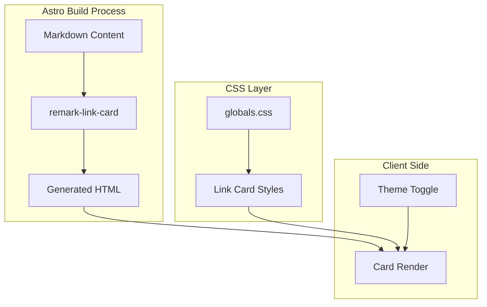

# Design Document: remark-link-card

## Overview

**Purpose**: Astroブログにremark-link-cardプラグインを導入し、Markdown内の裸リンクをリッチなカード形式で表示する機能を提供する。

**Users**: ブログ読者はリンク先の情報（タイトル、説明、OG画像）を視覚的に把握でき、ブログ管理者はMarkdownに生URLを記述するだけでカード表示を実現できる。

**Impact**: 既存のAstro Markdownパイプラインにremarkプラグインを追加し、globals.cssにカードスタイルを追加する。既存の43記事に含まれる`<https://...>`形式リンクが自動的にカード化される。

### Goals
- remark-link-cardプラグインをAstro設定に統合
- 既存CSS変数システム（shadcn/ui）と調和するカードスタイルを実装
- ライト/ダークモード両対応のレスポンシブデザイン
- キャッシュによるビルドパフォーマンス最適化

### Non-Goals
- インライン形式リンク（`[text](url)`）のカード化
- カスタムカードデザインのユーザー設定機能
- リンクカードのサーバーサイド画像最適化（Astro Image統合）

## Architecture

### Existing Architecture Analysis

現在のMarkdownパイプライン構成:
- **remarkPlugins**: 未使用（空）
- **rehypePlugins**: `rehypeMermaid`のみ
- プラグインオプションは配列形式 `[[plugin, options]]`

スタイリングパターン:
- CSS変数: shadcn/ui準拠（`:root`と`.dark`で切替）
- グローバルスタイル: `globals.css`
- Markdownコンテンツスタイル: `[...slug].astro`の`<style is:global>`内prose定義

### Architecture Pattern & Boundary Map



**Architecture Integration**:
- **Selected pattern**: Plugin Extension — 既存Astro Markdownパイプラインにremarkプラグインを追加
- **Domain/feature boundaries**: Markdownパース（remark）とスタイリング（CSS）を分離
- **Existing patterns preserved**: rehypePluginsと同様の配列形式設定、CSS変数によるテーマ管理
- **New components rationale**: プラグイン設定のみ、新規コンポーネント不要
- **Steering compliance**: 既存パターン踏襲

### Technology Stack

| Layer | Choice / Version | Role in Feature | Notes |
|-------|------------------|-----------------|-------|
| Markdown Processing | remark-link-card v1.3.1 | 裸リンクをHTML構造に変換 | MIT License |
| Styling | CSS (globals.css) | カードビジュアル定義 | 既存CSS変数活用 |
| Build | Astro v5.16.9 | remarkPlugins統合 | 既存バージョン |
| Cache | /public/remark-link-card/ | OG画像・ファビコンキャッシュ | ビルド最適化 |

## Requirements Traceability

| Requirement | Summary | Components | Interfaces | Flows |
|-------------|---------|------------|------------|-------|
| 1.1 | remarkPlugins登録 | AstroConfig | astro.config.mjs | Build |
| 1.2 | ビルドエラーなし | AstroConfig | — | Build |
| 1.3 | キャッシュ有効化 | AstroConfig | plugin options | Build |
| 1.4 | URL短縮表示 | AstroConfig | plugin options | Build |
| 2.1 | 生URL変換 | remark-link-card | — | Parse |
| 2.2 | 山括弧URL変換 | remark-link-card | — | Parse |
| 2.3 | インライン形式維持 | remark-link-card | — | Parse |
| 2.4 | OG情報表示 | remark-link-card | HTML output | Render |
| 3.1 | CSS変数使用 | LinkCardStyles | CSS classes | Render |
| 3.2 | パディング・角丸 | LinkCardStyles | CSS classes | Render |
| 3.3 | ホバーエフェクト | LinkCardStyles | CSS classes | Render |
| 3.4 | レスポンシブ対応 | LinkCardStyles | CSS classes | Render |
| 4.1 | ダークモード変数 | LinkCardStyles | .dark selector | Render |
| 4.2 | コントラスト維持 | LinkCardStyles | CSS classes | Render |
| 4.3 | テーマ即時反映 | LinkCardStyles | CSS classes | Render |
| 5.1 | キャッシュディレクトリ | CacheConfig | plugin options | Build |
| 5.2 | gitignore除外 | CacheConfig | .gitignore | — |
| 5.3 | キャッシュ読込 | remark-link-card | plugin options | Build |

## Components and Interfaces

| Component | Domain/Layer | Intent | Req Coverage | Key Dependencies | Contracts |
|-----------|--------------|--------|--------------|------------------|-----------|
| AstroConfig | Build | remarkPlugins設定 | 1.1-1.4, 5.1 | astro.config.mjs (P0) | Config |
| LinkCardStyles | Styling | カードビジュアル | 3.1-3.4, 4.1-4.3 | globals.css (P0) | CSS |
| CacheConfig | Build | キャッシュ管理 | 5.1-5.3 | .gitignore (P1) | Config |

### Build Layer

#### AstroConfig

| Field | Detail |
|-------|--------|
| Intent | remark-link-cardプラグインをAstro Markdownパイプラインに統合 |
| Requirements | 1.1, 1.2, 1.3, 1.4, 5.1 |

**Responsibilities & Constraints**
- remarkPlugins配列にremark-link-cardを追加
- プラグインオプション（cache, shortenUrl）を設定
- 既存rehypePlugins設定との共存

**Dependencies**
- Inbound: Markdownファイル — パース対象（P0）
- External: remark-link-card v1.3.1 — リンクカード変換（P0）

**Contracts**: Config [x]

##### Config Interface
```typescript
// astro.config.mjs への追加設定
interface RemarkLinkCardOptions {
  cache: boolean;      // OG画像・ファビコンをキャッシュ
  shortenUrl: boolean; // URLをドメイン名のみに短縮
}

// 設定例
const remarkLinkCardConfig: [typeof remarkLinkCard, RemarkLinkCardOptions] = [
  remarkLinkCard,
  { cache: true, shortenUrl: true }
];
```

**Implementation Notes**
- Integration: `markdown.remarkPlugins`配列に追加、既存`rehypePlugins`の前に配置
- Validation: ビルド時にプラグイン読み込みエラーがないこと確認
- Risks: TypeScript型定義なし（`// @ts-ignore`で対応）

### Styling Layer

#### LinkCardStyles

| Field | Detail |
|-------|--------|
| Intent | リンクカードのビジュアルスタイルを定義 |
| Requirements | 3.1, 3.2, 3.3, 3.4, 4.1, 4.2, 4.3 |

**Responsibilities & Constraints**
- remark-link-cardが生成する`.rlc-*`クラスにスタイル適用
- 既存CSS変数（`--card`, `--border`, `--radius`等）を使用
- `.dark`セレクタでダークモード対応

**Dependencies**
- Inbound: globals.css — スタイル定義場所（P0）
- Inbound: CSS Variables — デザイントークン（P0）

**Contracts**: CSS [x]

##### CSS Interface

**生成されるHTML構造**:
```html
<a class="rlc-container" href="[URL]">
  <div class="rlc-info">
    <div class="rlc-title">[タイトル]</div>
    <div class="rlc-description">[説明]</div>
    <div class="rlc-url-container">
      
      <span class="rlc-url">[URL]</span>
    </div>
  </div>
  <div class="rlc-image-container">
    
  </div>
</a>
```

**CSSクラス仕様**:

| Class | Purpose | CSS Variables Used |
|-------|---------|-------------------|
| `.rlc-container` | カード全体のコンテナ | `--card`, `--border`, `--radius` |
| `.rlc-info` | テキスト情報エリア | — |
| `.rlc-title` | ページタイトル | `--card-foreground` |
| `.rlc-description` | メタ説明文 | `--muted-foreground` |
| `.rlc-url-container` | URL表示エリア | — |
| `.rlc-favicon` | ファビコン画像 | — |
| `.rlc-url` | URL文字列 | `--muted-foreground` |
| `.rlc-image-container` | OG画像コンテナ | — |
| `.rlc-image` | OG画像 | — |

**レスポンシブ仕様**:
- デスクトップ（768px以上）: 横並びレイアウト（画像右側）
- モバイル（768px未満）: 縦並びレイアウト（画像上部）

**ホバー効果**:
- `box-shadow`の強調
- `transform: translateY(-2px)`による浮き上がり効果
- `transition`によるスムーズなアニメーション

**Implementation Notes**
- Integration: globals.cssの末尾にリンクカードスタイルセクションを追加
- Validation: ライト/ダークモード両方で視認性確認
- Risks: 他のリンクスタイル（`.prose a`）との競合を避けるため、`.rlc-container`で明示的にリセット

### Config Layer

#### CacheConfig

| Field | Detail |
|-------|--------|
| Intent | OG画像・ファビコンキャッシュの管理設定 |
| Requirements | 5.1, 5.2, 5.3 |

**Responsibilities & Constraints**
- キャッシュディレクトリ `/public/remark-link-card/` の存在を前提
- .gitignoreでバージョン管理から除外

**Dependencies**
- Inbound: .gitignore — 除外設定（P1）
- External: remark-link-card cache機能 — キャッシュ生成（P0）

**Contracts**: Config [x]

##### Config Interface
```gitignore
# remark-link-card cache
public/remark-link-card/
```

**Implementation Notes**
- Integration: .gitignoreに1行追加
- Validation: `git status`でキャッシュファイルが追跡されないこと確認
- Risks: なし

## Data Models

### Domain Model

本機能はMarkdownパース時のHTML変換のみであり、永続化データモデルは存在しない。

**キャッシュデータ**（remark-link-card管理）:
- OG画像ファイル: `/public/remark-link-card/images/`
- ファビコンファイル: `/public/remark-link-card/favicons/`
- メタデータJSON: プラグイン内部管理

## Error Handling

### Error Strategy

| Error Type | Scenario | Response |
|------------|----------|----------|
| ネットワークエラー | OG情報取得失敗 | キャッシュ利用 or フォールバック表示 |
| 画像読込エラー | OG画像404 | CSSで非表示 or プレースホルダー |
| プラグインエラー | 設定不正 | ビルド時エラーメッセージ |

### CSS Fallback

OG画像が存在しない場合のフォールバックスタイル:
```css
.rlc-image-container:empty,
.rlc-image-container:has(img[src=""]) {
  display: none;
}

.rlc-container:has(.rlc-image-container:empty) .rlc-info {
  flex: 1;
}
```

## Testing Strategy

### Unit Tests
- プラグインオプション設定が正しく適用されること（手動確認）

### Integration Tests
1. 生URLが正しくカード変換されること
2. 山括弧URLが正しくカード変換されること
3. インライン形式リンクが変換されないこと
4. ビルドがエラーなく完了すること

### E2E/UI Tests
1. ライトモードでカードが正しく表示されること
2. ダークモードでカードが正しく表示されること
3. テーマ切替時にカードスタイルが即座に反映されること
4. モバイル幅でレスポンシブレイアウトが適用されること
5. ホバー時にエフェクトが表示されること

## Performance & Scalability

### Target Metrics
- ビルド時間: キャッシュ有効時、初回以降は外部リクエストなし
- ページロード: キャッシュ画像は`/public/`から配信、CDNキャッシュ対象

### Optimization
- `cache: true`によりOG情報を永続化
- 画像は初回ビルド時にダウンロード、以降は再取得しない

## Supporting References

詳細な調査結果・代替案の比較は[research.md](./research.md)を参照。
