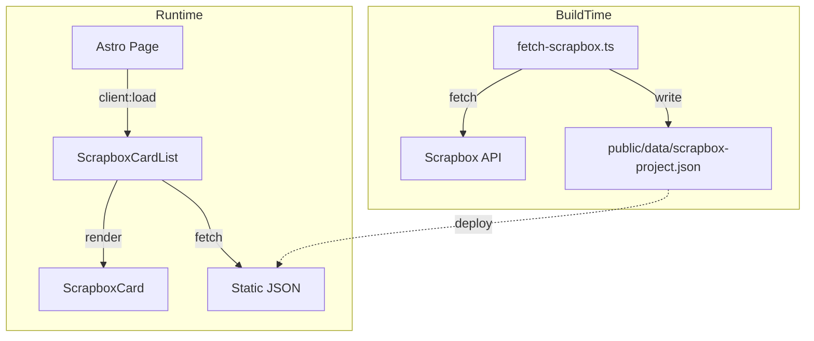
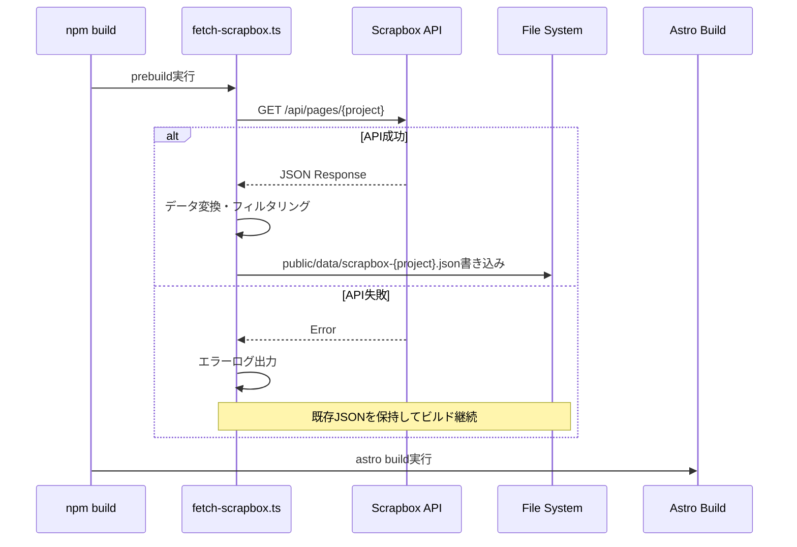
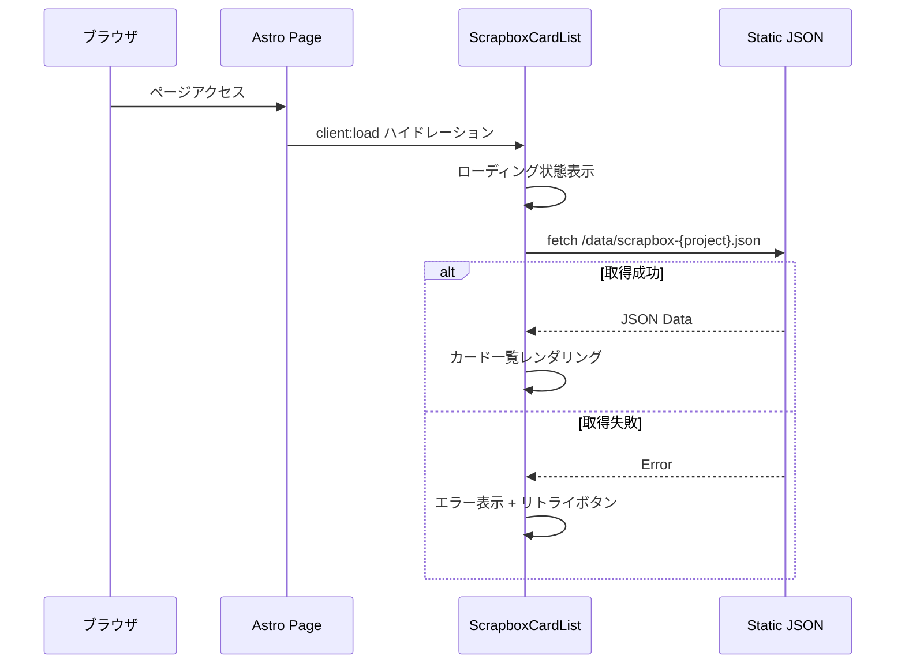
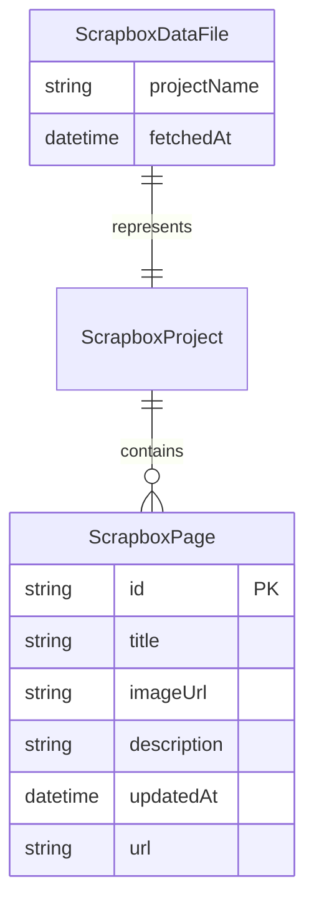

# Design Document: scrapbox-card-list

## Overview

**Purpose**: Scrapbox プロジェクトの最新ページ一覧を、CodePen ライクなリッチカード UI で表示するコンポーネントを提供する。

**Users**: ブログ訪問者が Scrapbox コンテンツを視覚的に魅力的な形式で閲覧する。開発者が `<ScrapboxCardList>` コンポーネントを任意の Astro ページに配置する。

**Impact**: 既存の Astro ブログに新規コンポーネントとビルドスクリプトを追加。既存機能への影響なし。

### Goals
- Scrapbox API からビルド時にデータを取得し、CORS 制限を回避
- モダンなカードデザインでページ一覧を表示
- レスポンシブ対応（デスクトップ/タブレット/モバイル）
- エラー状態（ローディング、データなし、ネットワークエラー）の適切なハンドリング

### Non-Goals
- リアルタイムデータ更新（将来要件として記録済み）
- SEO 最適化（クライアントサイドレンダリングのため不要）
- Scrapbox への書き込み機能
- 複数プロジェクトの同時表示（将来要件として記録済み）

## Architecture

### Architecture Pattern & Boundary Map



**Architecture Integration**:
- **Selected pattern**: ビルド時データ取得 + クライアントサイドレンダリング
- **Domain boundaries**: ビルド時処理（Node.js スクリプト）とランタイム処理（React コンポーネント）を明確に分離
- **Existing patterns preserved**: 既存の shadcn/ui Card コンポーネント、React + Tailwind パターン
- **New components rationale**: ScrapboxCardList（データ取得 + 状態管理）、ScrapboxCard（単一カード表示）、fetch-scrapbox.ts（ビルド時データ取得）

### Technology Stack

| Layer | Choice / Version | Role in Feature | Notes |
|-------|------------------|-----------------|-------|
| Frontend | React 19 + Astro 5 | カードリスト UI コンポーネント | 既存スタック継続利用 |
| UI Components | shadcn/ui Card | カードレイアウトベース | 既存コンポーネント拡張 |
| Data Fetching | TanStack Query v5 | データ取得・キャッシュ・状態管理 | 新規追加 |
| Styling | Tailwind CSS 4 | レスポンシブグリッド、ホバーエフェクト | 既存スタック継続利用 |
| Data | Static JSON | Scrapbox データの静的配信 | `public/data/` に配置 |
| Build Script | Node.js + TypeScript | ビルド時 API 取得 | `scripts/fetch-scrapbox.ts` |

## System Flows

### ビルド時データ取得フロー



### クライアント側データ取得フロー



## Requirements Traceability

| Requirement | Summary | Components | Interfaces | Flows |
|-------------|---------|------------|------------|-------|
| 1.1-1.5 | ビルド時データ取得 | fetch-scrapbox.ts | ScrapboxApiResponse, ScrapboxPageData | ビルド時データ取得フロー |
| 2.1-2.4 | コンポーネント Props | ScrapboxCardList | ScrapboxCardListProps | - |
| 3.1-3.4 | クライアント側データ取得 | ScrapboxCardList | useScrapboxData hook | クライアント側データ取得フロー |
| 4.1-4.5 | リッチカード UI | ScrapboxCard | ScrapboxCardProps | - |
| 5.1-5.3 | レスポンシブ対応 | ScrapboxCard, ScrapboxCardList | - | - |
| 6.1-6.3 | エラーハンドリング | ScrapboxCardList | FetchState | クライアント側データ取得フロー |

## Components and Interfaces

| Component | Domain/Layer | Intent | Req Coverage | Key Dependencies | Contracts |
|-----------|--------------|--------|--------------|------------------|-----------|
| fetch-scrapbox.ts | Build Script | ビルド時に Scrapbox API からデータ取得 | 1.1-1.5 | Node.js fetch API (P0) | Service |
| ScrapboxCardList | UI / React | カード一覧の表示と状態管理 | 2.1-2.4, 3.1-3.4, 6.1-6.3 | ScrapboxCard (P0), useScrapboxData (P0) | State |
| ScrapboxCard | UI / React | 単一カードの表示 | 4.1-4.5, 5.1-5.3 | shadcn/ui Card (P1), useImageLazyLoad (P1) | - |
| useImageLazyLoad | Hooks | 画像遅延読み込み | 4.1, 5.2 | Intersection Observer API (P0) | State |
| useScrapboxData | Hooks | データ取得とキャッシュ | 3.1-3.4 | TanStack Query (P0) | State |

### Build Script Layer

#### fetch-scrapbox.ts

| Field | Detail |
|-------|--------|
| Intent | ビルド時に Scrapbox API からページ一覧を取得し、静的 JSON として保存 |
| Requirements | 1.1, 1.2, 1.3, 1.4, 1.5 |

**Responsibilities & Constraints**
- Scrapbox API エンドポイントへの HTTP リクエスト
- レスポンスデータの変換・フィルタリング
- JSON ファイルの書き込み
- エラー時の graceful degradation（既存ファイル保持）

**Dependencies**
- External: Scrapbox API — ページ一覧取得 (P0)
- External: Node.js fs/promises — ファイル書き込み (P0)

**Contracts**: Service [x]

##### Service Interface

```typescript
// Scrapbox API レスポンス型
interface ScrapboxApiResponse {
  projectName: string;
  skip: number;
  limit: number;
  count: number;
  pages: ScrapboxApiPage[];
}

interface ScrapboxApiPage {
  id: string;
  title: string;
  image: string | null;
  descriptions: string[];
  updated: number;
  created: number;
  views: number;
  linked: number;
  pin: number;
}

// 出力 JSON 型（クライアント用に正規化）
interface ScrapboxPageData {
  id: string;
  title: string;
  imageUrl: string | null;
  description: string;
  updatedAt: string; // ISO 8601 形式
  url: string;
}

interface ScrapboxDataFile {
  projectName: string;
  fetchedAt: string; // ISO 8601 形式
  pages: ScrapboxPageData[];
}

// スクリプト実行関数
async function fetchScrapboxPages(
  projectName: string,
  options?: { limit?: number }
): Promise<ScrapboxDataFile>;
// Throws: FetchError (API failure, network error, parse error)
```

- Preconditions: 環境変数 `SCRAPBOX_PROJECT` または引数で projectName が指定されていること
- Postconditions: `public/data/scrapbox-{project}.json` が作成/更新される
- Invariants: エラー時も既存ファイルは削除されない

**Implementation Notes**
- Integration: `package.json` の `prebuild` スクリプトで実行
- Validation: API レスポンスの必須フィールド存在チェック
- Risks: Scrapbox API 仕様変更時にパースエラー発生の可能性

### UI Layer

#### ScrapboxCardList

| Field | Detail |
|-------|--------|
| Intent | Scrapbox ページ一覧のカードグリッド表示と状態管理 |
| Requirements | 2.1, 2.2, 2.3, 2.4, 3.1, 3.2, 3.3, 3.4, 6.1, 6.2, 6.3 |

**Responsibilities & Constraints**
- Props による設定（project, limit）
- データ取得状態の管理（loading, success, error）
- レスポンシブグリッドレイアウトの提供
- エラー時のリトライ機能

**Dependencies**
- Inbound: Astro Page — コンポーネント配置 (P0)
- Outbound: ScrapboxCard — カード描画 (P0)
- Outbound: useScrapboxData — データ取得 (P0)

**Contracts**: State [x]

##### Props Interface

```typescript
interface ScrapboxCardListProps {
  /** Scrapbox プロジェクト名 */
  project: string;
  /** 表示件数上限（デフォルト: 10） */
  limit?: number;
  /** カスタム className */
  className?: string;
}
```

##### State Management

```typescript
type FetchState<T> =
  | { status: 'idle' }
  | { status: 'loading' }
  | { status: 'success'; data: T }
  | { status: 'error'; error: Error; retry: () => void };

// コンポーネント内部状態
interface ScrapboxCardListState {
  fetchState: FetchState<ScrapboxPageData[]>;
}
```

**Implementation Notes**
- Integration: `client:load` ディレクティブで Astro ページに配置
- Validation: `project` prop 未指定時はエラーメッセージを表示
- Risks: JSON ファイル未生成時のエラーハンドリング

#### ScrapboxCard

| Field | Detail |
|-------|--------|
| Intent | 単一の Scrapbox ページをリッチカード形式で表示 |
| Requirements | 4.1, 4.2, 4.3, 4.4, 4.5, 5.1, 5.2, 5.3 |

**Responsibilities & Constraints**
- サムネイル画像、タイトル、説明文、リンクの表示
- ホバーエフェクトの適用
- 画像未設定時のフォールバック表示
- レスポンシブ対応

**Dependencies**
- Inbound: ScrapboxCardList — カードデータ受け渡し (P0)
- External: shadcn/ui Card — ベースコンポーネント (P1)

**Contracts**: _(Presentation component - summary only)_

##### Props Interface

```typescript
interface ScrapboxCardProps {
  /** ページデータ */
  page: ScrapboxPageData;
  /** カスタム className */
  className?: string;
}
```

**Implementation Notes**
- Integration: 既存 `Card`, `CardHeader`, `CardTitle`, `CardDescription` を組み合わせ
- Validation: `page.imageUrl` が null の場合はプレースホルダーアイコンを表示
- 画像遅延読み込み: `useImageLazyLoad` hook で Intersection Observer を使用、フェードインアニメーション付き
- Risks: 説明文の文字数が極端に長い場合の表示崩れ（line-clamp で対応）

### Hooks Layer

#### useImageLazyLoad

| Field | Detail |
|-------|--------|
| Intent | Intersection Observer を使用した画像遅延読み込みとフェードインアニメーション |
| Requirements | 4.1（サムネイル画像表示）, 5.2（画像リサイズ） |

**Contracts**: State [x]

##### Hook Interface

```typescript
interface UseImageLazyLoadOptions {
  /** 読み込み開始のマージン（デフォルト: '200px'） */
  rootMargin?: string;
  /** 読み込み開始の閾値（デフォルト: 0.1） */
  threshold?: number;
}

interface UseImageLazyLoadResult {
  /** img 要素に渡す ref */
  ref: RefObject<HTMLImageElement>;
  /** 画像が viewport に入ったか */
  isInView: boolean;
  /** 画像の読み込みが完了したか */
  isLoaded: boolean;
  /** 画像読み込み完了時のハンドラ */
  onLoad: () => void;
}

function useImageLazyLoad(
  options?: UseImageLazyLoadOptions
): UseImageLazyLoadResult;
```

**Implementation Notes**
- rootMargin: viewport の 200px 手前で読み込み開始（デフォルト）
- isLoaded: 画像の onload イベントで true に変更、フェードインのトリガーに使用
- アニメーション: Tailwind の `opacity-0 → opacity-100` + `transition-opacity` で実装

#### useScrapboxData

| Field | Detail |
|-------|--------|
| Intent | TanStack Query を使用した Scrapbox JSON データの取得とキャッシュ管理 |
| Requirements | 3.1, 3.2, 3.3, 3.4 |

**Contracts**: State [x]

##### Hook Interface

```typescript
import { useQuery } from '@tanstack/react-query';

function useScrapboxData(
  project: string,
  options?: { limit?: number }
) {
  return useQuery({
    queryKey: ['scrapbox', project],
    queryFn: () => fetchScrapboxJson(project),
    select: (data) => options?.limit ? data.pages.slice(0, options.limit) : data.pages,
    staleTime: 1000 * 60 * 5, // 5分間はキャッシュを使用
  });
}

// 戻り値: UseQueryResult<ScrapboxPageData[], Error>
// - isLoading, isError, data, error, refetch 等を提供
```

**Implementation Notes**
- キャッシュ: TanStack Query の組み込みキャッシュ機能を使用
- リトライ: `refetch()` で再取得可能
- Validation: JSON スキーマの簡易バリデーション（fetchScrapboxJson 内）

## Data Models

### Domain Model



### Logical Data Model

**ScrapboxPageData**（クライアント側で使用）:
- `id`: ページの一意識別子
- `title`: ページタイトル（検索・表示用）
- `imageUrl`: サムネイル URL（nullable、フォールバック処理必要）
- `description`: 説明文（`descriptions` 配列を結合・整形）
- `updatedAt`: 最終更新日時（ISO 8601 形式に変換）
- `url`: Scrapbox ページへの直接リンク

**Data Transformation**:
- Scrapbox API の `descriptions: string[]` → 先頭3要素を結合して `description: string` に変換
- Scrapbox API の `updated: number` (Unix timestamp) → `updatedAt: string` (ISO 8601) に変換
- `url` は `https://scrapbox.io/{project}/{encodeURIComponent(title)}` で生成

### Data Contracts & Integration

**JSON ファイル形式** (`public/data/scrapbox-{project}.json`):

```json
{
  "projectName": "example",
  "fetchedAt": "2026-01-17T00:00:00.000Z",
  "pages": [
    {
      "id": "abc123",
      "title": "Page Title",
      "imageUrl": "https://...",
      "description": "Page description text...",
      "updatedAt": "2026-01-16T12:00:00.000Z",
      "url": "https://scrapbox.io/example/Page%20Title"
    }
  ]
}
```

## Error Handling

### Error Strategy

| Error Type | Trigger | Response | Recovery |
|------------|---------|----------|----------|
| API 取得失敗（ビルド時） | Scrapbox API エラー | エラーログ出力、既存 JSON 保持 | ビルド継続、次回ビルドで再試行 |
| JSON 未存在（ランタイム） | ファイル未生成 or 404 | 「データが見つかりません」表示 | ビルド再実行を案内 |
| ネットワークエラー（ランタイム） | fetch 失敗 | エラー表示 + リトライボタン | ユーザーによるリトライ |
| データ 0 件 | API が空配列を返却 | 「ページが見つかりません」表示 | - |
| JSON パースエラー | 不正な JSON 形式 | エラー表示 | ビルド再実行を案内 |

### Error Categories and Responses

**User Errors (4xx)**:
- JSON 404: 「Scrapbox データが見つかりません。ビルドを再実行してください。」

**System Errors (5xx)**:
- ネットワークエラー: 「データの取得に失敗しました。」+ リトライボタン

**Business Logic Errors**:
- データ 0 件: 「このプロジェクトにはページがありません。」

## Testing Strategy

### Unit Tests
- `fetchScrapboxPages`: API モック、正常系/エラー系のデータ変換
- `useScrapboxData`: 各状態遷移（idle → loading → success/error）
- `ScrapboxCard`: Props に基づく正しいレンダリング

### Integration Tests
- ビルドスクリプト: 実際の API 呼び出し → JSON 生成の E2E
- ScrapboxCardList: JSON fetch → カード一覧表示の統合テスト

### E2E/UI Tests
- カード一覧ページの表示確認
- ホバーエフェクトの動作確認
- レスポンシブ表示（モバイル/タブレット/デスクトップ）

### Performance
- 大量ページ（100件以上）時の初期表示速度
- 画像遅延読み込みの動作確認
