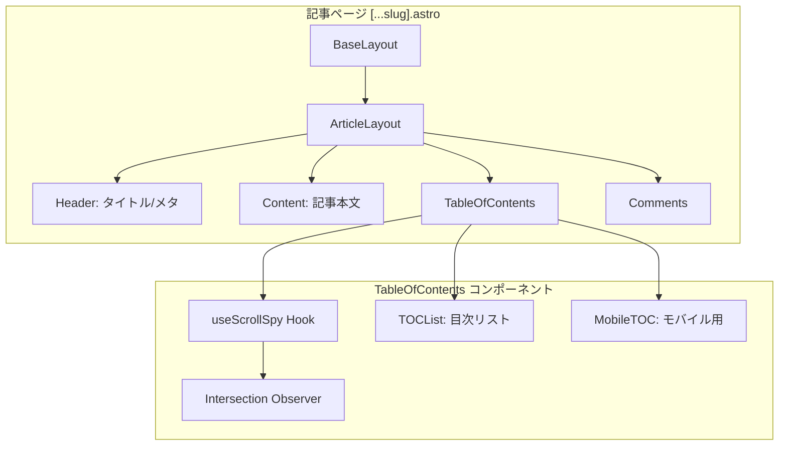
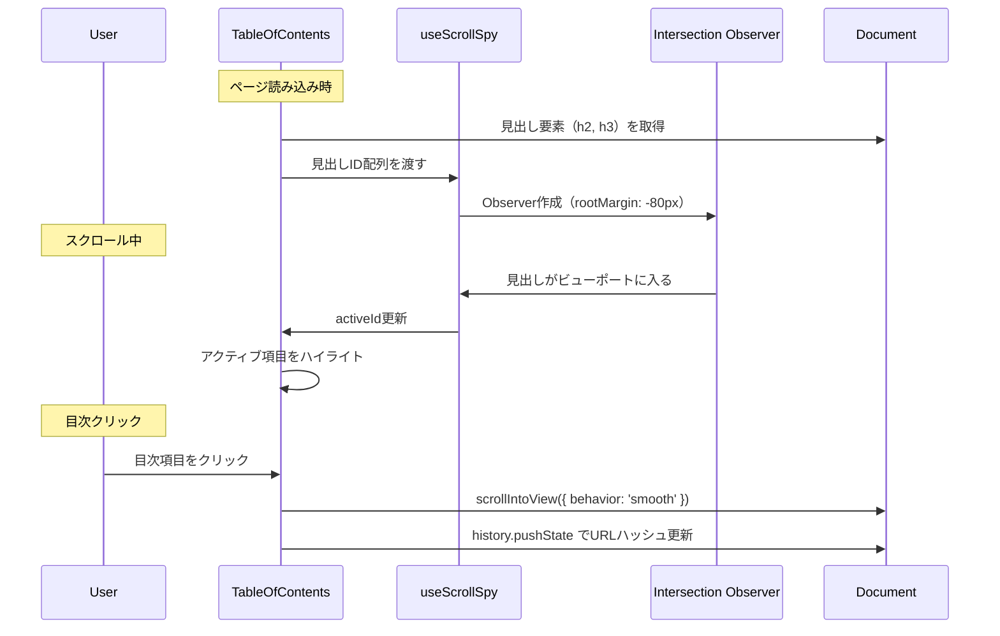

# Design Document: ScrollSpy Table of Contents

## Overview

**Purpose**: 記事ページにScrollSpy機能を備えた目次を表示し、読者が記事の構造を把握しながら効率的にナビゲーションできるようにする。

**Users**: ブログ読者が記事を読む際に利用する。

**Impact**: 既存の記事ページレイアウトを変更し、デスクトップでは2カラムレイアウト（記事 + 目次サイドバー）に拡張する。

### Goals
- 記事内のh2/h3見出しから目次を自動生成
- スクロール位置に応じてアクティブな見出しをハイライト
- デスクトップ: 右側スティッキー、モバイル: 折りたたみアコーディオン

### Non-Goals
- h4以下の見出しの対応
- 目次の手動編集機能
- 見出しの並べ替え機能

## Architecture

### Existing Architecture Analysis

現在の記事ページ（`[...slug].astro`）は単一カラムレイアウト:
- BaseLayout → article要素（container mx-auto）
- 記事コンテンツは`.prose`クラスでスタイリング
- Reactコンポーネントは`client:load`または`client:only`でハイドレーション

### Architecture Pattern & Boundary Map



**Architecture Integration**:
- **Selected pattern**: Container/Presentation（コンテナでロジック、プレゼンテーションで表示）
- **Domain boundaries**: 目次機能は独立したコンポーネントとして分離
- **Existing patterns preserved**: Reactコンポーネント + client:load
- **New components rationale**: 目次はインタラクティブなためReactで実装

### Technology Stack

| Layer | Choice / Version | Role in Feature | Notes |
|-------|------------------|-----------------|-------|
| Frontend | React 18 + TypeScript | 目次コンポーネント | 既存スタック |
| UI Library | shadcn/ui (Collapsible) | モバイル折りたたみ | 追加が必要 |
| State | useState + Intersection Observer | アクティブ見出し管理 | ブラウザAPI |
| Styling | Tailwind CSS | レスポンシブレイアウト | 既存スタック |

## System Flows

### ScrollSpy フロー



## Requirements Traceability

| Requirement | Summary | Components | Interfaces | Flows |
|-------------|---------|------------|------------|-------|
| 1.1 | 見出し抽出・目次生成 | TableOfContents | HeadingItem[] | 初期化 |
| 1.2 | 階層構造表示 | TOCList | - | - |
| 1.3 | 見出しなし時非表示 | TableOfContents | - | - |
| 1.4 | クリック可能リンク | TOCList | - | - |
| 2.1 | スクロール時ハイライト | useScrollSpy | activeId | ScrollSpy |
| 2.2 | ハイライト移動 | useScrollSpy | - | ScrollSpy |
| 2.3 | パフォーマンス最適化 | useScrollSpy (IO) | - | ScrollSpy |
| 2.4 | 最上部優先 | useScrollSpy | - | ScrollSpy |
| 3.1 | スムーズスクロール | TOCList | - | クリック |
| 3.2 | クリック後アクティブ | TOCList | - | クリック |
| 3.3 | URLハッシュ更新 | TOCList | - | クリック |
| 4.1 | デスクトップスティッキー | TableOfContents | - | - |
| 4.2 | モバイル折りたたみ | MobileTOC | isOpen | - |
| 4.3 | ダークモード対応 | Tailwind CSS | - | - |
| 4.4 | スティッキー維持 | CSS sticky | - | - |
| 4.5 | アニメーション | Collapsible | - | - |
| 5.1 | ARIA属性 | TableOfContents | aria-label | - |
| 5.2 | キーボード対応 | TOCList | - | - |
| 5.3 | aria-current | TOCList | - | - |
| 5.4 | aria-expanded | MobileTOC | - | - |
| 6.1 | アクティブ項目横にアバター | TOCList, TOCAvatar | avatarSrc | ScrollSpy |
| 6.2 | 静的画像読み込み | TOCAvatar | - | - |
| 6.3 | アバター移動 | TOCList | activeId | ScrollSpy |
| 6.4 | 移動アニメーション | TOCAvatar | CSS transition | - |

## Components and Interfaces

| Component | Domain/Layer | Intent | Req Coverage | Key Dependencies | Contracts |
|-----------|--------------|--------|--------------|------------------|-----------|
| TableOfContents | UI/Container | 目次全体のコンテナ | 1.1, 1.3, 4.1-4.4, 5.1 | useScrollSpy (P0) | State |
| useScrollSpy | Hooks | スクロール位置検出 | 2.1-2.4 | Intersection Observer (P0) | State |
| TOCList | UI/Presentation | 目次リスト表示 | 1.2, 1.4, 3.1-3.3, 5.2-5.3, 6.1, 6.3 | TOCAvatar (P1) | - |
| MobileTOC | UI/Presentation | モバイル用折りたたみ | 4.2, 4.5, 5.4 | Collapsible (P0) | State |
| TOCAvatar | UI/Presentation | アクティブ項目のアバター表示 | 6.1-6.4 | - | State |

### Hooks

#### useScrollSpy

| Field | Detail |
|-------|--------|
| Intent | Intersection Observerを使用してアクティブな見出しを検出 |
| Requirements | 2.1, 2.2, 2.3, 2.4 |

**Responsibilities & Constraints**
- 渡された見出しIDに対してIntersection Observerを設定
- ビューポート内の最上部の見出しをアクティブとして返す
- コンポーネントアンマウント時にObserverをクリーンアップ

**Dependencies**
- External: Intersection Observer API — 見出し検出 (P0)

**Contracts**: State [x]

##### State Management
```typescript
interface UseScrollSpyOptions {
  /** Observerのrootマージン（ヘッダー高さ考慮） */
  rootMargin?: string;
  /** 検出閾値 */
  threshold?: number | number[];
}

interface UseScrollSpyReturn {
  /** 現在アクティブな見出しのID */
  activeId: string | null;
}

function useScrollSpy(
  headingIds: string[],
  options?: UseScrollSpyOptions
): UseScrollSpyReturn;
```

**Implementation Notes**
- rootMarginはデフォルト`-80px 0px -80% 0px`（上部80px、下部80%をマージン）
- 複数の見出しがビューポート内にある場合、最も上部のものをアクティブとする

### UI Components

#### TableOfContents

| Field | Detail |
|-------|--------|
| Intent | 目次全体のコンテナ、レスポンシブ表示の切り替え |
| Requirements | 1.1, 1.3, 4.1-4.4, 5.1 |

**Responsibilities & Constraints**
- 見出し要素をDOMから抽出
- デスクトップ/モバイル表示の切り替え
- 見出しがない場合はnullを返す

**Dependencies**
- Inbound: [...slug].astro — 記事ページからpropsで見出し情報を受け取る (P0)
- Outbound: useScrollSpy — アクティブ見出しの検出 (P0)
- Outbound: TOCList — 目次リストの表示 (P1)
- Outbound: MobileTOC — モバイル表示 (P1)

**Contracts**: State [x]

##### State Management
```typescript
interface HeadingItem {
  id: string;
  text: string;
  level: 2 | 3;
}

interface TableOfContentsProps {
  /** 記事内の見出し一覧 */
  headings: HeadingItem[];
  /** カスタムクラス名 */
  className?: string;
  /** アバター画像のパス（public/からの相対パス、例: "/avatar.png"） */
  avatarSrc?: string;
  /** アバターの代替テキスト */
  avatarAlt?: string;
}
```

#### TOCList

| Field | Detail |
|-------|--------|
| Intent | 目次リストの表示とナビゲーション |
| Requirements | 1.2, 1.4, 3.1-3.3, 5.2-5.3 |

**Responsibilities & Constraints**
- 見出しの階層構造を維持して表示（h3はインデント）
- クリックでスムーズスクロール
- アクティブ項目のハイライト表示

**Contracts**: State [x]

##### State Management
```typescript
interface TOCListProps {
  headings: HeadingItem[];
  activeId: string | null;
  onItemClick?: (id: string) => void;
}
```

**Implementation Notes**
- スムーズスクロールは`element.scrollIntoView({ behavior: 'smooth', block: 'start' })`
- URLハッシュ更新は`history.pushState(null, '', `#${id}`)`（replaceStateではなくpushState）

#### MobileTOC

| Field | Detail |
|-------|--------|
| Intent | モバイル用折りたたみ目次 |
| Requirements | 4.2, 4.5, 5.4 |

**Responsibilities & Constraints**
- 折りたたみ/展開の制御
- アコーディオンアニメーション

**Dependencies**
- External: @radix-ui/react-collapsible — 折りたたみUI (P0)

**Contracts**: State [x]

##### State Management
```typescript
interface MobileTOCProps {
  headings: HeadingItem[];
  activeId: string | null;
}
// 内部でisOpen状態を管理
```

#### TOCAvatar

| Field | Detail |
|-------|--------|
| Intent | アクティブな目次項目の横にアバターアイコンを表示 |
| Requirements | 6.1, 6.2, 6.3, 6.4 |

**Responsibilities & Constraints**
- アクティブな項目の左側にアバター画像を表示
- アクティブ項目変更時にスムーズに移動
- public/ディレクトリの静的画像を使用

**Dependencies**
- なし（純粋なプレゼンテーションコンポーネント）

**Contracts**: State [x]

##### State Management
```typescript
interface TOCAvatarProps {
  /** アバター画像のパス（public/からの相対パス） */
  src: string;
  /** 代替テキスト */
  alt?: string;
  /** アバターのサイズ（px） */
  size?: number;
}
```

**Implementation Notes**
- アバター画像はTableOfContentsのpropsで設定可能にする
- デフォルトサイズは20px程度（目次テキストに合わせる）
- CSSのtransitionでスムーズな移動アニメーションを実現
- 画像はNext/Image or img要素で表示、border-radiusで丸く加工

## Data Models

### Domain Model

```typescript
/** 見出し情報 */
interface HeadingItem {
  /** 見出し要素のID（アンカーリンク用） */
  id: string;
  /** 見出しのテキスト */
  text: string;
  /** 見出しレベル（2 = h2, 3 = h3） */
  level: 2 | 3;
}
```

## Error Handling

### Error Strategy
- 見出しが取得できない場合: 目次を非表示
- Intersection Observerがサポートされていない場合: アクティブハイライトなしで静的目次を表示

### Error Categories and Responses
**User Errors**: なし
**System Errors**:
- DOM要素が見つからない → 静的目次として表示（ハイライトなし）

## Testing Strategy

プロジェクトの[テストアーキテクチャ](../../../docs/architecture/test_architecture.md)に準拠。

### Unit Tests（優先度: 高）

テスト価値が高く、実装コストが低い純粋関数を優先。

| テスト対象 | テストケース | 期待結果 |
|-----------|-------------|---------|
| `useScrollSpy` | 見出しIDリストを渡してObserver作成 | Observerがセットアップされる |
| `useScrollSpy` | 見出しがビューポートに入る | activeIdが更新される |
| `useScrollSpy` | 複数の見出しがビューポート内 | 最上部の見出しがactiveになる |
| `useScrollSpy` | アンマウント時 | Observerがクリーンアップされる |
| 見出し抽出 | h2, h3を含む記事 | 階層構造を維持したHeadingItem[] |
| 見出し抽出 | 見出しがない記事 | 空配列 |

**テストファイル配置**:
- `src/components/toc/useScrollSpy.test.ts`
- `src/lib/extractHeadings.test.ts`（見出し抽出ユーティリティ）

### Component Tests（優先度: 中）

DOMモックが必要だが、テスト価値が高い。

| テスト対象 | テストケース | 期待結果 |
|-----------|-------------|---------|
| `TOCList` | 見出し一覧の表示 | h3がインデントされて表示 |
| `TOCList` | activeIdが渡される | 該当項目がハイライト |
| `TOCList` | 項目クリック | onItemClickが呼ばれる |
| `TOCAvatar` | アクティブ項目に表示 | アバター画像が表示される |
| `TOCAvatar` | srcが渡される | 指定画像が読み込まれる |
| `MobileTOC` | 開閉ボタンクリック | isOpenがトグル |

**テストファイル配置**:
- `src/components/toc/TOCList.test.tsx`
- `src/components/toc/TOCAvatar.test.tsx`
- `src/components/toc/MobileTOC.test.tsx`

### E2E Tests（Playwright）

ユーザー操作を再現し、実際のブラウザ動作を検証。

| シナリオ | 手順 | 期待結果 |
|---------|------|---------|
| 目次表示 | 記事ページを開く | 目次が右側に表示される |
| ScrollSpy | ページをスクロール | アクティブ項目が変わる |
| アバター表示 | ページをスクロール | アバターがアクティブ項目に移動 |
| ナビゲーション | 目次項目をクリック | 該当セクションにスクロール、URLハッシュ更新 |
| モバイル表示 | ビューポートを縮小 | アコーディオン形式に切り替わる |
| モバイル開閉 | 開閉ボタンをクリック | 目次が展開/折りたたみ |
| ダークモード | テーマ切り替え | 目次のスタイルが追従 |

**テストファイル配置**:
- `e2e/toc.spec.ts`

### テスト環境設定

```typescript
// vitest.config.ts の追加設定
{
  test: {
    environment: "jsdom", // Component Tests用
    setupFiles: ["./src/test/setup.ts"],
  }
}
```

```typescript
// src/test/setup.ts
// Intersection Observer のモック
class MockIntersectionObserver {
  observe = vi.fn();
  disconnect = vi.fn();
  unobserve = vi.fn();
}
global.IntersectionObserver = MockIntersectionObserver;
```

## Self Review

### 要件とのギャップ分析

| チェック項目 | 状態 | 備考 |
|-------------|------|------|
| 全要件がコンポーネントにマッピングされている | ✅ | Traceability Matrixで確認済み |
| アバター機能（Req 6）が設計に反映されている | ✅ | TOCAvatar追加、propsにavatarSrc追加 |
| モバイル表示の仕様が明確 | ✅ | MobileTOC + Collapsible |
| URLハッシュの更新タイミング | ✅ | クリック時のみ（Design Decisionsに記載） |

### 設計上の懸念点

| 懸念 | リスク | 対策 |
|------|-------|------|
| アバターアニメーションのパフォーマンス | 低 | CSS transitionで実装、JSアニメーション回避 |
| 長い見出しテキストの表示 | 低 | line-clamp または text-overflow で対応 |
| Intersection Observerの閾値 | 低 | 実装時に調整可能なようにオプション化済み |

### 設計判断（確定）

| 項目 | 決定 | 理由 |
|------|------|------|
| モバイルでのアバター表示 | **非表示** | シンプルなUIを維持 |
| アバターの初期位置 | **最初の見出しに表示** | ページ読み込み直後からアバターが見える |
| 見出しがない記事のUI | 何も表示しない | Req 1.3に準拠 |

### コードレビュー観点

実装時に確認すべきポイント:

1. **型安全性**: HeadingItem, TOCAvatarPropsの型が適切に使用されているか
2. **アクセシビリティ**: aria-current, aria-expanded, キーボードナビゲーション
3. **パフォーマンス**: Intersection Observer のクリーンアップ、不要な再レンダリング防止
4. **エッジケース**: 見出しなし、見出し1つのみ、50個以上の見出し

## Performance & Scalability

- **Target**: 目次の初期表示は100ms以内
- **Optimization**: Intersection Observer使用によりscrollイベントのデバウンス不要
- **Consideration**: 見出しが50以上の長い記事でもパフォーマンス劣化なし
