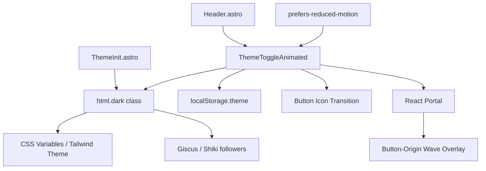
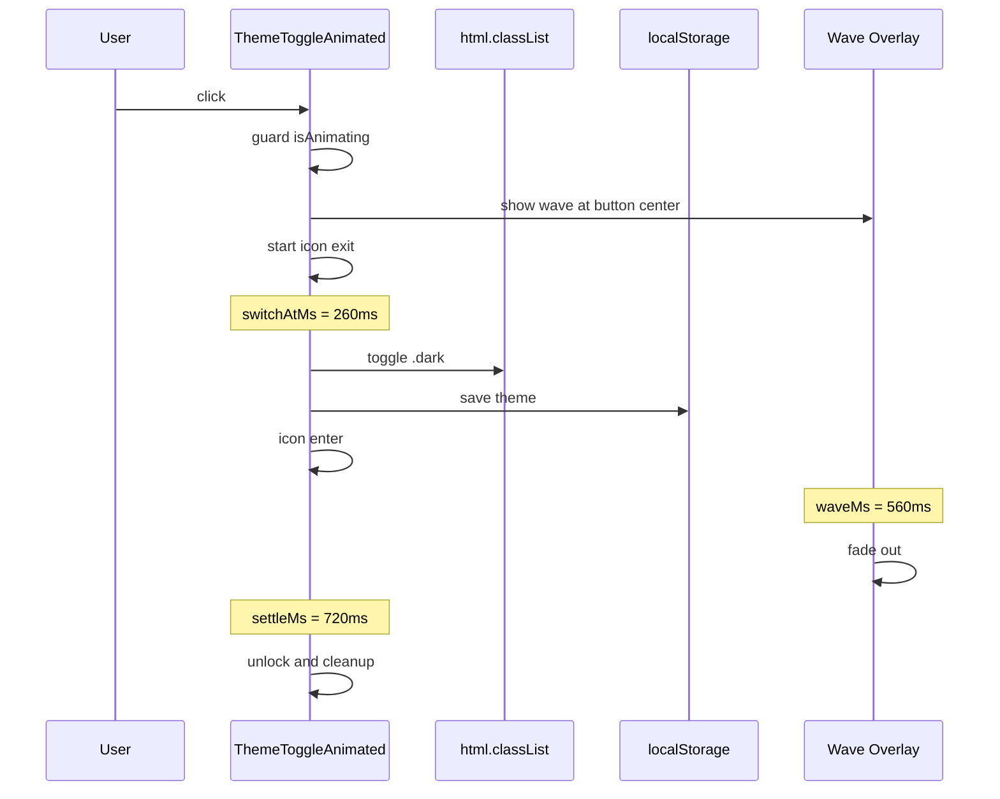
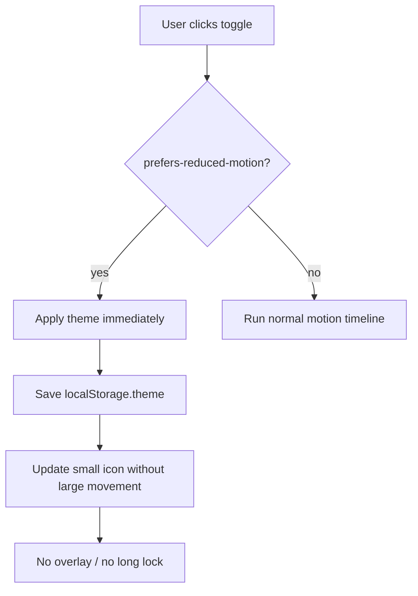

# Design Document: Theme Toggle Animation Refinement

## Table of Contents

| Section | What You'll Learn |
|---------|-------------------|
| [Overview](#overview) | 今回の改善範囲と非対象を確認する |
| [Architecture](#architecture) | 既存コンポーネントをどう整理するかを把握する |
| [System Flows](#system-flows) | クリックからテーマ反映までの時系列を確認する |
| [Requirements Traceability](#requirements-traceability) | 要件と設計要素の対応を確認する |
| [Components and Interfaces](#components-and-interfaces) | 追加する定数・状態・補助関数の契約を確認する |
| [Testing Strategy](#testing-strategy) | 実装時に検証すべき観点を確認する |
| [Implementation Notes](#implementation-notes) | 実装判断で迷いやすい点を整理する |

## Overview

**Purpose**: テーマ切替アニメーションを、読み物サイトとして邪魔にならない短いフィードバックへ整える。既存の波演出は維持しつつ、タイミング値・フェーズ管理・アクセシビリティ対応を見直す。

**Users**: ブログ読者はライト/ダークモード切替時に状態変化を自然に認識できる。開発者はアニメーション設定を一箇所で調整できる。

**Impact**: `src/components/ThemeToggleAnimated.tsx` の実装方針を変更する。外部ライブラリは追加せず、Issue #33 のサイト全体モーション設計とは分離する。

### Goals

- 波アニメーションをボタン起点に戻し、テーマ切替操作との因果を明確にする
- duration、delay、easing を `THEME_TOGGLE_MOTION` に集約する
- `prefers-reduced-motion` 有効時は全画面移動演出を止める
- テーマ反映、localStorage保存、`.dark` class更新の既存契約を維持する

### Non-Goals

- Framer Motion / react-spring の導入
- サイト全体のマイクロインタラクション設計
- Giscus、Shiki、ThemeInitのテーマ連動方式変更
- ページ遷移アニメーションやView Transition APIの本格導入

## Architecture

### Existing Architecture Analysis

`ThemeToggleAnimated` はReact Islandとして `Header.astro` から `client:load` で読み込まれる。テーマの初期適用は `ThemeInit.astro` がhead内で実行し、React側はマウント後に `document.documentElement.classList.contains("dark")` を読んで同期する。

現行実装の問題は、描画責務ではなくアニメーション契約が散在している点にある。`setTimeout` の数値、CSS transition duration、フェーズ名が近接していないため、演出を調整するとテーマ反映や操作ロックのタイミングがズレやすい。

### Architecture Pattern & Boundary Map

**Architecture Integration**:
- Selected pattern: dependency-free React state machine with centralized motion constants
- Domain/feature boundaries: テーマ状態管理、波演出、アクセシビリティ分岐を同一コンポーネント内で薄く分離する
- Existing patterns preserved: React Portal、ThemeInit連携、localStorageキー `"theme"`、Tailwind/CSS変数
- New components rationale: 新規コンポーネントは作らず、補助定数と小さな関数だけ追加する
- Steering compliance: 過度な抽象化を避け、現在の要件に必要な最小整理に留める



### Technology Stack

| Layer | Choice / Version | Role in Feature | Notes |
|-------|------------------|-----------------|-------|
| Frontend | React 19 | `ThemeToggleAnimated` の状態管理 | 既存依存を使用 |
| Styling | Tailwind CSS 4 + CSS variables | 色、transition、overlay配置 | `--background` / `--foreground` を優先 |
| Data / Storage | localStorage | 手動テーマ設定の永続化 | key: `"theme"` |
| Runtime API | `matchMedia` | reduced motion検出 | SSR後にクライアントで評価 |
| Animation Library | 追加なし | 今回は依存追加しない | Issue #33で再検討 |

## System Flows

### Normal Motion



### Reduced Motion



### Motion Timing Contract

```typescript
const THEME_TOGGLE_MOTION = {
  waveMs: 560,
  switchAtMs: 260,
  fadeMs: 140,
  iconMs: 220,
  settleMs: 720,
  easing: "cubic-bezier(0.16, 1, 0.3, 1)",
} as const;
```

| Phase | Time | Responsibility |
|-------|------|----------------|
| Start | 0ms | lock button, compute button center, show wave, start icon exit |
| Theme apply | 260ms | toggle `.dark`, persist `localStorage.theme`, start icon enter |
| Wave complete | 560ms | stop expanding and begin fade |
| Unlock | 720ms | hide overlay, reset phase, allow next click |

`switchAtMs` は `waveMs` の約46%に置く。波が画面を覆い始めたタイミングでテーマを切り替えることで、背景色の変化が唐突に見えにくい。

## Requirements Traceability

| Requirement | Summary | Components | Interfaces | Flows |
|-------------|---------|------------|------------|-------|
| 1.1-1.5 | 波とボタン内アイコンを主演出にする | `ThemeToggleAnimated`, Wave Overlay | `THEME_TOGGLE_MOTION` | Normal Motion |
| 2.1-2.5 | タイミングを一箇所で調整可能にする | `THEME_TOGGLE_MOTION`, timer cleanup | Timer refs | Normal Motion |
| 3.1-3.5 | reduced motionと操作安全性を担保する | `usePrefersReducedMotion`, button guard | `matchMedia` | Reduced Motion |
| 4.1-4.5 | 既存テーマ機構との互換性を維持する | Theme class update, storage update | `localStorage.theme`, `.dark` | Normal / Reduced |
| 5.1-5.4 | 外部ライブラリ導入判断を分離する | Design decision | Issue #33 | N/A |

## Components and Interfaces

| Component | Domain/Layer | Intent | Req Coverage | Key Dependencies | Contracts |
|-----------|--------------|--------|--------------|------------------|-----------|
| `ThemeToggleAnimated` | UI/React | テーマ切替UIと演出の制御 | 1, 2, 3, 4 | ThemeInit (P0), localStorage (P0) | State |
| `THEME_TOGGLE_MOTION` | UI config | モーションの時間・イージング契約 | 1, 2 | None | Constants |
| `getWaveGeometry` | UI helper | ボタン中心から画面を覆う円を計算 | 1, 2 | DOMRect (P0) | Pure helper |
| `usePrefersReducedMotion` | UI hook | OSの動き軽減設定をReact stateへ反映 | 3 | matchMedia (P0) | State |

### UI / React

#### ThemeToggleAnimated

| Field | Detail |
|-------|--------|
| Intent | テーマ変更、永続化、波演出、ボタン内アイコン遷移を管理する |
| Requirements | 1.1-1.5, 2.1-2.5, 3.1-3.5, 4.1-4.5 |

**Responsibilities & Constraints**
- `ThemeInit.astro` が適用済みのDOM状態を初期テーマとして読む
- クリック時にテーマを反転し、`.dark` classと`localStorage.theme`を更新する
- 通常時はボタン中心起点の波を表示する
- reduced motion時は全画面波と大きな移動をスキップする
- 未完了タイマーを保持し、unmount時に必ずclearする

**State Management**

```typescript
type IconPhase = "idle" | "exit" | "enter";

interface ThemeToggleState {
  isDark: boolean;
  mounted: boolean;
  isAnimating: boolean;
  showWave: boolean;
  waveStyle: React.CSSProperties;
  iconPhase: IconPhase;
}
```

`isAnimating` は通常モーション時だけ長く保持する。reduced motion時は即時反映し、長いdisabled状態を作らない。

#### getWaveGeometry

```typescript
interface WaveGeometry {
  left: number;
  top: number;
  size: number;
}

function getWaveGeometry(button: HTMLButtonElement, viewport: {
  width: number;
  height: number;
}): WaveGeometry;
```

- Preconditions: `button` はDOM上に存在し、`getBoundingClientRect()` を呼べる
- Postconditions: `size` は起点から最遠の画面角までを覆う直径になる
- Invariants: viewport全体を覆うため、半径は四隅までの最大距離以上にする

#### usePrefersReducedMotion

```typescript
function usePrefersReducedMotion(): boolean;
```

- 初期値は `false`
- クライアントマウント後に `window.matchMedia("(prefers-reduced-motion: reduce)")` を評価する
- media queryの変更イベントにも追従する
- `matchMedia` が利用できない環境では `false` として扱う

## Testing Strategy

### Unit Tests

- `getWaveGeometry` がボタン中心から画面四隅を覆う直径を返す
- `prefers-reduced-motion` 有効時に波表示フェーズを開始しない
- テーマ切替時に `.dark` class と `localStorage.theme` が更新される
- unmount時に未完了タイマーがclearされる

### Integration Tests

- `ThemeInit.astro` 適用済みの `.dark` class を初期表示時にReact stateへ同期する
- 通常モーションで `switchAtMs` 後にテーマが切り替わる
- アニメーション中の追加クリックで二重にテーマが反転しない

### E2E/UI Tests

- ライト→ダークで波アニメーション後に `html.dark` が付与される
- ダーク→ライトで波アニメーション後に `html.dark` が除去される
- ページリロード後も `localStorage.theme` のテーマが維持される
- reduced motion emulation時に全画面波が表示されず即時切替される

### Visual Regression

既存のスナップショットテストは `animations: "disabled"` を設定しているため、通常モーションそのものの差分確認には使わない。テーマ切替後の最終状態確認に限定する。

## Implementation Notes

- `THEME_TOGGLE_MOTION` はコンポーネント上部に置き、`setTimeout` とstyle transitionの両方で参照する。
- 波の背景色は固定 `rgb(10,10,10)` / `rgb(250,250,250)` より、切替先テーマの `--background` と揃える。ただしCSS変数を直接読み取る実装が重い場合は現行近似色を定数化する。
- 大アイコン演出は今回の主設計から外す。残す場合も `iconMs` 内の短い補助演出に限定し、reduced motion時は非表示にする。
- `aria-label` は現在状態ではなく操作意図を示すため、「ダークモードに切り替える」「ライトモードに切り替える」のように状態別にする。
- 実装後は `pnpm lint && pnpm test:run && pnpm build` を必ず実行する。
