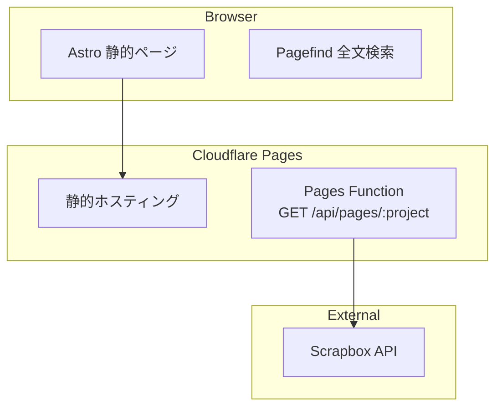

# KJR020's Blog

KJR020の技術ブログ。Astro + Cloudflare Pages で構築。

[](https://github.com/KJR020/kjr020.github.io/actions/workflows/ci.yml)

**https://kjr020.dev/**

## 特徴

### 全文検索

[Pagefind](https://pagefind.app/) によるクライアントサイド全文検索。`Cmd+K` でコマンドパレットから即座にアクセス可能。

### ブログ機能

- Markdown + Astro Content Collections による記事管理
- タグ分類 / シンタックスハイライト (Shiki) / Mermaid 図 / コールアウト / リンクカード
- [Giscus](https://giscus.app/) によるコメント (GitHub Discussions 連携)
- レスポンシブデザイン + ダークモード
- sitemap 自動生成

## アーキテクチャ



## 技術スタック

| カテゴリ          | 技術                                                                  |
|---------------|-----------------------------------------------------------------------|
| フレームワーク       | [Astro](https://astro.build/) 5.x + [React](https://react.dev/) 19    |
| スタイリング        | [Tailwind CSS](https://tailwindcss.com/) 4                            |
| 検索          | [Pagefind](https://pagefind.app/) (クライアントサイド全文検索)                 |
| インフラ          | [Cloudflare Pages](https://pages.cloudflare.com/) + Pages Functions   |
| Lint / Format | [Biome](https://biomejs.dev/)                                         |
| テスト           | [Vitest](https://vitest.dev/) + [Playwright](https://playwright.dev/) |
| CI/CD         | GitHub Actions → Cloudflare Pages                                     |

## プロジェクト構成

```text
src/
├── components/          # UI コンポーネント (Astro / React)
├── design-system/       # 開発時限定のLiving Design System
├── hooks/               # React Hooks
├── integrations/        # Astroカスタムintegration
├── layouts/             # ページレイアウト
├── lib/                 # ユーティリティ
├── pages/               # ルーティング (ファイルベース)
├── styles/              # グローバルスタイル
└── types/               # 型定義

functions/
├── _lib/                # Proxy 共通ロジック
└── api/pages/           # Scrapbox ページ一覧 Proxy

content/
└── posts/               # ブログ記事 (Markdown)

e2e/
├── helpers/             # Playwright E2E / visual regression helper
└── *.spec.ts            # E2E テスト

docs/
├── index.html           # GitHub Pages 旧URLから kjr020.dev へのリダイレクト
├── 404.html             # GitHub Pages 旧パスから kjr020.dev 同一パスへのリダイレクト
├── architecture/        # 設計ドキュメント
└── security/            # セキュリティ検証・依存管理チェックリスト
```

<details>
<summary><strong>開発ガイド</strong></summary>

### 必要な環境

- Node.js 22.x
- pnpm 11.x

### セットアップ

```shell
pnpm install
```

### コマンド

| コマンド                 | 説明               |
|----------------------|--------------------|
| `pnpm dev`           | Astro 開発サーバー起動 |
| `pnpm build`         | 本番ビルド            |
| `pnpm preview`       | ビルド結果のプレビュー      |
| `pnpm lint`          | Biome Lint         |
| `pnpm lint:fix`      | Lint 自動修正      |
| `pnpm format`        | フォーマット             |
| `pnpm typecheck`     | TypeScript 型チェック  |
| `pnpm test:run`      | Vitest 実行        |
| `pnpm test:coverage:report` | カバレッジ計測（閾値チェックなし） |
| `pnpm test:coverage` | カバレッジ閾値チェック      |
| `pnpm test:coverage:check` | カバレッジ閾値チェック（明示名） |
| `pnpm test:e2e`      | Playwright E2E テスト |
| `pnpm test:design-system` | Living Design System E2Eテスト |
| `pnpm test:e2e:update-snapshots` | 現在の実行環境用スナップショット更新 |

### Living Design System

`pnpm dev`の実行中だけ、`http://localhost:4321/design-system`でデザインシステムを確認できる。本番ビルドにはこのルートを含めない。

### スナップショット更新

Linux 用の基準画像は GitHub Actions の `CI` workflow を手動実行して更新する。`update_snapshots=true` と対象ブランチを指定すると、生成された `*-linux.png` が同じブランチへコミットされる。

macOS ローカルで `pnpm test:e2e:update-snapshots` を実行すると macOS 用の `*-darwin.png` が更新される。CI 用の `*-linux.png` 更新には使わない。

### Cloudflare Pages Functions のローカル実行

Scrapbox API Proxy (`/api/*`) を動かすには `wrangler` が必要:

```shell
# Astro dev + Functions を同時に起動
pnpm dev                             # port 4321
pnpm exec wrangler pages dev --proxy 4321 --port 8788
# → http://localhost:8788 でアクセス
```

`.dev.vars` に `SCRAPBOX_SID` を設定:

```shell
SCRAPBOX_SID=your-connect-sid-value
```

</details>

## デプロイ

Cloudflare Pages に自動デプロイ。`main` ブランチへの push で GitHub Actions → Cloudflare Pages にビルド・デプロイされる。

`kjr020.github.io` から `kjr020.dev` への旧URL互換リダイレクトは、GitHub Pages の `/docs` 配信で維持している。`docs/index.html` と `docs/404.html` は生成物ではなく、このリダイレクト用途の手動管理ファイル。

## セキュリティ

依存追加・更新時のサプライチェーン対策は [Supply Chain Security](docs/security/supply-chain.md) を参照。

## ライセンス

記事コンテンツ (`content/posts/`) の著作権は著者に帰属します。ソースコードは自由に参照してください。
