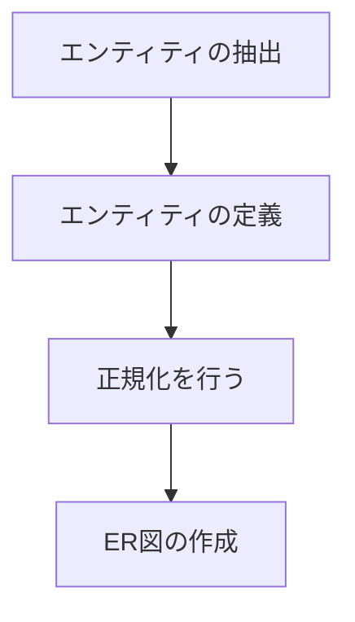

+++
title = 'RDBのテーブル設計について'
date = 2024-10-24T06:56:56+09:00
draft = true
+++

テーブル設計について

業務で初めてテーブル設計を行うこととなりました。

これまでは、既存のテーブルを使うことや都度追加するというやり方を取っていたため
コーディングを行う際に、テーブル設計を並行して行っていました。

なので、当初どのような手順で設計を考えていけば良いか分かりませんでした。

達人に学ぶDB設計という書籍を参考にしました

1. エンティティの抽出
2. エンティティの定義
3. 正規化を行う
4. ER図の作成

エンティティの抽出を考えるステップを飛ばしていたため、
エンティティの定義(テーブルの定義)ができずにいました。
実際に迷っていたのは、エンティティを定義することではなく、
必要なエンティティを抽出ことだったと気づきました。

## エンティティの抽出

### エンティティとは

まず初めにエンティティとは何か？について整理します
- エンティティとは、日本語で「実体」と訳される
- 物理的なものだけでなく、概念的なものも含まれる
  - 例えば、記録や注文のような実体を持たないものもエンティティとして扱う

### エンティティの抽出の仕方
