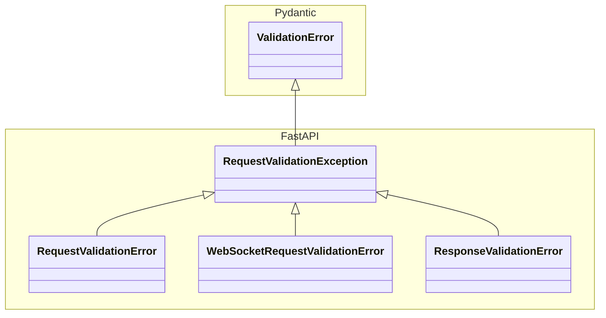

+++
title = 'FastAPIのバリデーションエラーについて調べた'
date = '2025-10-04T00:22:58+09:00'
draft = false 
tags = ["FastAPI", "Pydantic"]
+++

*FastAPIのバリデーションエラーについて調べたことを書く*

---

## 今更ながらFastAPI入門


近々業務でFastAPIを使うことになるのでキャッチアップをしていました。

前職で少しだけ触ったことがありましたが、機械学習データを可視化するためにjsonを返す簡単なAPIを実装しただけでした。

* CRUDのRしかない
* Routerもない
* バリデーションもない

この状態で業務を迎えるのは不安なので、学習を進めています。

## `ResponseValidationError`で詰まる

FastAPIの学習では、Zennで見つけたハンズオンをやりました。

<https://zenn.dev/sh0nk/books/537bb028709ab9:embed:cite>

TODOアプリのAPIを実装するシンプルな内容です。

ハンズオンをベースに手元の環境のバージョンに読み替えて実装を進めていると
更新のエンドポイントを実装する際に、下記のエラーのデバッグで詰まりました。

```bash
 fastapi-todo-app  | fastapi.exceptions.ResponseValidationError: 1 validation errors:fastapi-todo-app  |   {'type': 'model_attributes_type', 'loc': ('response',), 'msg': 'Input should be a valid dictionary or object to extract fields from', 'input': <coroutine object update_task at 0xffff7cd620c0>}
```

「バリデーションエラーが発生しているけど、データのどこに問題があるのか分からない...」


パッと見た時に`ResponseValidationError`の「Validation」という字面だけに反応して
「バリデーションだから入力値かな」と思いリクエストのパラメータをチェックしてました。

「何もおかしいところはないぞ？」

と少し悩んだところで、
エラーを見返してリクエストではなくレスポンスだったことに気づきました。

レスポンスにもバリデーションがあるという事が頭から抜けていました。

非同期関数の呼び出しで`await`をつけ忘れて、コルーチンが返っていた事が原因でレスポンスのバリデーションエラーが発生していたようです。

```python
@app.put("/tasks/{task_id}")
async def update_task(task_id: int, task_data: TaskModel):
    return some_async_function()
　# ↑ awaitのつけ忘れ
```

「エラーはちゃんと読まないとダメだな」と反省しつつ、
FastAPIのバリデーションエラーについて調べてみることにしました。

## 前提

pydanticのバージョンは`0.118.0`で確認しています。

## ドキュメントを読む


まずはFastAPIのドキュメントを読んでみました。

`ResponseValidationError`について詳しい説明はなく、
`RequestValidationError`について以下のような説明があるだけでした。

- リクエストbodyのデータにエラーがあった場合に使用される
- レスポンスとしてクライアントには500エラー(Internal Server Error)を返す
- 脆弱性になる可能性があるため、ユーザーには返さないように注意
- RequestValidationErrorには無効なデータを含んだbodyが含まれる
  - 実際にエラーが発生した時のデータを見ることができる
  - デバッグに使ったり、エラー内容をユーザーに教えるときに有効

この機会に、実装を見てドキュメントに説明のない部分を調べてみることにしました。

## バリデーションエラークラス

`exceptions.py`にバリデーションエラーの定義がありました。

FastAPIのバリデーションエラーは以下の4つのクラスが定義されています。

- `ValidationException`
- `RequestValidationError`
- `WebSocketRequestValidationError`
- `ResponseValidationError`

Pydanticの`ValidationError`を含めると以下のような継承関係になっています。



### ValidationErrorの定義を詳しくみる

```python
class ValidationException(Exception):
    def __init__(self, errors: Sequence[Any]) -> None:
        self._errors = errors

    def errors(self) -> Sequence[Any]:
        return self._errors


class RequestValidationError(ValidationException):
    def __init__(self, errors: Sequence[Any], *, body: Any = None) -> None:
        super().__init__(errors)
        self.body = body


class ResponseValidationError(ValidationException):
    def __init__(self, errors: Sequence[Any], *, body: Any = None) -> None:
        super().__init__(errors)
        self.body = body

    def __str__(self) -> str:
        message = f"{len(self._errors)} validation errors:\n"
        for err in self._errors:
            message += f"  {err}\n"
        return message
```

エラーのリストとbodyを持っています。
エラーの構造が`Any`型になっていてエラーメッセージの構造や具体的な中身がわからず。
もう少し詳しく知りたかったので、調べてみることにしました。


### エラーの中身

エラーの構造に関しては、
ドキュメントには説明がなかったのでソースコードを読んでみました。

((

この記事を書いた後から、実はpydantic側で`error｀の構造が定義されているということを知りました。

<https://docs.pydantic.dev/2.5/errors/errors/:embed:cite>

))

`fastapi/openapi/utils.py`を見ると、ValidationErrorの構造が定義されていました。

**ValidationErrorの構造**
```python
validation_error_definition = {
    "title": "ValidationError",
    "type": "object",
    "properties": {
        "loc": {
            "title": "Location",
            "type": "array",
            "items": {"anyOf": [{"type": "string"}, {"type": "integer"}]},
        },
        "msg": {"title": "Message", "type": "string"},
        "type": {"title": "Error Type", "type": "string"},
    },
    "required": ["loc", "msg", "type"],
}
```

**実際のエラーメッセージ**
```python
{
    'type': 'model_attributes_type',
    'loc': ('response',),
    'msg': 'Input should be a valid dictionary or object to extract fields from',
    'input': <coroutine object update_task at 0xffff7cd620c0>
}
```

### 各フィールドの詳細

ValidationErrorの各フィールドについて調べてみました。

#### 1. `type` - エラーの種類

エラーの種類を示すコードです。

| type                    | 意味                      |
|-------------------------|---------------------------|
| `model_attributes_type` | オブジェクトから属性を抽出できない     |
| `string_type`           | 文字列型が期待されているのに違う型 |
| `missing`               | 必須フィールドがない              |
| `bool_parsing`          | 真偽値の解析に失敗          |

#### 2. `loc` - エラーの場所

エラーが発生した場所をタプルで表します。

| loc                   | 意味                 |
|-----------------------|----------------------|
| `('response',)`       | レスポンス検証でのエラー       |
| `('body', 'name')`    | リクエストボディの`name`フィールド |
| `('query', 'page')`   | クエリパラメータの`page`      |
| `('path', 'user_id')` | パスパラメータの`user_id`    |

#### 3. `msg` - エラーメッセージ

人間が読める形のエラーメッセージです。

| msg                                                                     | 意味             |
|-------------------------------------------------------------------------|------------------|
| `"Input should be a valid dictionary or object to extract fields from"` | 辞書かオブジェクトが必要 |
| `"Field required"`                                                      | 必須フィールドが不足   |
| `"Input should be a valid string"`                                      | 文字列型が必要    |

#### 4. `input` - 実際の入力値

実際に渡された入力値が格納されます。

| input                                     | 意味        |
|-------------------------------------------|-------------|
| `<coroutine object update_task at 0x...>` | コルーチンオブジェクト |
| `"invalid_string"`                        | 不正な文字列 |
| `null`                                    | null値      |

### 今回のエラーを読み解く

改めて今回のエラーを各フィールドで読み解いてみます。

```python
{
    'type': 'model_attributes_type',
    'loc': ('response',),
    'msg': 'Input should be a valid dictionary or object to extract fields from',
    'input': <coroutine object update_task at 0xffff7cd620c0>
}
```

- `type: model_attributes_type` → モデルの属性を抽出できない
- `loc: ('response',)` → レスポンスでエラーが発生
- `msg` 入力は、フィールドが抽出可能な辞書かオブジェクトである必要がある
- `input: <coroutine object>` → 実際に渡されたのはコルーチンオブジェクト

レスポンスとして返そうとした値が、
コルーチンオブジェクトだったことでバリデーションエラーが発生していることがわかりました。


## まとめ

仕組みを調べてみると理解が深まって良かったです。
FastAPI（正確にはPydantic）のバリデーションエラーは構造化されているので各フィールドの意味を押さえておくと
認知的負荷が下がるのでエラーが発生したときに必要な情報を素早く読み取れて、デバッグの効率が上がるように思います。
