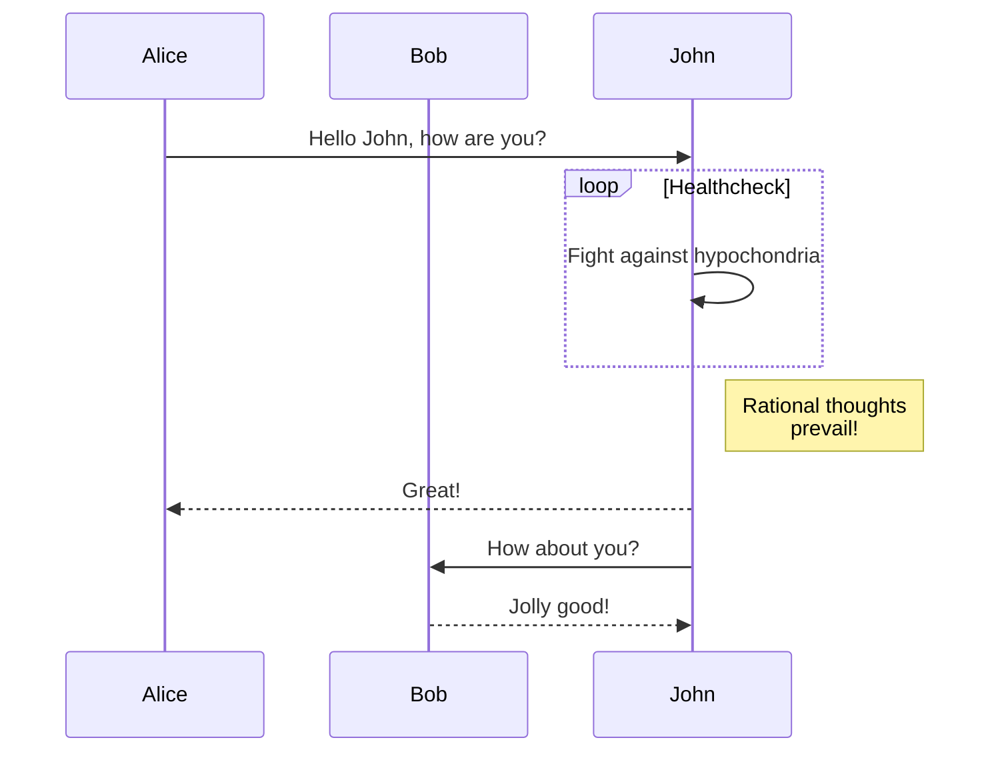

+++
title = 'Hugoでmermaid記法のグラフを表示する方法'
date = 2024-10-25T20:46:35+09:00
draft = false
tags = ['Hugo', 'Mermaid']
+++

唐突ですが、このブログはHugoで作成しています。  
記事の中でmermaid記法でグラフを表示したいと思ったため、  
方法を調べて設定しました。  
せっかくなので設定する際に調べた内容を書いておきます。

## Hugoでmermaid記法のグラフを表示する方法

まず検索すると公式ドキュメントがヒットしました。
それに従って設定をしていきます。  
リンクは↓です。

<https://gohugo.io/content-management/diagrams/#mermaid-diagrams>

## 設定方法

Hugoはデフォルトでは、mermaid記法のグラフ表示をサポートしていません。  
ですが、公式ドキュメントに記載がありました。
code block render hookを使えば良いとのことです。
親切に手順が書いてあるので、code block render hookが何か理解していなくても設定できました。

### 1. code block render hookの作成

Hugoのテーマに`layouts/_default/_markup/render-image.html`を作成します。

```html
<pre class="mermaid">
  {{- .Inner | safeHTML }}
</pre>
{{ .Page.Store.Set "hasMermaid" true }}
```

初めファイル名を`render_code_mermaid.html`と間違えていたため、設定が反映されませんでした。  
調べたところファイル名が`render-codeblock-xxx.html`の形式でcode block render hookを認識しているようです。  
なので、`render-codeblock-mermaid.html`というファイル名を間違えると設定が反映されません。  
要注意です。

詳しくは下記を参照してください。

<https://gohugo.io/render-hooks/code-blocks/#examples>

>Although you can use one template with conditional logic to control the behavior on a per-language basis, you can also create language-specific templates.
>```
>layouts/
>└── _default/
>    └── _markup/
>        ├── render-codeblock-mermaid.html
>        ├── render-codeblock-python.html
>        └── render-codeblock.html
>```

### 2. mermaidのスクリプトを読み込む

あとは、mermaidのコードブロックを含んだページにmermaidのスクリプトを読み込むように設定します。
テーマの`layouts/partials/head.html`に以下のようなスニペットを記述します。  
実際には、最終的にレンダリングされたhtmlでスニペットが読み込まれていれば良いので、
どのテンプレートに記述しても良いと思います。
特にこだわりがなければ、`layouts/partials/head.html`に記述すると良いと思います。


```html
{{ if .Store.Get "hasMermaid" }}
  <script type="module">
    import mermaid from 'https://cdn.jsdelivr.net/npm/mermaid/dist/mermaid.esm.min.mjs';
    mermaid.initialize({ startOnLoad: true });
  </script>
{{ end }}
```

### 3. mermaid記法をmarkdownで記述

こんな感じで記述します。

````markdown
  ```mermaid
  sequenceDiagram
      participant Alice
      participant Bob
      Alice->>John: Hello John, how are you?
      loop Healthcheck
          John->>John: Fight against hypochondria
      end
      Note right of John: Rational thoughts <br/>prevail!
      John-->>Alice: Great!
      John->>Bob: How about you?
      Bob-->>John: Jolly good!
  ```
````

以下のように表示されます。



## 余談

mermaidのコードブロックがグラフとして描画されるので 
mermaidの記述をどうやって書こうか迷いましたが、  
コードブロックをネストさせて、内側のコードブロックに記述することで表示できました。  
初めその発想がなかったので、調べてみて方法が分かった時「その手があったか」と目から鱗でした。
