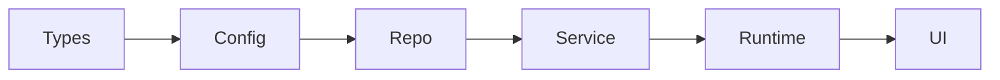

+++
title = 'OpenAIが実践するAgent-First時代の設計思想 — Harness Engineering'
date = '2026-02-27T00:25:00+09:00'
draft = false
tags = ['LLM', 'AI', 'ソフトウェアエンジニアリング']
description = 'OpenAI Engineeringが提唱する「Harness Engineering」について、ThoughtworksのBirgitta Böckelerによる解説も踏まえて自分なりにまとめました。エージェントにコードを書かせるために人間は何を設計すべきかを整理しています。'
+++

エージェントにコードを書かせるとき、人間の役割はどう変わるのか？ OpenAI Engineering が公開した記事「Harness engineering: leveraging Codex in an agent-first world」と、Thoughtworks の Distinguished Engineer である Birgitta Böckeler による解説記事（Martin Fowlerのサイトに掲載）を読んで、自分なりにまとめました。

https://openai.com/index/harness-engineering/

https://martinfowler.com/articles/exploring-gen-ai/harness-engineering.html

## Harness Engineering とは

**エージェントが正しくコードを書ける環境を設計すること**に注力する設計思想です。

「harness」という言葉については、Mitchell Hashimoto が自身のブログ記事の中で使い始めた用語のようです。

https://mitchellh.com/writing/my-ai-adoption-journey

Hashimoto は harness engineering を「エージェントがミスをしたとき、同じミスを二度と繰り返さないように仕組みを作ること」と説明しています。

> "anytime you find an agent makes a mistake, you take the time to engineer a solution such that the agent never makes that mistake again"

具体的なアクションとして、`AGENTS.md` にルールを追記してエージェントの振る舞いを改善することや、スクリプトによる自動検証ツールを作成してミスを機械的に検出する仕組みを挙げています。

Böckeler氏はこれを踏まえて「AIエージェントの振る舞いを制御するためのツールとプラクティス」と定義しています。

## エンジニアの役割の再定義

記事の前半では、エンジニアの役割がどう変わるかが語られていました。

OpenAI のチームは空のリポジトリから始めて、5ヶ月で約100万行のコードベースを構築したそうです。そのすべてが Codex によって書かれたとのこと。ここで強調されていたのは、人間の仕事が「コードを書くこと」から「エージェントが正しく動ける環境を作ること」に移ったという点でした。

> "Humans steer. Agents execute."

> "Our most difficult challenges now center on designing environments, feedback loops, and control systems."

人間の役割は実装者ではなく、

- 意図を定義する
- 制約を設計する
- フィードバックループを構築する

存在になるということです。

そして、エージェントがうまく動かないときは、プロンプトを場当たり的に修正するのではなく、**ツール・ガードレール・ドキュメントなど、何が足りていないのか**を特定してリポジトリにフィードバックするアプローチが述べられています。

> "When the agent struggles, we treat it as a signal: identify what is missing—tools, guardrails, documentation—and feed it back into the repository."

## 記事で紹介されていた原則

前のセクションでは「人間の役割が環境設計に移る」という話でしたが、では具体的にどんな環境を作ればいいのか。記事ではそのプラクティスが全体を通して紹介されていました。Böckeler氏はこれらを以下の3カテゴリに整理しています。

- **Context Engineering** — エージェントに渡す知識と動的な文脈
- **Architectural Constraints** — 機械的に強制されるアーキテクチャ制約
- **Garbage Collection** — 定期的なクリーンアップによる品質維持

それぞれについて、記事の内容をまとめてみました。

### Context Engineering

エージェントに「何を見せるか」の設計です。

OpenAI のチームでは、リポジトリ内に構造化されたドキュメント（`docs/` ディレクトリ）を整備し、それを信頼できる唯一の情報源（SSOT）として扱っているようです。エージェントの起点となる `AGENTS.md` は約100行に抑えられており、すべてを詰め込むのではなく、より詳しい情報への「地図」として機能しているとのことでした。

静的なドキュメントだけでなく、動的な文脈もエージェントに提供しています。

- Chrome DevTools Protocol を接続して DOM スナップショットやスクリーンショットを取得
- git worktree ごとに一時的なオブザーバビリティスタック（Victoria Logs / Victoria Metrics[^1]）を起動
- LogQL[^2] / PromQL[^7] / TraceQL[^8] でエージェントがログやメトリクスを直接クエリ可能

以下の図は、Codex エージェントが Chrome DevTools を介してアプリケーションのテストとフィードバックを行うフローを示しています。Codex がブラウザを操作して DOM スナップショットやスクリーンショットを取得し、表示結果を検証して問題があれば修正する、というループを回す構成です。

*出典: [Harness engineering - OpenAI](https://openai.com/index/harness-engineering/)*

また、オブザーバビリティスタックの全体像は以下のとおりです。

*出典: [Harness engineering - OpenAI](https://openai.com/index/harness-engineering/)*

図を左から追うと、まず APP がアプリケーション本体で、ここから OTLP（OpenTelemetry Protocol）でログ・メトリクス・トレースが出力されます。これらのテレメトリデータは VECTOR（ログルーター）を経由して、中央の Observability stack services に送られます。具体的には Victoria Logs[^1]・Victoria Metrics[^1]・Victoria Traces がそれぞれデータを格納し、LogQL[^2]・PromQL[^7]・TraceQL[^8] の各クエリ API を公開します。

図の右側では、Codex がこれらの API を使ってデータを扱います。「Query, Correlate, Reason」はそのプロセスを示しており、LogQL/PromQL/TraceQL でデータを検索（Query）し、ログ・メトリクス・トレースを横断的に紐付け（Correlate）、「起動800ms以内」「ユーザージャーニー2秒以内」といった要件を満たしているかを判断（Reason）します。

判断の結果、Codex は修正を実装して Refactor PR を作成（Implement change）し、アプリケーションを再起動（Restart app）します。更新された CODEBASE に対して Re-run workload → Test → UI Journey と検証を回し、その結果が再び Codex にフィードバックされます。この一連のループにより、エージェントはバグ再現から修正・検証・PR作成までを自律的に繰り返せる構成になっています。

### Architectural Constraints

エージェントが従うべきルールを、ドキュメントではなく**機械的に強制する**というアプローチです。

その具体例として、記事では固定レイヤーモデルが紹介されていました。

依存方向は前方向のみで、逆方向の依存は禁止されています。また、認証・テレメトリー・機能フラグなどレイヤーを横断して必要になる機能（Cross-cutting concerns）は、Providers という単一のインターフェースを経由してのみアクセスできるという制約もあります。

重要なのは、こうしたルールを「守ってください」と指示するのではなく、カスタム linter や structural tests[^3] で機械的に強制している点です。linter のエラーメッセージ自体が修正手順をエージェントに伝えるように設計されており、ルール違反は CI で検出されます。

> "Agents are most effective in environments with strict boundaries and predictable structure…"
> "The constraints are what allows speed without decay or architectural drift."

### Garbage Collection

AIコードの問題として、既存パターンを増幅してしまうことが挙げられていました。

> "Codex replicates patterns that already exist in the repository—even uneven or suboptimal ones."

放置すると品質は徐々に劣化します。
OpenAIのチームでは対策として、

- Golden Principles をリポジトリ内に明文化
- 定期的に background で Codex にクリーンアップタスクを実行させる
- 小さな refactor PR を継続的に出す

などのアプローチを取っているとのことでした。

根底の考え方としては、技術的負債はローンであり、小さく継続的に返済するべきだという考え方に基づいているようです。

> "Technical debt is like a high-interest loan…"

## 記事で語られなかった部分

Böckeler氏が解説記事内で指摘していた、**機能や振る舞いの検証（テスト）についての言及が薄い**という点も気になりました。記事中では構造テストやカスタム linter によるアーキテクチャの強制、Chrome DevTools を使った UI 検証、オブザーバビリティスタックによるパフォーマンス検証など、**内部品質を担保するためのテスト**は詳しく語られています。しかし Böckeler氏が問題にしているのは、それとは別の観点です。

> "All of the described measures focus on increasing long-term internal quality and maintainability. What I am missing in the write-up is verification of functionality and behaviour."

つまり、コードベースの構造が保たれていることと、**ソフトウェアがビジネス要件を満たし意図通りに動くこと**は別の問題であり、後者の検証プロセスが見えてこないという指摘です。ただし、これはあくまで「記事の記述として薄い」という批評であり、OpenAI が機能検証をしていないという意味ではないと解釈しています。Chrome DevTools による UI 検証やオブザーバビリティスタックでの要件判定は、機能的な検証の側面も含むと思いました。記事で語られなかった部分に何があるのかは、気になるところです。

## 読んでみて

OpenAI 取締役の Bret Taylor が X で言及[^5]したことを皮切りに、Fowler氏が LinkedIn で「価値あるフレームワーク」と評価[^6]、Böckeler氏が詳細な解説記事を公開するなど、業界での注目度が高い記事だと感じました。

エージェントがうまく動かないときに、プロンプトではなく仕組みの不備として捉える。この姿勢はソフトウェアエンジニアリングに限らず、問題解決の根本的なスタンスとして身につまされる教訓でした。記事中の「制約がスピードを生む」という考え方は、Uncle Bob が指摘するプログラミングパラダイムの発展[^4]にも通じるところがあります。

自分の開発を振り返ると、`CLAUDE.md` によるルール定義や CI / hooks での制約強制といったことはやっていましたが、オブザーバビリティをコンテキストとしてエージェントに提供するアプローチや、AIに継続的にクリーンアップ・改善を実行させるアプローチはまだ取り入れられていませんでした。これから取り入れていきたいと思います。

[^1]: いずれも軽量な OSS のログ・メトリクス収集ツール。Prometheus 互換でありながらリソース消費が少ないのが特徴。[Victoria Metrics](https://victoriametrics.com/)
[^2]: ログを問い合わせるためのクエリ言語。Loki / Victoria Logs 向け。[LogQL documentation](https://grafana.com/docs/loki/latest/query/)
[^7]: メトリクスを問い合わせるためのクエリ言語。Prometheus / Victoria Metrics 向け。[PromQL documentation](https://prometheus.io/docs/prometheus/latest/querying/basics/)
[^8]: トレースを問い合わせるためのクエリ言語。Tempo / Victoria Traces 向け。[TraceQL documentation](https://grafana.com/docs/tempo/latest/traceql/)
[^3]: コードの機能的な正しさではなく、モジュール間の依存方向やレイヤー境界といったアーキテクチャ上のルールが守られているかを検証するテスト。[ArchUnit](https://www.archunit.org/)（Java）など。
[^4]: Robert C. Martin『[Clean Architecture](https://www.oreilly.com/library/view/clean-architecture-a/9780134494272/)』より。構造化プログラミングは goto を、オブジェクト指向は関数ポインタを、関数型は代入を制約することで進化してきたという主張。
[^5]: [Bret Taylor の X 投稿](https://x.com/btaylor/status/2026784092398776760)
[^6]: Martin Fowler の LinkedIn での言及。Böckeler氏の解説記事は Fowler のサイトに掲載: [Harness Engineering - martinfowler.com](https://martinfowler.com/articles/exploring-gen-ai/harness-engineering.html)

## 参考

https://openai.com/index/harness-engineering/

https://martinfowler.com/articles/exploring-gen-ai/harness-engineering.html

https://mitchellh.com/writing/my-ai-adoption-journey

## 関連記事

https://www.infoq.com/news/2026/02/openai-harness-engineering-codex/

https://tonylee.im/en/blog/openai-harness-engineering-five-principles-codex
