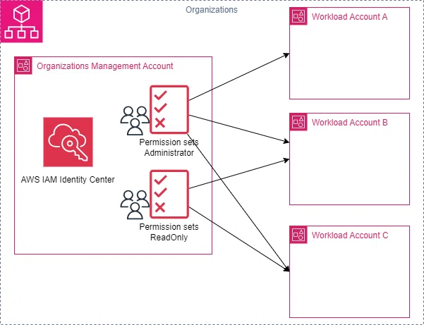

+++
title = 'IAM Identity Centerについて調べた'
date = 2025-04-20T07:27:19+09:00
draft = true
+++

## この記事の目的
IAM Identity Centerの概要を掴むこと

## 動機

個人で学習してる時に、AWS CLIでトークンを発行しようとしたら、CLI ver2 を使用して
IAM Identity Centerを使ったSSOを推奨された

なんのこっちゃと思ったので、調べてみた

<https://docs.aws.amazon.com/ja_jp/singlesignon/latest/userguide/what-is.html>

> AWS IAM アイデンティティセンター は、ワークフォースユーザーを Amazon Q Developer や Amazon Quick Suite などの AWS マネージドアプリケーションやその他の AWS リソースに接続するための AWS ソリューションです。

うん。わからん。

- IAM Identity Centerとは
- AWSが提供するSSOを簡素化するサービス
