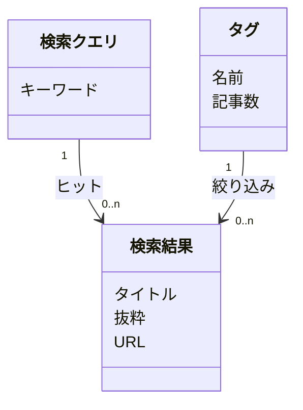

# Searchページ UIデザイン

モデルベースUIデザイン手法で設計した、Searchページのレイアウト設計書。

## フェーズ1：環境調査と基本設計

### Step 1: ユースケース一覧

| ID | 分類 | ユースケース記述 |
|:---|:-----|:----------------|
| UC_S_1 | 検索結果 | 読者が 検索結果を 閲覧できる |
| UC_S_2 | 検索結果 | 読者が 検索結果を さらに読み込める |
| UC_T_1 | タグ | 読者が タグを 一覧できる |
| UC_T_2 | タグ | 読者が タグで 検索結果を絞り込める |
| UC_Q_1 | 検索クエリ | 読者が 検索クエリを 入力できる |
| UC_Q_2 | 検索クエリ | 読者が 検索クエリを クリアできる |

### Step 2: タスク表

| ユーザー（アクション） | システム（働き） | CRUD | 関連UC |
|:----------------------|:----------------|:-----|:-------|
| キーワードを入力する | Pagefindインデックスを検索する | R | UC_Q_1 |
| クリアする | 検索状態をリセットする | D | UC_Q_2 |
| 検索結果を閲覧する | タイトル・抜粋を表示する | R | UC_S_1 |
| もっと見る | 次の5件を読み込む | R | UC_S_2 |
| タグ一覧を見る | タグと件数を表示する | R | UC_T_1 |
| タグをクリックする | そのタグで検索を実行する | R | UC_T_2 |

## フェーズ2：UIの構造設計

### Step 3: コンテンツ構造モデル



#### 多重度→ビュー変換

| オブジェクト | 多重度 | ビュー |
|:------------|:-------|:------|
| 検索結果 | 0..n | リストビュー + Empty State（0件時） |
| タグ | 1..n | コレクションビュー（常に1件以上） |
| 検索クエリ | 1 | 単体入力ビュー |

### Step 4: フレーム構造

#### 案A: 2カラムレイアウト

```
┌────────────────────────┬────────────┐
│ [検索入力ビュー]         │ [タグ一覧]  │
│ ┌────────────┐[クリア]  │ tag tag    │
│ └────────────┘          │ tag tag    │
│ [検索結果リストビュー]    │            │
│  結果1                  │            │
│  結果2                  │            │
│  [もっと見る(R)]         │            │
└────────────────────────┴────────────┘
```

#### 案B: セクション縦積み（Home準拠）✅ 採用

```
┌──────────────────────────────────┐
│ [検索セクション]                    │
│  ── Search ──                     │
│ ┌──────────────────┐ [クリア]     │
│ └──────────────────┘              │
│  結果1                            │
│  結果2                            │
│  [もっと見る(R)]                   │
├──────────────────────────────────┤
│ [タグセクション]                    │
│  ── Tags ──                       │
│  tag tag tag tag tag              │
│  tag tag tag tag                  │
└──────────────────────────────────┘
```

### Step 5: ナビゲーション構造

```
[ヘッダー]
├── Home
├── Posts
├── Search ← 現在のページ
│   ├── 検索結果 → 記事詳細ページへ遷移
│   └── タグクリック → 検索クエリに反映（同ページ内）
└── ...
```

## レイアウト案の評価

| 観点 | 案A（2カラム） | 案B（セクション縦積み） |
|------|---------------|----------------------|
| Home との統一感 | × 独自レイアウト | ○ 同じセクションパターン |
| タグの視認性 | △ サイドに押し込め | ○ 全幅で見やすい |
| モバイル | △ 縦積みにフォールバック | ○ そのまま動く |
| 検索↔タグの関連性 | ○ 横に並んで近い | △ スクロールで離れる |
| 情報の優先度 | − | ○ 検索が最上位、タグは補助 |

## 決定事項

**案Bを採用**。理由:

1. Homeと同じセクション構造でサイト全体の一貫性が保てる
2. タグは検索の補助であり、常に横に見える必要はない
3. モバイルで自然に動く（レスポンシブ対応不要）

## 実装方針

### デザイントークンの統一（Homeページ準拠）

- セクション見出し: `font-bold font-heading tracking-tight border-l-2 border-link pl-3` + `font-size: var(--font-size-title3)`
- セクション間: `border-top: 1px solid var(--border)` で区切り
- セクション余白: `py-phi-xl`
- フェードインアニメーション: `animate-fade-in-up` + `animation-delay`

### コンポーネント構成

| コンポーネント | 種別 | 役割 |
|:--------------|:-----|:-----|
| `SearchBox` | React（`client:load`） | 検索入力・結果表示。Pagefind JS APIを直接使用 |
| `TagBubbleCloud` | React（`client:load`） | タグ一覧表示。クリックで検索クエリに反映 |
| `search.astro` | Astro | ページレイアウト。セクション構造を定義 |

### 技術選定

- **Pagefind UI (`pagefind-ui.js`)は不使用**。Pagefind検索API (`pagefind.js`) を直接利用し、UIは自前Reactコンポーネントで実装
- 理由: Pagefind UIのSvelteスコープ付きCSSとの詳細度バトルを回避し、サイトのデザインシステム（Tailwind + CSS変数）をそのまま適用するため
