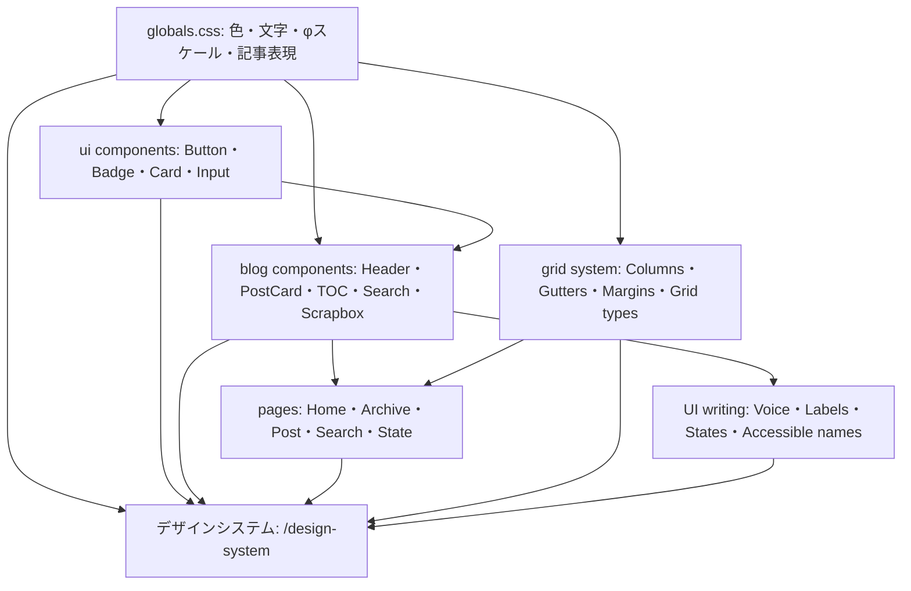

# KJR020's Blog デザインシステム

KJR020's Blogの視覚言語、UI部品、状態、ページ構造を定義する正規仕様。

## 全体像

Source of Truthは役割ごとに分ける。値は`globals.css`、部品の構造とvariantは`src/components/`、言葉とレイアウトの原則はこの文書群で定義する。デザインシステムはそれらを直接読み込み、人が視覚的・操作的に確認するための入口とする。

独立したHTMLへ値や部品を複製しない。仕様を変えるときは、正規の実装・関連ガイド・デザインシステム・テストを同じ変更で更新する。

## デザインシステム

- [Grid system](grid-system.md)
- [UIライティングガイドライン](ui-writing-guidelines.md)
- [デザインシステム実装](../src/design-system/pages/index.astro)
- [開発時限定ルート](../src/integrations/devDesignSystem.ts)

`pnpm dev`を起動し、`http://localhost:4321/design-system`を開く。色・文字・spacingは`globals.css`のCSS変数、Button・Badge・Input・Card・ブログパターンは実コンポーネントから描画される。全ページを共通のHeader・Sidebar・トークンで描画し、ライトとダークの両方で確認できる。

### ページ構成

| ページ | ルート | 収録する章 |
| --- | --- | --- |
| 概要 | `/design-system` | 適用範囲と5カテゴリへの入口 |
| 基盤 | `/design-system/foundations` | 1. トークン、2. レイアウト原則、10. レスポンシブ・アクセシビリティ |
| コンポーネント | `/design-system/components` | 4. 基本部品、5. ナビゲーション・検索部品、6. ブログ固有部品 |
| パターン | `/design-system/patterns` | 3. 状態の体系、7. 記事コンテンツ、8. ページの型 |
| コンテンツ | `/design-system/content` | 9. UIライティング |
| ガバナンス | `/design-system/governance` | 11. ガバナンス |

記事ページの読書仕様は`/design-system/patterns#article-reading`へ統合し、`8-3. 記事ページ`としてページの型から参照できるようにする。サイドバーはすべてのページで6カテゴリと下位項目を同じ構造で保持し、現在のカテゴリだけを初期展開する。カテゴリ名はページへのリンク、右端の開閉ボタンは下位項目の表示切り替えに用い、複数カテゴリを同時に展開できる。

このルートはAstroの`dev`コマンドでだけ注入する。`build`、`preview`、`sync`では登録せず、公開成果物へ出力しない。検索エンジン向けにも`noindex,nofollow`を指定する。

## デザインシステムの構成

| 章 | 内容 | 主な根拠 |
| --- | --- | --- |
| 1. トークン | 色、Callout色、文字、φスケール、角丸、影 | `globals.css` |
| 2. レイアウト原則 | ページシェル、Grid、幅、配置、余白、強調 | Grid system・`BaseLayout.astro` |
| 3. 状態の体系 | 操作状態、非同期状態、現在地、選択 | Components・Blog patterns |
| 4. 基本部品 | Button、Badge / Tag、Card、Input、TextLink、Kbd | `src/components/ui/`・`PostMeta.astro` |
| 5. ナビゲーション・検索部品 | Header、SearchBox、Command Palette、Theme、Mobile Menu | `src/components/` |
| 6. ブログ固有部品 | PageHero、PostCard、TOC、Scrapbox | Blog components |
| 7. 記事コンテンツ | Markdown、Callout、Link Card、Code、Image | 記事実装 |
| 8. ページの型 | ホーム、記事一覧、記事ページ、検索、ポリシー・状態 | Pages・Grid system・Article reading |
| 9. UIライティング | 声、6原則、部品文法、表記、状態メッセージ | UIライティング |
| 10. レスポンシブ・アクセシビリティ | Breakpoint、Keyboard、ARIA、Motion、Loading | Components・guidelines |
| 11. ガバナンス | Source of Truth、適合ルール、更新方法 | デザインシステム全体 |

デザインシステムへ追加するのは、ブログで採用済みの仕様と実装だけとする。改善候補、優先度、移行状況、実装との差分はIssueまたはADRで管理する。

## 記述方針

- 採用済みの正規仕様だけを記載する。
- 改善候補、優先度、移行状況、実装との差分はIssueまたはADRで管理する。
- 新しい視覚表現はオーナーと合意し、デザインシステムへ正規仕様として定義してから実装する。
- トークンには用途を表す名前を付け、値と意味を一対一で管理する。
- 部品名は実装のコンポーネント名と対応させる。
- 仕様を変更するときは、デザインシステムと関連ガイドを同時に更新する。
- 実装とテストはデザインシステムへ適合させる。

## 更新フロー

1. 新しい表現の変更理由と適用範囲をオーナーと合意する。
2. デザインシステムへ正規仕様として定義し、変更対象のSource of Truthを更新する。
3. 実装と関連ガイドを正規仕様へ揃える。
4. `pnpm test:design-system`で実コンポーネントとの接続を確認する。
5. `pnpm build`で`dist/design-system`が生成されないことを確認する。

デザインシステム側へCSS値やコンポーネントの見た目を再実装しない。標本固有のレイアウトだけを`src/design-system/styles.css`へ置く。

## デザイン原則

KJR020's Blogのデザインは次の原則に従う。

- ニュートラルな面と文字を基調に、リンクを青、破壊的状態を赤で表す。
- ヘッダーはsystem sans、本文と見出しはNoto Sans JP、コードはJetBrains Monoを使用する。
- 文字・行高・間隔・基準角丸に黄金比φを採用する。
- ページ骨格はAtlassianを参考にした2 / 6 / 12 columnsのGridで整理する。
- Card、細い境界、控えめな影で情報単位を作る。
- ライト/ダーク、Desktop/Mobile、通常/非同期状態を同じ部品で扱う。
- 記事では見出し、コード、Callout、Link Card、TOCを組み合わせる。
- UIは記事を主役にし、操作と状態を簡潔・具体的・中立に伝える。

### Headerのブランド表現

Headerのブランドリンクは、栗マスコットの目を切り出したシンボルと`KJR020's Blog`を組み合わせる。

| 項目 | 正規仕様 |
| --- | --- |
| Symbol | `/images/kjr020-eyes.svg`を50×32pxで表示する |
| Eye | `#fafafa`の面と、表示時に約1pxとなる`#71717a`の輪郭 |
| Pupil | 黒目とまぶたを`#18181b`の独立したpathで描画する |
| Background | 背景を描画せず、SVGの外側を透明にする |
| Theme | Light / Darkで同じSVGを使い、反転filterを適用しない |
| Accessibility | 隣接するブログ名がリンクのAccessible Nameを担うため、シンボルは空の代替テキストで装飾画像として扱う |
| Source of Truth | `public/images/kjr020-eyes.svg`、`src/components/Header.astro` |

### 記事の読書設計

記事本文は、続けて読む情報と詳細を確認する情報で幅を使い分ける。記事とデザインシステムの標本は、同じMarkdown変換、DOM拡張、CSSを使用する。

| 項目 | 正規仕様 |
| --- | --- |
| Reading lane | 本文・見出し・リストはArticle内の7 / 9、17px、行高1.70、最大38字を基準とする |
| Wide lane | Figure・Code・TableはArticle内の9 / 9を使用する。Compactでは1 columnに戻す |
| Figure | Markdown画像と直後の強調文を`figure`と`figcaption`へ変換する |
| Image zoom | 画像は原寸へのリンクとし、JavaScript利用時はDialogで拡大する。閉じた後は画像リンクへフォーカスを戻す |
| Code language | Shikiが生成する`data-language`を可視ラベルへ変換する |
| Code copy | Copy操作を右上へ置き、成功・失敗をAccessible Nameと`aria-live="polite"`で伝える |
| Source of Truth | `src/pages/posts/[...slug].astro`、`src/integrations/rehypeArticleFigures.ts`、`src/components/article/ImageLightbox.astro`、`src/lib/articleCode.ts`、`src/styles/article-content.css`、`src/styles/article-code.css` |

## Tag interaction

記事メタ情報のTagは、記事カード全体のリンクと分類リンクを区別するため、Render型の面移動を使用する。通常時はSecondaryの面と通常の文字色を表示し、HoverとKeyboard focusでは前景色6%の面を14deg傾けて左から通し、文字色をLinkへ変える。

| 項目 | 正規仕様 |
| --- | --- |
| Duration | 面移動は220ms、文字色は200ms |
| Easing | 面移動は`ease-in-out`、文字色は`ease-out` |
| Card coordination | Tag上では親PostCardの背景色とタイトル色のhoverを重ねない |
| Reduced motion | `prefers-reduced-motion: reduce`では面移動の遷移時間を0sにし、状態変化は維持する |
| Source of Truth | `src/components/PostMeta.astro`、`src/components/PostCard.astro` |

## 関連ファイル

- [globals.css](../src/styles/globals.css) - グローバルトークンと記事表現
- [概要ページ](../src/design-system/pages/index.astro) - 5カテゴリへの入口
- [共通レイアウト](../src/design-system/components/DesignSystemLayout.astro) - Header・Sidebar・Footer・共通script
- [ページナビゲーション](../src/design-system/navigation.ts) - 6ページとセクションの対応
- [デザインシステム固有スタイル](../src/design-system/styles.css) - 標本固有のレイアウト
- [Dev integration](../src/integrations/devDesignSystem.ts) - 非公開ルートの登録条件
- [デザインシステム E2E](../e2e/design-system.spec.ts) - 実装との接続、章目次、Mobile表示
- [button.tsx](../src/components/ui/button.tsx) - Button variants
- [badge.tsx](../src/components/ui/badge.tsx) - Badge variants
- [card.tsx](../src/components/ui/card.tsx) - Card composition
- [input.tsx](../src/components/ui/input.tsx) - Input states
- [BaseLayout.astro](../src/layouts/BaseLayout.astro) - ページシェル
- [Header.astro](../src/components/Header.astro) - Global navigation
- [PostCard.astro](../src/components/PostCard.astro) - 記事一覧パターン
- [SearchBox.tsx](../src/components/search/SearchBox.tsx) - 全文検索
- [TableOfContents.tsx](../src/components/toc/TableOfContents.tsx) - 記事目次
- [記事ページ](../src/pages/posts/[...slug].astro) - Reading / Wide laneと記事本文
- [Figure変換](../src/integrations/rehypeArticleFigures.ts) - Markdown画像とCaptionの構造化
- [画像拡大](../src/components/article/ImageLightbox.astro) - FigureのDialog拡大
- [コード拡張](../src/lib/articleCode.ts) - 言語表示、Copy操作、完了通知
- [記事コンテンツスタイル](../src/styles/article-content.css) - Reading / Wide laneとFigure
