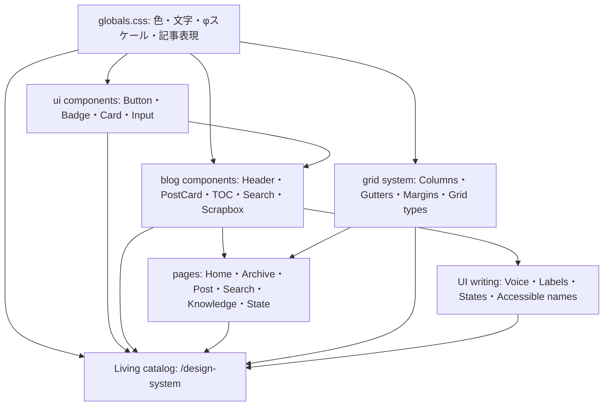

# KJR020ブログ デザインシステム

KJR020ブログの視覚言語、UI部品、状態、ページ構造を定義する正規仕様。

## 全体像

Source of Truthは役割ごとに分ける。値は`globals.css`、部品の構造とvariantは`src/components/`、言葉とレイアウトの原則はこの文書群で定義する。Living catalogはそれらを直接読み込み、人が視覚的・操作的に確認するための入口とする。

独立したHTMLへ値や部品を複製しない。仕様を変えるときは、正規の実装・関連ガイド・Living catalog・テストを同じ変更で更新する。

## Living catalog

- [Grid system](grid-system.md)
- [UIライティングガイドライン](ui-writing-guidelines.md)
- [Living catalog実装](../src/design-system/pages/index.astro)
- [開発時限定ルート](../src/integrations/devDesignSystem.ts)

`pnpm dev`を起動し、`http://localhost:4321/design-system`を開く。色・文字・spacingは`globals.css`のCSS変数、Button・Badge・Input・Card・ブログパターンは実コンポーネントから描画される。ライトとダークの両方を同じページで確認できる。

このルートはAstroの`dev`コマンドでだけ注入する。`build`、`preview`、`sync`では登録せず、公開成果物へ出力しない。検索エンジン向けにも`noindex,nofollow`を指定する。

## Catalogの構成

| 章 | 内容 | 主な根拠 |
| --- | --- | --- |
| Foundations | 色、文字、φスケール、Grid、角丸 | `globals.css`・Grid system |
| Components | Button、Badge / Tag interaction、Input、Card | `src/components/ui/`・`PostMeta.astro` |
| Blog patterns | PageHero、PostCard、ページの型 | Blog components |
| UI writing | 文言設計、状態メッセージ | UIライティング |
| Accessibility | 操作、読み上げ、Theme、Motion | Components・guidelines |
| Governance | Source of Truth、更新方法 | デザインシステム全体 |

Catalogへ追加するのは、ブログで採用済みの仕様と実装だけとする。改善候補、優先度、移行状況、実装との差分はIssueまたはADRで管理する。

## 記述方針

- 採用済みの正規仕様だけを記載する。
- 改善候補、優先度、移行状況、実装との差分はIssueまたはADRで管理する。
- トークンには用途を表す名前を付け、値と意味を一対一で管理する。
- 部品名は実装のコンポーネント名と対応させる。
- 仕様を変更するときは、Living catalogと関連ガイドを同時に更新する。
- 実装とテストはデザインシステムへ適合させる。

## 更新フロー

1. 変更対象のSource of Truthを更新する。
2. Living catalogの標本または説明を更新する。
3. `pnpm test:design-system`で実コンポーネントとの接続を確認する。
4. `pnpm build`で`dist/design-system`が生成されないことを確認する。

Catalog側へCSS値やコンポーネントの見た目を再実装しない。標本固有のレイアウトだけを`src/design-system/styles.css`へ置く。

## デザイン原則

KJR020ブログのデザインは次の原則に従う。

- ニュートラルな面と文字を基調に、リンクを青、破壊的状態を赤で表す。
- Noto Sans JPとJetBrains Monoを役割で使い分ける。
- 文字・行高・間隔・基準角丸に黄金比φを採用する。
- ページ骨格はAtlassianを参考にした2 / 6 / 12 columnsのGridで整理する。
- Card、細い境界、控えめな影で情報単位を作る。
- ライト/ダーク、Desktop/Mobile、通常/非同期状態を同じ部品で扱う。
- 記事では見出し、コード、Callout、Link Card、TOCを組み合わせる。
- UIは記事を主役にし、操作と状態を簡潔・具体的・中立に伝える。

## Tag interaction

記事メタ情報のTagは、記事カード全体のリンクと分類リンクを区別するため、Render型の面移動を使用する。通常時はSecondaryの面と通常の文字色を表示し、HoverとKeyboard focusでは前景色6%の面を14deg傾けて左から通し、文字色をLinkへ変える。

| 項目 | 正規仕様 |
| --- | --- |
| Duration | 面移動は220ms、文字色は200ms |
| Easing | 面移動は`ease-in-out`、文字色は`ease-out` |
| Card coordination | Tag上では親PostCardの背景色とタイトル色のhoverを重ねない |
| Reduced motion | `prefers-reduced-motion: reduce`では面移動の遷移時間を0sにし、状態変化は維持する |
| Source of Truth | `src/components/PostMeta.astro`、`src/components/PostCard.astro` |

## 関連ファイル

- [globals.css](../src/styles/globals.css) - グローバルトークンと記事表現
- [Living catalog](../src/design-system/pages/index.astro) - 実装から描画する標本
- [Catalog styles](../src/design-system/styles.css) - 標本固有のレイアウト
- [Dev integration](../src/integrations/devDesignSystem.ts) - 非公開ルートの登録条件
- [Living catalog E2E](../e2e/design-system.spec.ts) - 実装との接続、章目次、Mobile表示
- [button.tsx](../src/components/ui/button.tsx) - Button variants
- [badge.tsx](../src/components/ui/badge.tsx) - Badge variants
- [card.tsx](../src/components/ui/card.tsx) - Card composition
- [input.tsx](../src/components/ui/input.tsx) - Input states
- [BaseLayout.astro](../src/layouts/BaseLayout.astro) - ページシェル
- [Header.astro](../src/components/Header.astro) - Global navigation
- [PostCard.astro](../src/components/PostCard.astro) - 記事一覧パターン
- [SearchBox.tsx](../src/components/search/SearchBox.tsx) - 全文検索
- [TableOfContents.tsx](../src/components/toc/TableOfContents.tsx) - 記事目次
