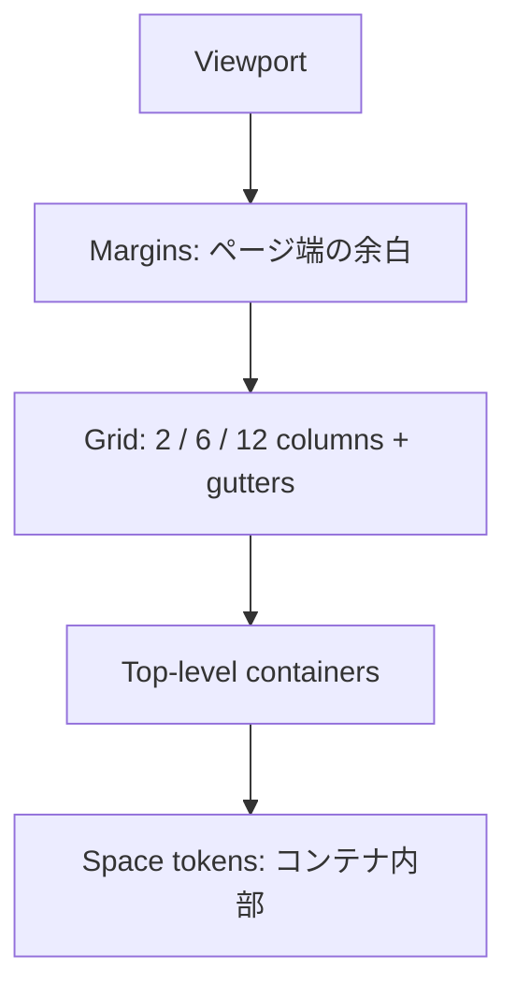

# KJR020's Blog Grid system

Atlassian Design Systemの考え方をKJR020's Blogへ適用した、ページ横方向の正規配置ルール。

## 概要



Gridはページの骨格を揃えるために使う。記事、一覧、画像、検索結果、サイドバーなどのトップレベルコンテナをcolumnsへ配置し、ボタン、アイコン、カード内部などの小さな要素はGridへ直接揃えず、spacing tokenで整える。

## 設計判断

Atlassian Design SystemのGridは、12 columns、gutters、marginsを基本要素とし、画面幅に応じて2 / 6 / 12 columnsへ変化する。また長文にはfixed-narrowを推奨している。

KJR020's Blogでは、その原則を次のように調整する。

- Atlassianの6 breakpointを、KJR020's Blogの`md: 768px`と`lg: 1024px`へ合わせて3段階に圧縮する。
- Desktopは12 columns、Tabletは6 columns、Mobileは2 columnsとする。
- Desktopのmarginsは32px、TabletとMobileは16pxとする。
- Desktopのguttersは16px、TabletとMobileは12pxとする。
- 構造化されたページはfixed-wide 1152pxを使う。
- 長文中心のページは、読みやすさを優先するfixed-narrow 864pxを使う。
- Fluidは横スクロール領域など、横方向の拡張に意味がある領域の内部に限定する。

## 基本要素

| 要素 | 役割 | ルール |
| --- | --- | --- |
| Columns | コンテナの幅と位置を決める | 同じ階層のトップレベルコンテナを列線へ揃える |
| Gutters | Columns間を分離する | コンテンツを置かない。隣接領域の余白として保つ |
| Margins | Gridとviewport端を離す | ページ全体で共通化し、個別ページで上書きしない |

## Breakpoints

| モード | Viewport | Columns | Gutters | Margins | UIの構成 |
| --- | ---: | ---: | ---: | ---: | --- |
| Compact | 320–767px | 2 | 12px | 16px | Mobile、1 column表示、折りたたみ目次 |
| Medium | 768–1023px | 6 | 12px | 16px | Tailwind `md`、水平navigation |
| Wide | 1024px以上 | 12 | 16px | 32px | Tailwind `lg`、本文＋sidebar |

320px未満でも内容は欠落させず、Compactを流動的に縮小する。Breakpointはコンテンツ領域ではなく、viewport全体の幅で判定する。

## Grid types

| Type | 最大幅 | 用途 | 主なページ |
| --- | ---: | --- | --- |
| Fixed-wide | 1152px | 本文と補助領域を横に並べる構造化ページ | 記事＋目次、検索＋タグ |
| Fixed-narrow | 864px | 読むことが主目的の長文ページ | 記事単体、Privacy Policy、説明文書 |
| Fluid | なし | 横方向の広がり自体に意味がある領域 | 横scroll carouselの内部 |

Command PaletteなどのoverlayはGridの外に浮く要素なので、Grid typeには含めない。個別の`max-inline-size`で管理する。

## 配置パターン

### 記事詳細

| モード | Article | Table of contents |
| --- | --- | --- |
| Compact | 2 / 2 columns | 本文上部の折りたたみ領域 |
| Medium | 6 / 6 columns | 本文上部の折りたたみ領域 |
| Wide | 9 / 12 columns | 3 / 12 columns |

Wideでは記事と目次の間に1 gutterを置く。Article内は外側のPage Gridとは独立した9 tracksで構成し、本文・見出し・リストを7 / 9、Figure・Code・Tableを9 / 9へ配置する。Compactでは両方を1 columnへ戻す。

### 検索

| モード | Results | Tag filters |
| --- | --- | --- |
| Compact | 2 / 2 columns | Resultsの下 |
| Medium | 6 / 6 columns | Resultsの下 |
| Wide | 9 / 12 columns | 3 / 12 columns |

### Home / Archive

Page hero、section header、post listはGrid全体を使う。PostCardの外枠は全幅へ揃えるが、Card内部のtitle、meta、tagはcolumnsへ揃えずspacing tokenで配置する。

## 使用ルール

### Gridへ揃えるもの

- Page heroとsection
- Article、aside、検索結果、filter sidebar
- Card list、画像、表、formなどのトップレベルコンテナ
- 同じ階層で横に並ぶ主要領域

### Gridへ揃えないもの

- Button、icon、badge、tag
- Card内部のtitle、description、action
- Dropdown、tooltip、dialogなどのoverlay
- 記事本文中のinline要素

### Do / Don't

- **Do:** コンテナの開始・終了をcolumn lineへ揃える。
- **Do:** DOM順と視覚順を一致させ、狭い画面では自然な縦積みにする。
- **Do:** 内部レイアウトはFlexbox、Grid、spacing tokenから目的に合うものを選ぶ。
- **Don't:** Contentをgutterやmarginへはみ出させない。
- **Don't:** 小さな部品までpage gridへ固定しない。
- **Don't:** `grid-auto-flow: dense`やCSSの`order`でinteractive contentの視覚順だけを変えない。
- **Don't:** 長文をFluidでviewport全幅まで広げない。

## CSSリファレンス

Gridを実装するときは、次のsemantic tokenとlayoutを基準にする。

```css
:root {
  --grid-columns: 2;
  --grid-gutter: 0.75rem;
  --grid-margin: 1rem;
  --grid-wide: 72rem;
  --grid-narrow: 54rem;
}

.layout-grid {
  display: grid;
  grid-template-columns: repeat(var(--grid-columns), minmax(0, 1fr));
  column-gap: var(--grid-gutter);
  inline-size: min(100%, var(--grid-wide));
  margin-inline: auto;
  padding-inline: var(--grid-margin);
}

@media (min-width: 48rem) {
  :root {
    --grid-columns: 6;
  }
}

@media (min-width: 64rem) {
  :root {
    --grid-columns: 12;
    --grid-gutter: 1rem;
    --grid-margin: 2rem;
  }
}
```

CSS Gridは2次元のページ骨格に使い、navigationやtoolbarのような1方向の並びにはFlexboxを使う。可変幅のtrackには`minmax(0, 1fr)`を使い、長いURLやcodeが親を押し広げないようにする。

## 参考資料

- [Grid — Atlassian Design System](https://atlassian.design/foundations/grid-beta/applying-grid/) - columns / gutters / margins、breakpoints、fixed / fluidの考え方
- [Spacing — Atlassian Design System](https://atlassian.design/foundations/spacing/) - コンテナ内部をspacing tokenで構成する原則
- [CSS Grid Layout — MDN](https://developer.mozilla.org/docs/Web/CSS/CSS_grid_layout) - CSS実装の標準仕様解説

## 関連ファイル

- [デザインシステム概要](blog-design-system.md) - 全体構成とSource of Truth
- [デザインシステムの基盤ページ](../src/design-system/pages/foundations.astro) - Gridの視覚例（`pnpm dev`の`/design-system/foundations`）
- [BaseLayout.astro](../src/layouts/BaseLayout.astro) - Page shell
- [記事詳細](../src/pages/posts/[...slug].astro) - 本文＋目次layout
- [検索](../src/pages/search.astro) - 検索結果＋filter layout
