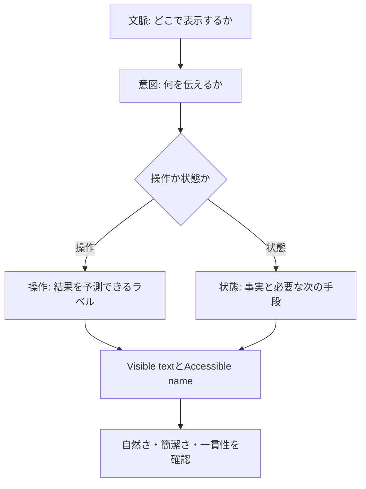

# KJR020's Blog UIライティング

読者が記事を探し、読み、次の場所へ移るための正規ライティング仕様。

## 判断フロー



文言は単独で決めない。周囲の見出し、直前の操作、視覚情報、支援技術へ伝わる情報を含めて設計する。

## 声の性格

KJR020's BlogのUIは、記事を主役にしながら操作と状態を分かりやすく伝える。

| 特性 | 基準 |
| --- | --- |
| 簡潔 | 判断に必要な情報だけを伝える |
| 自然 | 日常的で読み慣れた日本語を使う |
| 具体的 | 必要な場合は「記事」「検索」「Scrapbox」など対象を示す |
| 落ち着き | 事実を穏やかに伝え、過剰に謝らない |
| 誠実 | 分からない原因や読者の状態を推測しない |

記事本文では書き手の個性を表現し、UIでは操作や状態の理解を優先する。

## 6つの原則

### 1. 文脈から書き始める

近くの見出しや直前の操作から明らかな情報は繰り返さない。短くして意味が曖昧になる場合だけ対象を補う。

- 検索結果の末尾: `さらに表示`
- 404ページ: `トップへ戻る`
- 外部サービスへのリンク: `Scrapboxを開く`
- カード全体がリンクの場合: 見出しと役割を示す短い要約をリンク名とし、補助的な`開く`を重ねない
- カードの要約が名詞句の場合: 句点を付けない

### 2. 1つの文言に1つの役割を持たせる

- 見出し: 何の場所か
- 説明: 何ができるか
- ボタン: 何が起きるか
- 状態: 何が起きたか
- 補助文: 次に何ができるか

状態と対処方法が両方必要な場合は、見出しと本文へ分ける。

### 3. 操作後を予測できるラベルにする

文法を機械的に統一するのではなく、押した後に何が起きるか分かる言葉を選ぶ。

| 文脈 | ラベル |
| --- | --- |
| 検索結果の追加 | `さらに表示` |
| 読み込みの再実行 | `再読み込み` |
| 404からの移動 | `トップへ戻る` |
| 外部サービスへの移動 | `Scrapboxを開く` |
| 入力内容の削除 | `検索条件をクリア` |

`OK`や`実行`のように、結果が分からないラベルは使わない。

### 4. 読者が知っている言葉を使う

内部実装ではなく、画面上の対象を表す。

- `検索インデックス`ではなく`検索`
- `取得データ`ではなく`記事`または`Scrapbox`
- `処理に失敗しました`ではなく、完了できなかったことを具体的に示す

Pagefind、API、proxyなどの実装語は、記事本文や開発者向けログに限定する。

### 5. 状態は事実を先に伝える

最初に何が起きたかを伝え、役に立つ場合だけ次の手段を続ける。原因が確認できない場合は説明を作らない。

```text
検索できません
しばらくしてから、もう一度お試しください。
```

読者ができることがない場合は、形だけの対処方法を付けない。

### 6. Visible textとAccessible nameを一緒に決める

- Visible labelがある場合は、その文言をAccessible nameの基礎にする。
- Placeholderを入力欄の名前にしない。`label`または`aria-labelledby`を使う。
- Icon-only buttonは、操作を具体的に名付ける。
- 同じ画面に同じ見た目の操作が複数ある場合だけ、対象名を補う。
- `aria-expanded`や`aria-pressed`が伝える状態をAccessible nameで重複させない。
- 見た目だけでは分からない完了結果は、短い表示文または`aria-live="polite"`で伝える。

## 日本語の書き方

### 文体

- ボタンやリンクは、`戻る`、`開く`、`再読み込み`のように短く書く。
- 説明文、空状態、エラー本文は「です・ます」で統一する。
- `〜していただく`のような過剰な敬語は使わない。
- 読者を責める表現や、必要以上に謝る表現は使わない。

### 日本語と英語

- Navigationのカテゴリ名とサービス固有名は英語を使用できる。
  - `Home`, `Posts`, `Search`, `Scrapbox`
- 説明、操作、状態は日本語を基本とする。
- 技術固有名詞は公式表記を使う。
  - `Astro`, `Pagefind`, `Scrapbox`, `Google Analytics`
- 同じ役割の中で日本語と英語を混在させない。

### 句読点

- ボタン、リンク、Navigation、見出し、タグには句点を付けない。
- 完全文の説明や状態には「。」を付ける。
- 進行中を表す場合は全角の`…`を1つ使う。
- 感嘆符は使用しない。

### 数字・日付・件数

- 数字は算用数字を使う。
- 記事日付は`2026年3月21日`形式とする。
- 件数は対象と隣接させる。
  - `12件の記事`
  - `3件のタグ`

## コンポーネント別の文法

| 部品 | 基準 | 例 |
| --- | --- | --- |
| Navigation | 名詞または固定カテゴリ名 | `Posts`, `Search` |
| Page title | 場所を示す名詞 | `Posts`, `Search` |
| Section title | 内容を示すカテゴリ名 | `Latest Posts`, `Scrapbox` |
| Button | 操作後を予測できる言葉 | `トップへ戻る`, `さらに表示` |
| Icon button | 操作を示す短い名前 | `メニューを開く`, `パネルを閉じる` |
| Theme switch | 対象名。状態は`aria-checked`で伝える | `ダークモード` |
| Search label | 入力の目的 | `記事を検索` |
| Search placeholder | 入力する内容 | `キーワードを入力` |
| Result count | 件数 + 対象 | `12件の記事` |
| Loading | 文脈上必要な進行状態 | `検索しています…` |
| Empty state | 状態 + 必要な次の手段 | `記事が見つかりません` |
| Error | 完了できなかったこと | `検索できません` |
| Success feedback | 完了した操作 | `コードをコピーしました` |
| External link | 移動先 + 操作 | `Scrapboxを開く` |

## 状態メッセージ

| 状態 | 見出し・通知 | 本文・操作 |
| --- | --- | --- |
| 検索中 | `検索しています…` | 原則として追加説明を付けない |
| 検索結果0件 | `記事が見つかりません` | `キーワードを変えて検索してください。` |
| 検索エラー | `検索できません` | `しばらくしてから、もう一度お試しください。` |
| Scrapbox 0件 | `ページがありません` | 次の操作がない場合は本文を付けない |
| Scrapboxエラー | `Scrapboxを読み込めませんでした` | 操作: `再読み込み` |
| コピー完了 | `コードをコピーしました` | `aria-live="polite"`で通知する |
| 404 | `ページが見つかりません` | `お探しのページは移動または削除された可能性があります。` + `トップへ戻る` |

### ローディング

短時間で完了する処理では、読み上げを増やさない。待っている対象を伝える必要がある場合だけ表示する。

### 空状態

検索結果0件、Collection 0件、404を同じ文言にしない。見出しには状態を、本文には役に立つ次の手段だけを書く。

### エラー

エラーは次の順で構成する。

1. 完了できなかったこと
2. 読者が次にできること
3. 必要な場合だけ、入力内容や保存状態への影響

技術詳細はログへ送り、読者向けメッセージには出さない。

### 完了

操作結果が画面から明らかな場合は、完了メッセージを重ねない。視覚だけでは分からない場合は、短い過去形で通知する。

## アクセシビリティ

- InputにはVisible labelまたは視覚的に隠したlabelを関連付ける。
- Placeholderは補助情報として扱い、Accessible nameには使わない。
- Icon-only buttonには操作を表すAccessible nameを付ける。
- 同じ遷移先のリンクには同じ名前を使う。
- 異なる操作に同じAccessible nameを使わない。
- 通常の完了通知には`aria-live="polite"`を使う。
- ローディング中の細かな変化を繰り返し読み上げない。
- 緊急でない情報に`role="alert"`や`aria-live="assertive"`を使わない。

## レビューチェックリスト

### 文脈

- [ ] 周囲の見出しや直前の操作を踏まえているか
- [ ] 近くにある情報を繰り返していないか
- [ ] その文言がないと判断できない情報か

### 言葉

- [ ] 声に出して読んでも自然な日本語か
- [ ] 操作後に何が起きるか予測できるか
- [ ] 内部実装語や曖昧な総称が出ていないか
- [ ] 原因や読者の状態を推測していないか
- [ ] 同じ役割を同じ言葉で表しているか

### 表記

- [ ] ラベルに不要な句点がないか
- [ ] 完全文に句点があるか
- [ ] 三点リーダーは`…`か
- [ ] 数字、日付、件数の形式が統一されているか

### アクセシビリティ

- [ ] InputにPlaceholder以外の名前があるか
- [ ] Icon-only buttonに操作を表す名前があるか
- [ ] Visible textとAccessible nameが矛盾していないか
- [ ] 必要な状態変化が支援技術にも伝わるか
- [ ] ARIAが伝える状態を文言で重複していないか

## ガバナンス

この文書に記載するのは、採用済みの正規ルールと用例だけとする。改善候補、優先度、移行状況、実装との差分はIssueまたはADRで管理し、この文書へ混在させない。

ルールを変更する場合は、変更理由を合意したうえでこの文書とデザインシステムを同時に更新する。実装とテストはこの仕様へ適合させる。

## 参考資料

- [Content — Atlassian Design System](https://atlassian.design/foundations/content/) - UI contentの基礎
- [Voice and tone — Atlassian Design System](https://atlassian.design/foundations/content/voice-tone) - 状況に応じた声とトーン
- [Error messages — Atlassian Design System](https://atlassian.design/foundations/content/designing-messages/error-messages) - エラーの構成と回復手段

## 関連ファイル

- [デザインシステムのコンテンツページ](../src/design-system/pages/content.astro) - UIライティングの視覚サマリー（`pnpm dev`の`/design-system/content`）
- [デザインシステム概要](blog-design-system.md) - デザインシステム全体の構成
- [SearchBox.tsx](../src/components/search/SearchBox.tsx) - 検索UI
- [CommandPalette.tsx](../src/components/search/CommandPalette.tsx) - Command Palette
- [ThemeToggleAnimated.tsx](../src/components/theme/ThemeToggleAnimated.tsx) - Theme切り替え
- [ScrapboxCardList.tsx](../src/components/scrapbox/ScrapboxCardList.tsx) - Scrapboxの状態表示
- [posts/[...slug].astro](../src/pages/posts/[...slug].astro) - Code Copy
